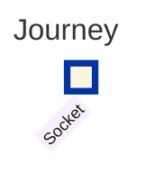
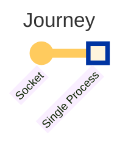
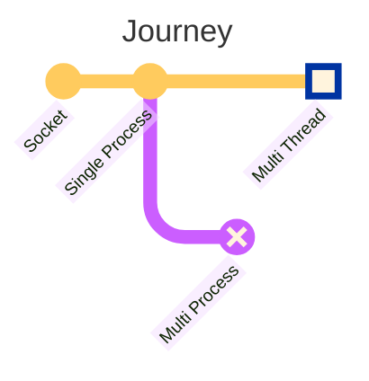
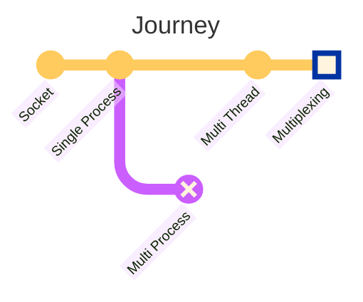
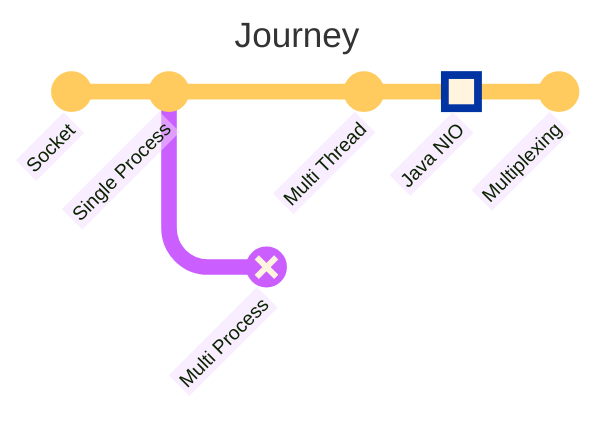
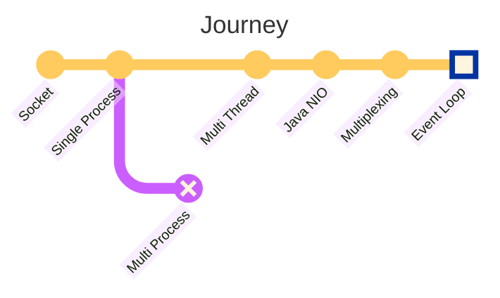
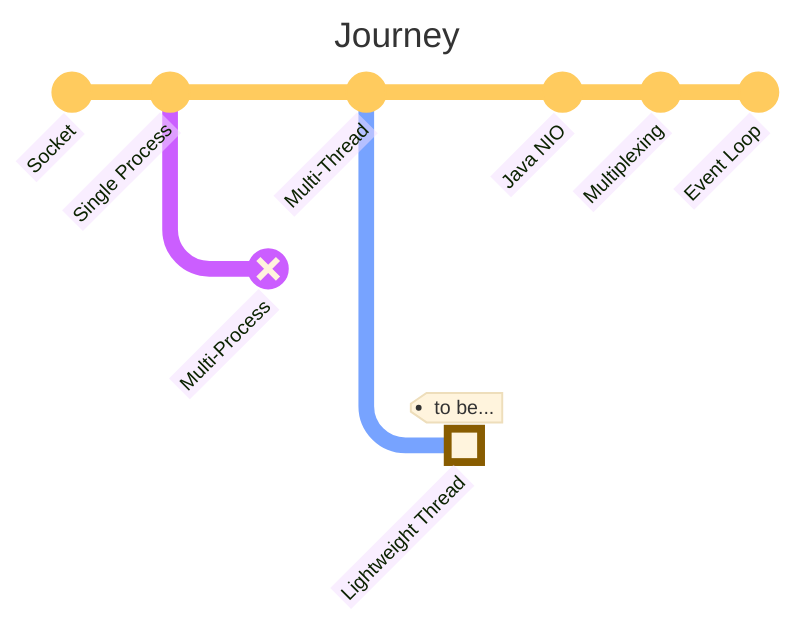

## Overview

Implementing a server application that can handle multiple client requests simultaneously is now very easy. Just using
Spring MVC alone can get you there in no time. However, as an engineer, I am curious about the underlying principles. In
this article, we will embark on a journey to reflect on the considerations that were made to implement a
multi-connection server by questioning the things that may seem obvious.

:::info

You can check the example code on [GitHub](https://github.com/songkg7/journey-to-a-multi-connect-server).

:::

## Socket



The first destination is 'Socket'. From a network programming perspective, a socket is a communication endpoint used
like a file to exchange data over a network. The description 'used like a file' is important because it is accessed
through a file descriptor (fd) and supports I/O operations similar to files.

:::info[Why are sockets identified by fd instead of port?]

While sockets can be identified using one's IP, port, and the other party's IP and port, using fd is preferred because
sockets have no information until a connection is accepted, and more data is needed than just a simple integer like fd.

:::

To implement a server application using sockets, you need to go through the following steps:

<!-- truncate -->


- Create a socket with `socket()`
- Prepare for connection with `bind(), listen()`
- Accept a connection with `accept()`
- Allocate another socket immediately after accepting = needs to be able to accept other connections

The socket used for connections is called a listening socket. This listening socket only serves to accept connections,
so a separate socket is created and used for communication with each client.

Now that we have seen how connections are established and maintained between the server and clients, let's implement a
server application in Java.

## Single Process Server



```java
try (ServerSocket serverSocket = new ServerSocket(PORT)) {
    while (true) {
        try (
                Socket clientSocket = serverSocket.accept();
                BufferedReader in = new BufferedReader(new InputStreamReader(clientSocket.getInputStream()));
                PrintWriter out = new PrintWriter(clientSocket.getOutputStream(), true)
        ) {
            String inputLine;
            while ((inputLine = in.readLine()) != null) {
                System.out.println("Echo: " + inputLine);
            }
            System.out.println("Client disconnected.");
        } catch (IOException e) {
            System.out.println("Exception in connection with client: " + e.getMessage());
        }
    }
} catch (IOException e) {
    System.out.println("Could not listen on port " + PORT + ": " + e.getMessage());
}
```

1. Bind the port to `ServerSocket` and wait for client requests in an infinite loop.
2. When a client request occurs, call `accept()` to accept the connection and create a new `Socket`.
3. Use the `Socket` with streams to read or write data.

With the socket concept we discussed earlier, a simple server application has been completed. Now, even you, the reader
of this article, can implement a server application without using a framework 🎉.

However, this server application has some drawbacks. It is difficult to handle multiple requests simultaneously. Since
it operates in a single process, it can only handle one request at a time, and subsequent requests can only be processed
after the previous connection is terminated.

Let's look at an example.


The response for hello1 comes back fine, but you can see that the response for hello2 only arrives after the connection
for hello1 is terminated.

- While there is no issue when a single client connects, there is a problem when multiple clients connect.
- If multiple clients connect, the subsequent ones have to wait in a queue until the initial connection is terminated.
- Inability to handle multiple requests simultaneously leads to inefficient resource utilization.

To address this issue, two approaches can be considered:

- Multi-process
- Multi-thread

Directly handling multi-processes in Java is challenging. Let's set aside the regret and move on to multi-threading.

## Multi-threaded Server



```java
try (ServerSocket serverSocket = new ServerSocket(PORT)) {
    LOGGER.info("Server is running on port " + PORT);

    while (true) {
        Socket clientSocket = serverSocket.accept(); // Main thread accepts the request and creates a client socket
        new Thread(new ClientHandler(clientSocket)).start(); // Delegates to a worker thread
    }
} catch (IOException e) {
    LOGGER.severe("Could not listen on port " + PORT + ": " + e.getMessage());
}
```

```java
public class ClientHandler implements Runnable {
    // omitted...

    @Override
    public void run() {
        try (
                BufferedReader in = new BufferedReader(new InputStreamReader(clientSocket.getInputStream()));
                PrintWriter out = new PrintWriter(clientSocket.getOutputStream(), true)
        ) {
            String inputLine;
            while ((inputLine = in.readLine()) != null) {
                out.println("Echo: " + inputLine); // Echo back the received message
            }
        } catch (IOException e) {
            LOGGER.severe("Error handling client: " + e.getMessage());
        } finally {
            try {
                clientSocket.close();
            } catch (IOException e) {
                LOGGER.severe("Failed to close client socket: " + e.getMessage());
            }
        }
    }
}
```


By creating a new thread for each request, multiple requests can now be handled simultaneously. So, is our journey
complete here? Considering the characteristics of the JVM, it seems like there is room for further optimization.

- **Thread creation and maintenance are resource-intensive tasks**, and Java allocates stack space when creating a
  thread, which can be around 1MB depending on the CPU architecture.
- If 10,000 requests occur simultaneously, the server would need over 10GB of memory just for thread resources.
- Since server resources are not infinite, it is necessary to limit the maximum number of threads. This is where the
  concept of a **thread pool** comes into play.
- Spring MVC was developed based on these thoughts.

Optimization has been completed.
Through [some experiments](https://haril.dev/blog/2023/11/10/Spring-MVC-Traffic-Testing), it has been proven that the
framework can handle the [c10k problem](http://www.kegel.com/c10k.html) with ease. However, something feels off 🤔.

- The more threads are blocked, the more inefficiently the application operates. This is because contention occurs
  during context switching.
- Threads compete for limited CPU resources to check if data has arrived on the socket and read it.
- In other words, as the number of network requests increases, the application slows down.
- **Using a thread pool means that there is a ceiling on the maximum number of requests that can be processed
  concurrently**.
- As engineers striving for higher goals, we want to break through this ceiling.

## Multiplexing Server



The overhead of threads being blocked was burdensome for server applications. How can we handle many requests without
threads being blocked?

The answer lies in multiplexing. Multiplexing is a technology that allows handling many requests with fewer threads.
With multiplexing, it is possible to implement servers that can handle around 100,000 concurrent connections easily.
This is the main course of our journey this time.

Before delving into multiplexing, it is necessary to understand Java's I/O.

### Java NIO



Java NIO is an API introduced from JDK 1.4 onwards to replace the existing I/O API. Why was Java I/O slow?

- Java could not directly access kernel memory, so a process of copying kernel buffers to JVM memory was necessary,
  which operated in a blocking manner.
- After the data was copied to JVM memory (heap), garbage collection was required, adding additional overhead.
- NIO introduced an API that allows direct access to kernel memory, which is ByteBuffer.
- This eliminated the need for copying from the kernel space. Zero copy was achieved.

Java NIO has three core components: **Channel, Buffer, Selector**.

#### Channel

When exchanging data between the server and clients, channels are used to read and write data using buffers (
ByteBuffer).

- FileChannel: Reads and writes data to files.
- DatagramChannel: Reads and writes data over the network using UDP.
- **SocketChannel**: Reads and writes data over the network using TCP.
- **ServerSocketChannel**: Listens for TCP connection requests from clients, and a SocketChannel is created for each
  connection.

#### Buffer

Buffers are components used for reading and writing data. Since it needs to work bidirectionally, it switches between
write and read modes using the `flip()` method. After reading all the data, the buffer needs to be cleared for writing
again, which can be done by calling the `clear()` method.

Buffers have several characteristics:

- `capacity`: The size needs to be specified when created and cannot be changed.
- `position`: Indicates the index of the next element to be read or written.
- `limit`: Represents the first limit within the buffer where data can be read or written.
- `mark`: Allows marking a position and later returning to that position.

#### Selector

The Selector is a key component that enables multiplexing. It makes select, epoll, kqueue, implemented in C, easily
usable in Java.


- Monitors events from multiple channels.
- It can monitor multiple channels with a single thread.
- Internally, SelectorProvider selects the appropriate multiplexing technology based on the operating system and
  version.
    - There are select, poll, epoll, kqueue, and depending on the machine for debugging, different implementation
      technologies may be used, so caution is required during debugging.

Shall we look at some code?

##### Creating a Selector

```java
Selector selector = Selector.open();
```

You can create a selector using the `open` method. As mentioned earlier, through `SelectorProvider`, the appropriate
multiplexing technology is selected based on the OS.

##### Registering a Channel

```java
ServerSocketChannel channel = ServerSocketChannel.open();
channel.bind(new InetSocketAddress("localhost", 8080));
channel.configureBlocking(false); // non-blocking mode
SelectionKey key = channel.register(selector, SelectionKey.OP_READ);
```

It is essential to switch to non-blocking mode. When registering a channel with the selector, you can specify which
events to monitor. There are four types of events, represented by SelectionKey constants.

- `OP_CONNECT`
- `OP_ACCEPT`
- `OP_READ`
- `OP_WRITE`

##### Selecting Channels with the Selector

The selector calls select to wait until there are channels ready for processing.

```java
selector.select(); // blocking
```

Isn't it fascinating? Not all internal operations are non-blocking I/O just because it is an implementation of
non-blocking I/O. In situations where there is no data ready to be read, it is natural for the operation to block until
the data is ready.

One question arises here. **If it blocks until there is data to read, what is the difference between this and
multi-threading?** 🤔

In the **multi-threading model, one thread can handle only one request**, but in the **multiplexing model, one thread
can handle multiple requests**. The selector provides a mechanism for threads to handle requests starting from the one
that is ready first, reducing the time threads are blocked compared to the multi-threading model.

:::tip

How about using the folk game 'Red light, Green light' as an analogy?

Typically, the thread (Socket) remembers all the game participants (Channel) and watches them all at once (Selector).
If the thread cannot watch all participants at once and has to focus on each one individually, it becomes a
multi-threading model 😂.

:::

if you need, you can make select non-blocking. Just call `selectNow`.

```java
selector.selectNow(); // non-blocking
```

and then you can get the set of channels that are ready using the `selectedKeys()` method.

```java
Set<SelectionKey> keys = selector.selectedKeys();
```

### Multiplexing Server Implementation

By combining the concepts we have explored so far, we can implement a multiplexing-based server as follows.

```java
try (
        ServerSocketChannel channel = ServerSocketChannel.open();
        Selector selector = Selector.open()
) {
    channel.bind(new InetSocketAddress(PORT));
    channel.configureBlocking(false); // non-blocking mode
    LOGGER.info("Server started on port " + PORT);

    channel.register(selector, SelectionKey.OP_ACCEPT);
    ByteBuffer buffer = ByteBuffer.allocate(256);

    while (true) {
        selector.select(); // blocking

        Iterator<SelectionKey> keys = selector.selectedKeys().iterator();
        while (keys.hasNext()) {
            SelectionKey key = keys.next();
            keys.remove();

            if (key.isAcceptable()) {
                // Accept connection from client
                accept(channel, selector);
            } else if (key.isReadable()) {
                // Read data from client
                read(key, buffer);
            }
        }
    }
}
```

- Set up a `ServerSocketChannel` in non-blocking mode.
- Register the selector with the channel along with the event.
- Wait until an event occurs in an infinite loop. By using `select`, you can unblock when an event occurs.
- Get the list of channels that triggered the event. You can check the channel information using `SelectionKey`.
- Delegate the event to the appropriate handler to process it.

Now that we have explored multiplexing, does it all seem too complicated? If you have ever used Netty, you have already
been using multiplexing. Netty is a framework designed to make it easy to use nio-based multiplexing.

## Event Loop



When exploring Netty, you may come across the concept of an event loop. What is an event loop? If you have encountered
NodeJS, you might have heard this term frequently. When you search for an event loop on Wikipedia, you get the following
explanation:

> It is an infinite loop that watches if an event occurs in a queue-like data structure and delegates the action to an
> appropriate handler for processing.

An infinite loop, event processing... doesn't it sound similar to what we have been examining so far? The event loop is
a concept based on multiplexing, which is why it resembles the operations we have discussed.

```java
// Event Loop
while (true) {
    selector.select();
    Set<SelectionKey> selected = selector.selectedKeys();
    for (SelectionKey selectionKey : selected) {
        dispatch(selectionKey);
    }
    selected.clear();
}
```

The main thread of the JVM waits in the loop until an event occurs and then delegates the event to the appropriate
handler.

Now that we understand why blocking operations should be avoided in a non-blocking multiplexing server, it is clear that
the main thread only operates, and if threads are blocked outside the loop, the delegation of events through select can
slow down over time.

This brings us to the end of our journey, where we have delved into the reasons for avoiding blocking operations in a
non-blocking multiplexing server. By understanding the event loop, we see how the mechanism of delegating events to
appropriate handlers allows the server to handle multiple requests efficiently.

Similarly, tasks that are calculation-intensive (= CPU intensive) do not go well with event loops because they delay the
operation of threads. If such tasks occur frequently, it is necessary to create separate threads to delegate the tasks,
in order to avoid disrupting the main thread loop.

## Conclusion

You have journeyed with me to explore the essence of the thought process behind implementing a multi-connection server.

- A single process could not handle multiple connections,
- Multi-processes and multi-threads required too many resources,
    - Thread pools solved the resource issue, but still fell short in handling many requests simultaneously.
- Using multiplexing allows handling many requests with just one thread.
    - The key was having a selector to determine which requests are ready to be processed.

Through this journey, many questions have been answered. Now that the journey has come to an end, I hope everyone can
rest easy.

Oh, there is actually one place we haven't visited yet. It's a really interesting topic, so I'll save it for the next
post.



## Reference

- https://engineering.linecorp.com/ko/blog/do-not-block-the-event-loop-part1
- https://mark-kim.blog/understanding-non-blocking-io-and-nio/
- https://oliveyoung.tech/blog/2023-10-02/c10-problem/
