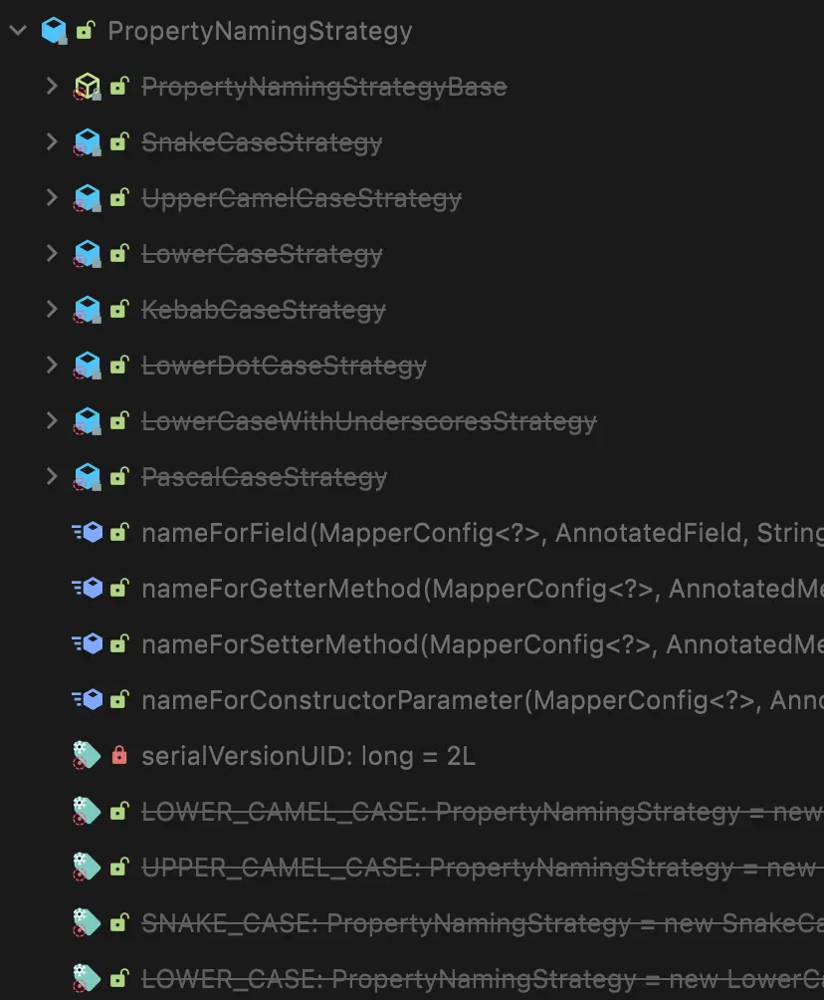

APIで使用されるJSONの命名規則が、アプリケーション内の命名戦略と異なる場合があります。

```json
{
  "Title": "Frozen",
  "Year": "2013",
  "Type": "movie",
  "Poster": "https://m.media-amazon.com/images/M/MV5BMTQ1MjQwMTE5OF5BMl5BanBnXkFtZTgwNjk3MTcyMDE@._V1_SX300.jpg",
  "imdbID": "tt2294629"
}
```

```java
private String title;
private String year;
private String imdbId;
private String type;
private String poster;
```

変数名がJSONのキーと一致しない場合、データは正しくマッピングされません。

このような場合、プロジェクト内の変数名を変更せずにデータをマッピングするために`@JsonProperty(value)`を使用できます。しかし、多くのフィールドが異なる命名戦略を持つ場合、各フィールドに`@JsonProperty(value)`を使用すると、コードが多くのアノテーションで乱雑になります。

ここで`@JsonNaming`アノテーションが役立ちます。クラス全体の命名戦略を一度に変更することができます。

## @JsonNaming

### v2.12以前

以下のようにエレガントに解決できます：

```java
@Data
@JsonNaming(value = PropertyNamingStrategy.UpperCamelCaseStrategy.class)
public class Movie {

    private String title;
    private String year;

    @JsonProperty("imdbID")  // 必要な場合のみ！
    private String imdbId;
    private String type;
    private String poster;

}
```


_この方法は非推奨で、取り消し線が引かれています。_

しかし、この方法はJackson 2.12以降非推奨となったため、新しいアプローチを見てみましょう。

### v2.12以降

バージョン2.12以降では、`PropertyNamingStrategies`を使用する必要があります。

```java
@JsonNaming(value = PropertyNamingStrategies.UpperCamelCaseStrategy.class)
```

内部実装の詳細な説明は長くなりすぎるため割愛しますが、非常に興味深い実装となっているので、一度見てみることをお勧めします！

:::info

簡単に言うと、更新された内部実装には`NamingBase`という抽象クラスが含まれており、これは元の`PropertyNamingStrategy`を継承し、その後命名戦略が`NamingBase`を継承します。`NamingBase`は中間実装クラスとして使用されます。

:::
