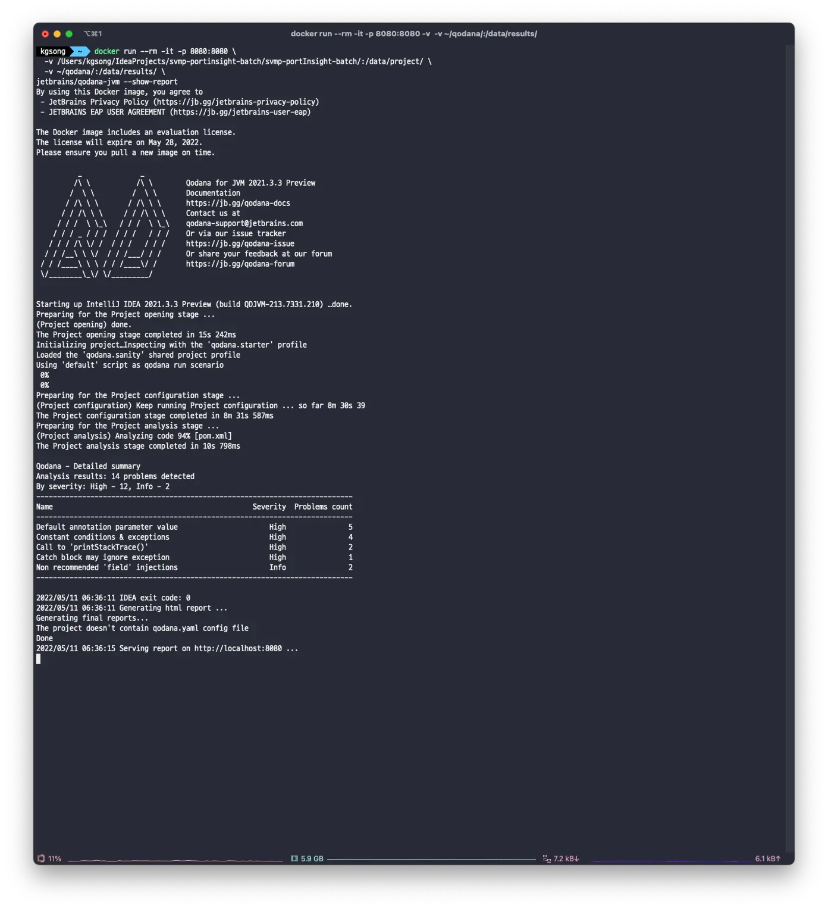

## Qodanaとは？

Qodanaは、JetBrainsが提供するコード品質向上ツールです。非常に使いやすいので、簡単に紹介したいと思います。

まず、Dockerがインストールされた環境が必要です。

```bash
docker run --rm -it -p 8080:8080 \
  -v <source-directory>/:/data/project/ \
  -v <output-directory>/:/data/results/ \
jetbrains/qodana-jvm --show-report
```

私はJavaアプリケーションを解析しているので、jvmイメージを使用しました。別の言語を使用している場合は、[Qodanaのウェブサイト](https://www.jetbrains.com/ko-kr/qodana/)で適切なイメージを見つけることができます。

- `<source-directory>`には解析したいプロジェクトのパスを置き換えてください。
- `<output-directory>`には解析結果を保存するパスを入力してください。これについては後ほど説明します。

解析結果を保存するために、ルートディレクトリにqodanaというフォルダを作成しました。

```bash
mkdir ~/qodana
# そして<output-directory>を~/qodanaに置き換えます。
```

次に、上記の`docker run ~`コマンドを実行し、しばらく待つと以下のような結果が表示されます。

私はテスト用にシンプルなJavaアプリケーションを使用しました。



今、http://localhost:8080 にアクセスすると、コード解析の結果を見ることができます。


Dockerがインストールされていれば、現在のプロジェクトのコード解析結果を簡単に取得できます。

このような解析ツールはコードレビューの一形態として機能し、レビュアーの疲労を軽減し、より詳細なレビューに集中できるようにします。このようなコード品質管理ツールを積極的に活用することで、非常に便利な開発体験を得ることができます。