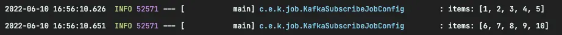

:::info

この記事を書く前にDockerを使ってKafkaをインストールしましたが、その内容はここでは扱いません。

:::

## KafkaItemReaderとは..?

Spring Batchでは、Kafkaトピックからデータを処理するために`KafkaItemReader`が提供されています。

簡単なバッチジョブを作成してみましょう。

## 例

まず、必要な依存関係を追加します。

```gradle
dependencies {
    ...
    implementation 'org.springframework.boot:spring-boot-starter-batch'
    implementation 'org.springframework.kafka:spring-kafka'
    ...
}
```

`application.yml`にKafkaの設定を行います。

```yaml
spring:
  kafka:
    bootstrap-servers:
      - localhost:9092
    consumer:
      group-id: batch
```

```java
@Slf4j
@Configuration
@RequiredArgsConstructor
public class KafkaSubscribeJobConfig {

    private final JobBuilderFactory jobBuilderFactory;
    private final StepBuilderFactory stepBuilderFactory;
    private final KafkaProperties kafkaProperties;

    @Bean
    Job kafkaJob() {
        return jobBuilderFactory.get("kafkaJob")
                .incrementer(new RunIdIncrementer())
                .start(step1())
                .build();
    }

    @Bean
    Step step1() {
        return stepBuilderFactory.get("step1")
                .<String, String>chunk(5)
                .reader(kafkaItemReader())
                .writer(items -> log.info("items: {}", items))
                .build();
    }

    @Bean
    KafkaItemReader<String, String> kafkaItemReader() {
        Properties properties = new Properties();
        properties.putAll(kafkaProperties.buildConsumerProperties());

        return new KafkaItemReaderBuilder<String, String>()
                .name("kafkaItemReader")
                .topic("test") // 1.
                .partitions(0) // 2.
                .partitionOffsets(new HashMap<>()) // 3.
                .consumerProperties(properties) // 4.
                .build();
    }
}
```

1. データを読み取るトピックを指定します。
2. トピックのパーティションを指定します。複数のパーティションを指定することも可能です。
3. **KafkaItemReaderでオフセットを指定しない場合**、オフセット0から読み取ります。空のマップを提供すると、最後のオフセットから読み取ります。
4. 実行に必要なプロパティを設定します。

:::tip

`KafkaProperties`は、SpringでKafkaを便利に使用するためのさまざまな公開インターフェースを提供します。

:::

## 試してみる

さて、バッチジョブを実行すると、`application.yml`の情報に基づいて`consumer groups`が自動的に作成され、ジョブがトピックの購読を開始します。

`kafka console producer`を使って、`test`トピックに1から10までのデータを追加してみましょう。

```bash
kafka-console-producer.sh --bootstrap-server localhost:9092 --topic test
```


バッチジョブがトピックを正常に購読していることがわかります。



`chunkSize`を5に設定したので、データは5件ずつバッチ処理されます。

ここまで、Spring Batchでの`KafkaItemReader`の基本的な使い方を見てきました。次に、テストコードの書き方を見てみましょう。