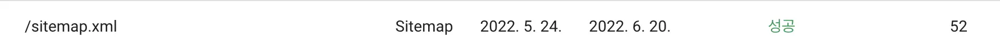

ブログのインデックスをGoogleに登録するために`sitemap.xml`を登録していましたが、「sitemapが見つかりません」というエラーメッセージばかりが表示されていました。最終的に解決方法を見つけたので、ここで共有します。

この方法がすべてのケースで解決するわけではありませんが、試してみる価値はあると思います。

以下のコマンドを実行するだけです：

```bash
curl https://www.google.com/ping\?sitemap\={あなたのsitemapのパス}
```

そして、再度サーチコンソールを確認すると...！


_ほぼ1ヶ月かかってやっと解決しました...😢_

ついにsitemapが認識されました。

お役に立てれば幸いです！

### 参考

- [sitemap.org](https://www.sitemaps.org/protocol.html#submit_ping)

- [google developers docs](https://developers.google.com/search/docs/advanced/sitemaps/build-sitemap?hl=ko)