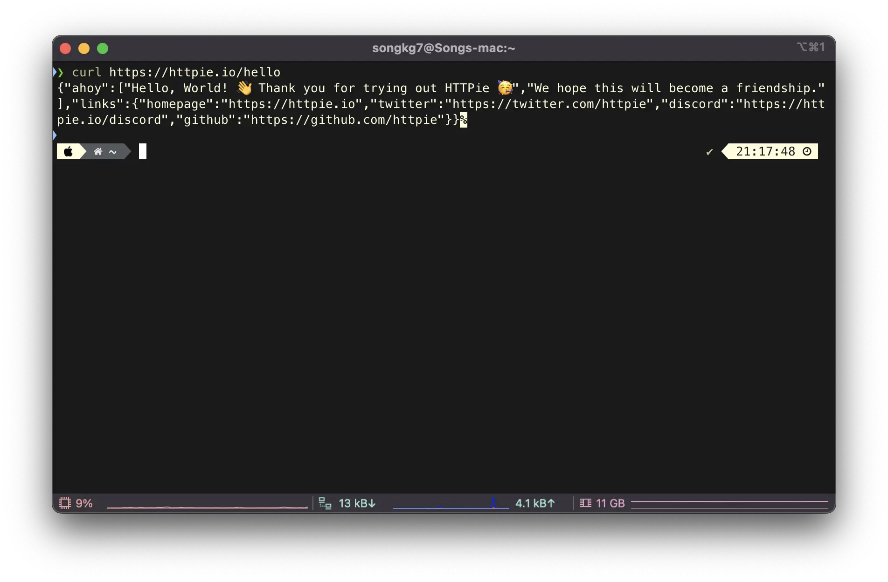

## 概要

> curlコマンドを置き換えることができるCLIツール

Linuxを頻繁に使用する開発者であれば、`curl`コマンドをよく使うでしょう。サーバーから外部APIリクエストを送信するための必須コマンドですが、出力の可読性が低いという欠点があります。HTTPieはこの欠点を解消できる興味深いツールなので、紹介しましょう。

## インストール

Macユーザーの場合、brewを使って簡単にインストールできます。

```bash
brew install httpie
```

CentOSの場合、yumを使ってインストールできます。

```bash
yum install epel-release
yum install httpie
```

## 使用方法

まず、`curl`を使ってGETリクエストを送信する方法です。

```bash
curl https://httpie.io/hello
```



次に、`HTTPie`を使って比較してみましょう。

```bash
https httpie.io/hello
```


コマンドのあらゆる面で可読性が大幅に向上しています。レスポンスとヘッダーの値がデフォルトで含まれているため、別のコマンドを使用せずに一目でさまざまな情報を得ることができます。

コマンドでは`https`と`http`が区別されることに注意してください。

```bash
http localhost:8080
```

公式サイトに記載されているように、POSTリクエストを送信することもできます。

```bash
http -a USERNAME POST https://api.github.com/repos/httpie/httpie/issues/83/comments body='HTTPie is awesome! :heart:'
```

その他のさまざまな機能については[GitHub](https://github.com/httpie/httpie)で説明されているので、うまく活用すれば生産性を大幅に向上させることができます。

## 参考

- [httpie](https://github.com/httpie/httpie)