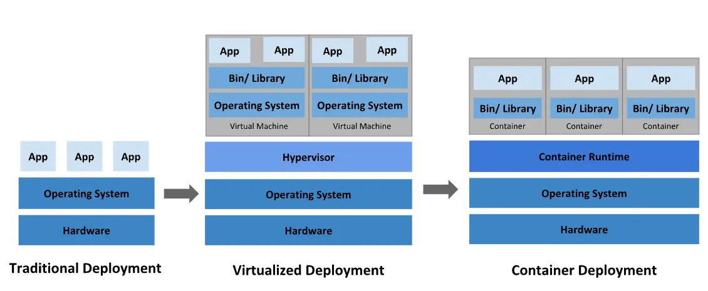

:::info

この記事は社内情報共有のために書かれており、Java開発環境を基に説明しています。

:::

## Dockerとは？

:::info

Linuxコンテナを作成・使用するためのコンテナ技術であり、この技術をサポートする最大の企業の名前でもあり、オープンソースプロジェクトの名前でもあります。

:::


_誰もが一度はDockerを検索したときに見たことがある画像_

2013年に導入されたDockerは、インフラの世界をコンテナ中心のものに変革しました。多くのアプリケーションがコンテナを使用してデプロイされ、Dockerfileを作成してイメージをビルドし、コンテナをデプロイすることが一般的な開発プロセスとなりました。2019年のDockerConプレゼンテーションでは、1052億回ものコンテナイメージのプルが報告されました。

Dockerを使用することで、非常に軽量なモジュール型の仮想マシンのようにコンテナを扱うことができます。さらに、コンテナは柔軟にビルド、デプロイ、コピー、移動が可能で、クラウド向けのアプリケーション最適化をサポートします。

## Dockerコンテナの利点

### どこでも一貫した動作

コンテナランタイムがインストールされている限り、Dockerコンテナはどこでも同じ動作を保証します。例えば、チームメンバーAがWindows OSを使用し、チームメンバーBがMacOSを使用している場合でも、Dockerfileを通じてイメージを共有することで、OSに関係なく同じ結果を確認できます。デプロイの場合も同様です。コンテナが正常に動作することが確認されていれば、追加の設定なしでどこでも正常に動作します。

### モジュール性

Dockerのコンテナ化アプローチは、アプリケーションの一部を分解、更新、または回復する能力に焦点を当てています。サービス指向アーキテクチャ（SOA）のように、複数のアプリケーション間でプロセスを共有するマイクロサービスベースのアプローチを採用できます。

### レイヤリングとイメージバージョン管理

各Dockerイメージファイルは一連のレイヤーで構成されており、これらが一つのイメージに結合されます。

Dockerは新しいコンテナをビルドする際にこれらのレイヤーを再利用するため、ビルドプロセスが非常に速くなります。中間の変更はイメージ間で共有され、速度、スケーラビリティ、効率が向上します。

### 高速なデプロイ

Dockerベースのコンテナはデプロイ時間を数秒に短縮できます。OSを起動してコンテナを追加または移動する必要がないため、デプロイ時間が大幅に短縮されます。さらに、高速なデプロイ速度により、コンテナによって生成されたデータの作成と削除がコスト効率よく簡単に行え、ユーザーはそれが正しく行われたかどうかを心配する必要がありません。

要するに、**Docker技術は効率性を強調し、より細かく制御可能なマイクロサービスベースのアプローチを提供します**。

### ロールバック

Dockerを使用してデプロイする際、イメージはタグ付きで使用されます。例えば、バージョン1.2のイメージを使用してデプロイし、リポジトリにバージョン1.1のイメージがまだある場合、jarファイルを再準備することなくコマンドを実行するだけで済みます。

```bash
docker run --name app image:1.2
docker stop app

## バージョン1.1を実行
docker run --name app image:1.1
```

## Docker使用前後の比較

Dockerコンテナを使用することで、従来の方法に比べてはるかに迅速かつ柔軟なデプロイが可能になります。

### Dockerコンテナを使用しないデプロイ

1. ローカルマシンでデプロイする`jar`ファイルをパッケージ化。
2. `scp`などのファイル転送プロトコルを使用して`jar`ファイルを本番サーバーに転送。
3. ステータス管理のために`systemctl`を使用してサービスファイルを作成。
4. `systemctl start app`でアプリケーションを実行。

複数のアプリが1つのサーバーで実行されている場合、停止したアプリを見つけるのは非常に複雑になります。複数のサーバーで複数のアプリを実行する場合も同様で、各サーバーでコマンドを実行する必要があり、非常に疲れるプロセスです。

### Dockerコンテナを使用したデプロイ

1. `Dockerfile`を使用してアプリケーションのイメージを作成。→ ビルド ⚒️
2. DockerhubやGitlabレジストリなどのリポジトリにイメージをプッシュ。→ シッピング🚢
3. 本番サーバーで`docker run image`を使用してアプリケーションを実行。

複雑なパス設定やファイル転送プロセスに時間を浪費する必要はありません。Dockerはどの環境でも動作し、どこでも実行され、リソースを効率的に使用します。

Dockerは単一のコンテナを効果的に管理するように設計されています。しかし、数百のコンテナやコンテナ化されたアプリを使用し始めると、管理とオーケストレーションが非常に困難になります。すべてのコンテナにネットワーキング、セキュリティ、テレメトリなどのサービスを提供するためには、一歩引いてそれらをグループ化する必要があります。ここでKubernetes[^footnote]が登場します。

## いつ使用すべきか？

開発者はほぼすべての状況でDockerを非常に有用と感じるでしょう。実際、Dockerは開発、デプロイ、運用において従来の方法よりも優れていることが多いため、Dockerコンテナは常に最優先で検討すべきです。

1. ローカルマシンでPostgreSQLのような開発データベースが必要なとき。
2. 新しい技術をテストまたは迅速に採用したいとき。
3. ローカルマシンに直接インストールまたはアンインストールが難しいソフトウェアがあるとき（例：WindowsでJavaを再インストールするのは悪夢です）。
4. フロントエンドチームなど、他のチームから最新のデプロイバージョンをローカルマシンで実行したいとき。
5. 本番サーバーをNCPからAWSに切り替える必要があるとき。

## 例

シンプルなAPIサーバー：

```bash
docker run --name rest-server -p 80:8080 songkg7/rest-server
```

```bash
# curlを使用
curl http://localhost/ping

# httpieを使用
http localhost/ping
```

ポート80がコンテナのポート8080にマッピングされているため、コンテナとの通信がうまくいくことが確認できます。

:::tip[**よく使われるDocker Runオプション**]

`--name`
: コンテナに名前を付ける

`-p`
: コンテナのポートをホストに公開する

`--rm`
: コンテナが終了したときに自動的に削除する

`-i`
: インタラクティブモード、アタッチされていなくてもSTDINを開いたままにする

`-t`
: 擬似TTYを割り当て、ターミナルに似た環境を作成する

`-v`
: ボリュームをバインドマウントする

:::

## 結論

Dockerコンテナを使用することで、従来のデプロイ方法で発生する問題を解決しながら、便利な操作が可能になります。次回は、アプリケーションのイメージを作成する`Dockerfile`について見ていきます。

## 参考文献

- [Redhat - What is Docker?](https://www.redhat.com/ko/topics/containers/what-is-docker)

---

[^footnote]: [Kubernetes](https://haril.dev/jp/blog/2022/07/22/kubernetes-start)
