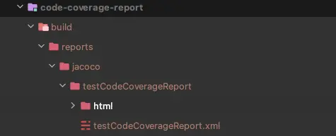

## 概要

Gradle 7.4から、複数のJacocoテストレポートを1つの統合レポートに集約する機能が追加されました。以前は、複数のモジュールにまたがるテスト結果を1つのファイルで見るのは非常に困難でしたが、今ではこれらのレポートを統合することが非常に便利になりました。

## 使用方法

### レポートを収集するためのサブモジュールの作成

現在のプロジェクト構成は、`application`というモジュールと、`application`モジュールで使用される`list`や`utils`といった他のモジュールで構成されています。

`code-coverage-report`モジュールを追加することで、`application`、`list`、`utils`モジュールからテストレポートを収集できます。

プロジェクト構成は次のようになります：

- application
- utils
- list
- code-coverage-report

### jacoco-report-aggregationプラグインの追加

```gradle
// code-coverage-report/build.gradle
plugins {
    id 'base'
    id 'jacoco-report-aggregation'
}

repositories {
    mavenCentral()
}

dependencies {
    jacocoAggregation project(":application")
}
```

これで、`./gradlew testCodeCoverageReport`を実行することで、すべてのモジュールのテスト結果を集約したJacocoレポートを生成できます。



:::warning

集約機能を使用するには、jarファイルが必要です。`jar { enable = false }`と設定している場合は、trueに変更する必要があります。

:::

### 更新 22-09-28

Gradleのマルチプロジェクトセットアップの場合、単一プロジェクトで正しく除外されたパッケージが集約レポートでは除外されない問題があります。

次の設定を追加することで、特定のパッケージを除外したレポートを生成できます。

```gradle
testCodeCoverageReport {
    reports {
        csv.required = true
        xml.required = false
    }
    getClassDirectories().setFrom(files(
        [project(':api'), project(':utils'), project(':core')].collect {
            it.fileTree(dir: "${it.buildDir}/classes/java/main", exclude: [
                '**/dto/**',
                '**/config/**',
                '**/output/**',
            ])
        }
    ))
}
```

## 次のステップ

Gradleで`jacoco-aggregation-report`と一緒に導入された`jvm-test-suite`プラグインも非常に有用です。これらのプラグインは補完的な関係にあるため、一緒に使用することをお勧めします。

## 参考

- [Gradle 7.4 リリースノート](https://docs.gradle.org/7.4/release-notes.html)