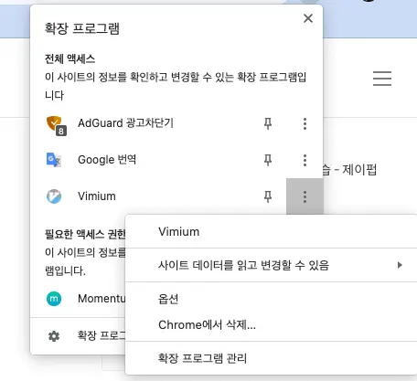
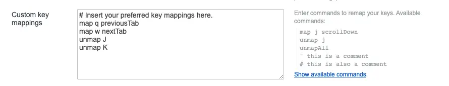
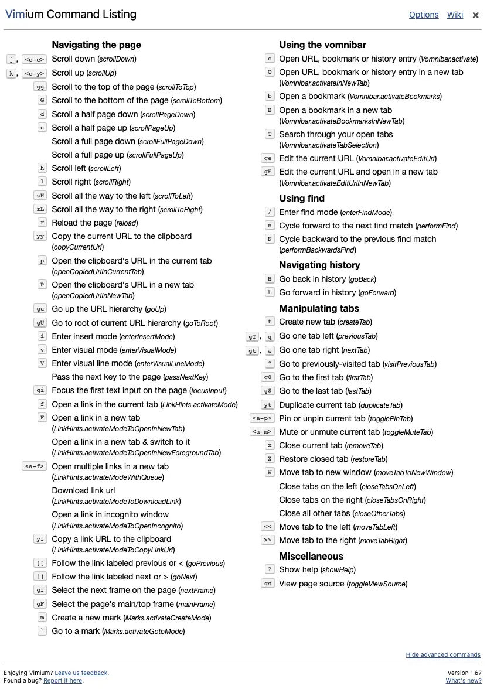

## 概要

最近、Vimを使い始めたので、すべての環境をVimに合わせるようにしています。その中で、Safari用のVim拡張機能であるVimariと、Chrome用の拡張機能であるVimiumのショートカットにいくつかの違いがあることに気付きました。それらを統一するために、特定のキーをリマップすることにしました。このガイドでは、Vimiumでショートカットをリマップする方法を紹介します。

## Vimiumオプションウィンドウ

Chromeの拡張機能のボタンをクリックして、オプションを開きます。

このセクションを変更することで、ショートカットを変更できます。基本的なマッピング方法はVimと同じです。個人的には、Vimariのタブナビゲーションショートカットをq, wからVimiumのJ, Kに変更する方が便利だと感じました。

特定のアクションにどのキーをマップすれば良いか分からない場合は、その横にある「利用可能なコマンドを表示」をクリックすると、役立つ説明が表示されます。

ここから、希望するアクションを見つけて特定のキーにマップすることができます。