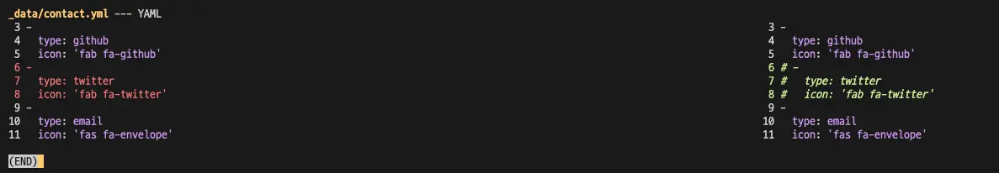

## 概要

Difftasticは、`git diff`の使用をより便利にするためのツールです。ターミナルで頻繁に`git diff`コマンドを使用する人にとって非常に役立ちます。

## 使用方法

```bash
brew install difftastic
```

グローバル設定:

```bash
git config --global diff.external difft
```

これで、`git diff`コマンドを使用すると、以前よりもはるかに直感的な差分結果を確認できます。



## 参考

- [Difftastic](https://difftastic.wilfred.me.uk/introduction.html)
