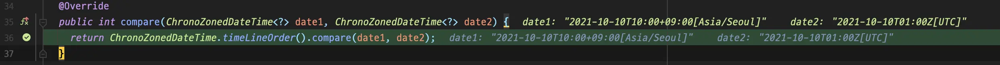

## 概要

Javaには時間を表現するためのオブジェクトがいくつか存在します。この記事では、その中でも最も情報量が多い`ZonedDateTime`を使用した時間の比較方法について説明します。

## 異なるが同じ時間？

まず、簡単なテストコードを書いて、何か特異な点がないか確認してみましょう。

```java
ZonedDateTime seoulZonedTime = ZonedDateTime.parse("2021-10-10T10:00:00+09:00[Asia/Seoul]");
ZonedDateTime utcTime = ZonedDateTime.parse("2021-10-10T01:00:00Z[UTC]");

assertThat(seoulZonedTime.equals(utcTime)).isFalse();
assertThat(seoulZonedTime).isEqualTo(utcTime);
```

このコードはテストに合格します。`equals`が`false`を返す一方で、`isEqualTo`は合格します。なぜでしょうか？

実際には、上記のコードにおける2つの`ZonedDateTime`オブジェクトは同じ時間を表しています。しかし、`ZonedDateTime`は内部的に`LocalDateTime`、`ZoneOffset`、および`ZoneId`を含んでいるため、`equals`を使用して比較すると、絶対時間ではなくオブジェクトの値が同じかどうかをチェックします。

そのため、`equals`は`false`を返します。


_ZonedDateTime#equals_

しかし、`isEqualTo`は時間オブジェクトの操作に関して異なる動作をするようです。

実際、`ZonedDateTime`を比較する際、`isEqualTo`は`ZonedDateTime`の`equals`を呼び出すのではなく、`ChronoZonedDateTimeByInstantComparator#compare`を呼び出します。


_Comparator#compareが呼び出される。_

内部実装を見ると、`toEpochSecond()`を使用して秒に変換することで比較が行われていることがわかります。つまり、`equals`を通じてオブジェクトを比較するのではなく、`compare`を通じて絶対時間を比較しています。

これに基づいて、`ZonedDateTime`の比較を以下のようにまとめることができます：

`equals`
: オブジェクトを比較

`isEqualTo`
: 絶対時間を比較

したがって、`ZonedDateTime`を間接的に含むオブジェクトを比較する場合、`equals`が呼び出されるため、`ZonedDateTime`の絶対値に基づいて比較したい場合は、オブジェクト内で`equals`メソッドをオーバーライドする必要があります。

```java
public record Event(
        String name,
        ZonedDateTime eventDateTime
) {
    @Override
    public boolean equals(Object o) {
        if (this == o) {
            return true;
        }
        if (o == null || getClass() != o.getClass()) {
            return false;
        }
        Event event = (Event) o;
        return Objects.equals(name, event.name)
                && Objects.equals(eventDateTime.toEpochSecond(), event.eventDateTime.toEpochSecond());
    }

    @Override
    public int hashCode() {
        return Objects.hash(name, eventDateTime.toEpochSecond());
    }
}
```

```java
@Test
void equals() {
    ZonedDateTime time1 = ZonedDateTime.parse("2021-10-10T10:00:00+09:00[Asia/Seoul]");
    ZonedDateTime time2 = ZonedDateTime.parse("2021-10-10T01:00:00Z[UTC]");

    Event event1 = new Event("event", time1);
    Event event2 = new Event("event", time2);

    assertThat(event1).isEqualTo(event2); // pass
}
```

## 結論

- `ZonedDateTime`間で`equals`が呼び出される際に絶対時間を比較したい場合は、`toEpochSecond()`などを使用して変換する必要があります。
- テストコードや類似のシナリオで`isEqualTo`を使用して直接`ZonedDateTime`を比較する場合、`equals`は呼び出されず、内部変換が行われるため、別途変換する必要はありません。
- オブジェクト内に`ZonedDateTime`が含まれている場合、必要に応じてオブジェクトの`equals`メソッドをオーバーライドする必要があります。