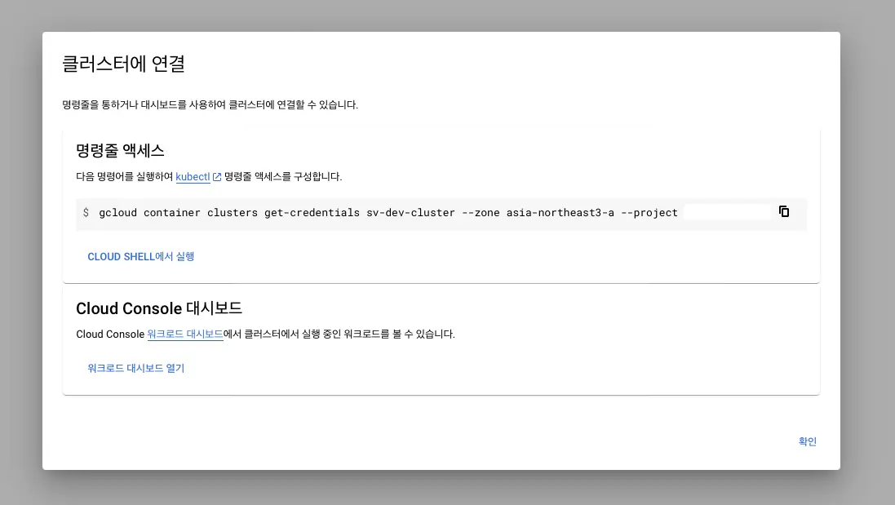

## 概要

GoogleのCloud Shellを通じてウェブからどこでも`kubectl`を実行できるのは非常に便利ですが、簡単なクエリコマンドのためにウェブアクセスと認証を行う手間がかかるという欠点があります。この記事では、ローカルCLIを使ってGoogle Cloud Kubernetesを迅速に管理する方法を紹介します。

## 目次

### GCP CLIのインストール

まず、GCP CLIをインストールする必要があります。適切なオペレーティングシステムを確認し、インストールするために[gcp-cli](https://cloud.google.com/sdk/gcloud?hl=ko)リンクを参照してください。

### 接続

インストールが完了したら、以下のコマンドを使用して認証プロセスを進めます。

```bash
gcloud init
```

GCP Kubernetes Engineにアクセスし、クラスターの接続情報を取得する必要があります。




コマンドラインアクセス用のコマンドをコピーし、ターミナルで実行します。

```bash
gcloud container clusters get-credentials sv-dev-cluster --zone asia-northeast3-a --project {projectId}
```

```console
Fetching cluster endpoint and auth data.
CRITICAL: ACTION REQUIRED: gke-gcloud-auth-plugin, which is needed for continued use of kubectl, was not found or is not executable. Install gke-gcloud-auth-plugin for use with kubectl by following https://cloud.google.com/blog/products/containers-kubernetes/kubectl-auth-changes-in-gke
kubeconfig entry generated for sv-dev-cluster.
```

### プラグインのインストール

現在使用しているKubernetesのバージョンがv1.26未満の場合、`gke-gcloud-auth-plugin`のインストールを要求するエラーが発生することがあります。以下のコマンドを使用してプラグインをインストールします。

:::info

v1.26以前では、クライアントとGoogle Kubernetes Engine間の認証を管理するためのクライアント固有のコードが既存のkubectlおよびカスタムKubernetesクライアントに含まれていました。v1.26以降、このコードはOSS kubectlに含まれなくなりました。GKEユーザーは、GKE固有のトークンを生成するために別の認証プラグインをダウンロードして使用する必要があります。新しいバイナリであるgke-gcloud-auth-pluginは、Kubernetes Client-goユーザー認証情報プラグインメカニズムを使用してkubectl認証をGKE用に拡張します。このプラグインはすでにkubectlでサポートされているため、v1.26が提供される前にこの新しいメカニズムに切り替えることができます。 - Google

:::

```bash
gcloud components install gke-gcloud-auth-plugin
```

```console
Your current Google Cloud CLI version is: 408.0.1
Installing components from version: 408.0.1

┌────────────────────────────────────────────┐
│    These components will be installed.     │
├────────────────────────┬─────────┬─────────┤
│          Name          │ Version │   Size  │
├────────────────────────┼─────────┼─────────┤
│ gke-gcloud-auth-plugin │   0.4.0 │ 7.1 MiB │
└────────────────────────┴─────────┴─────────┘

For the latest full release notes, please visit:
  https://cloud.google.com/sdk/release_notes

Do you want to continue (Y/n)?  y

╔════════════════════════════════════════════════════════════╗
╠═ Creating update staging area                             ═╣
╠════════════════════════════════════════════════════════════╣
╠═ Installing: gke-gcloud-auth-plugin                       ═╣
╠════════════════════════════════════════════════════════════╣
╠═ Installing: gke-gcloud-auth-plugin                       ═╣
╠════════════════════════════════════════════════════════════╣
╠═ Creating backup and activating new installation          ═╣
╚════════════════════════════════════════════════════════════╝

Performing post processing steps...done.

Update done!
```

接続コマンドを再実行すると、エラーメッセージなしでクラスターが接続されることが確認できます。

```bash
gcloud container clusters get-credentials sv-dev-cluster --zone asia-northeast3-a --project {projectId}
```

```console
Fetching cluster endpoint and auth data.
kubeconfig entry generated for sv-dev-cluster.
```

接続が成功すると、Docker Desktopにも変化が見られます。具体的には、Kubernetesタブに新しい情報が表示されます。


その後、`kubectl`を使用してローカルで直接GKEリソースを確認することもできます。

```bash
kubectl get deployments
NAME                  READY   UP-TO-DATE   AVAILABLE   AGE
my-application        1/1     1            1           20d
```

## 結論

GKEリソースをローカルで効率的に管理する方法を簡単に紹介しました。ローカルで`kubectl`を使用することで、オートコンプリートなどの拡張機能が利用でき、Kubernetesの管理が非常に便利になります。GKEの使用が初めての方は、ぜひ試してみてください。

## 参考

[k8s-plugin](https://cloud.google.com/blog/products/containers-kubernetes/kubectl-auth-changes-in-gke?hl=en)