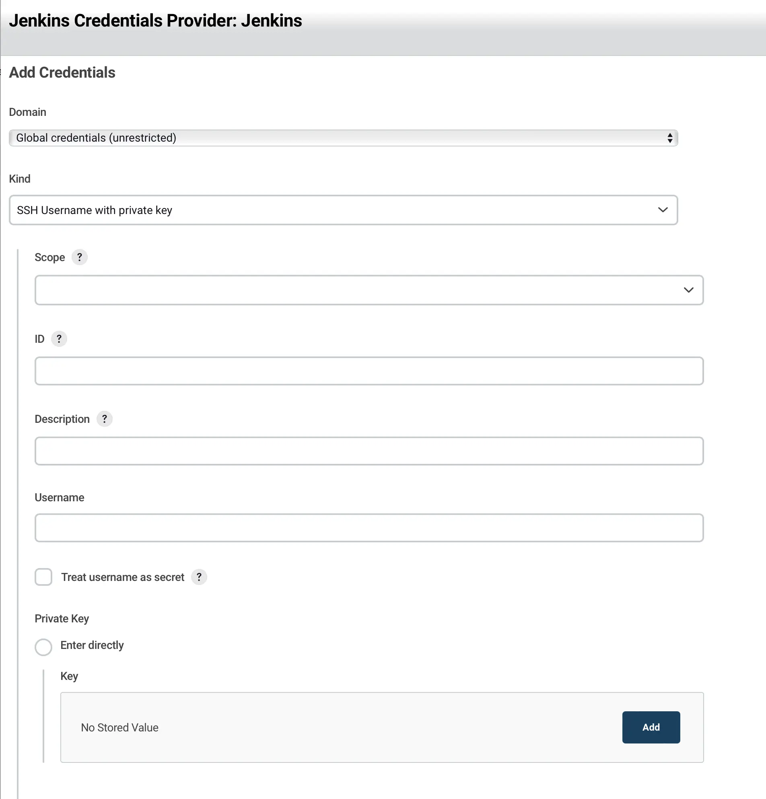

## 概要

この記事では、Dockerを使用してJenkinsをインストールおよび運用する方法について説明します。

## 目次

### インストール

#### Docker

```bash
docker run --name jenkins-docker -d -p 8080:8080 -p 50000:50000 -v /home/jenkins:/var/jenkins_home -u root jenkins/jenkins:lts 
```

ホストマシン上にJenkinsデータを永続化するためにボリュームをマウントします。TeamCityとは異なり、Jenkinsはすべての設定をファイルで管理します。マウントを設定することで、認証情報やデータ管理が非常に便利になるため、必ず設定してください。一般的なターゲットパスは`/home/jenkins`または`/var/lib/jenkins`です。

この記事の目的のために、`/home/jenkins`パスが作成されていると仮定します。

### 認証

マスターとノードの両方に対するセキュリティとアクセス制御を確保するために、'jenkins'という名前のユーザーを作成し、以下の手順に従います。

#### ユーザーアクセス権の設定

```bash
chown -R jenkins /var/lib/jenkins
```

#### SSHキーの管理

キーがない場合は、`ssh-keygen`を使用してプライベートキーとパブリックキーを生成します。

パスの入力を求められたら、`/home/jenkins/.ssh/id_rsa`と入力して、キーが`/home/jenkins/.ssh`に作成されるようにします。

#### GitLab

GitLabの個人設定にはSSH設定タブがあります。そこにパブリックキーを追加します。

パイプラインでGitを選択すると、リポジトリパスの入力フィールドが表示されます。git@~で始まるSSHパスを入力すると赤いエラーが表示されます。これを解決するために、資格情報を作成します。SSH資格情報を選択して作成し、ID値には有用な値を入力することをお勧めします。

#### ノード設定

ノードはJenkinsの役割を効率的に分散する方法です。

ノードと通信するために、マスターで`ssh-keygen`を使用してキーを生成します。既に使用しているキーがある場合は、それを再利用できます。



- `ID`: この値はJenkinsが内部でSSHキーを識別するために使用され、Jenkinsfileで資格情報を使用しやすくするため、意味のある値を設定するのがベストです。設定しない場合はUUID値が生成されます。
- `Username`: Linuxユーザー。通常、'jenkins'がユーザーとして使用されるため、'jenkins'と入力します。**これを入力しないと、キーエラーが発生する可能性があるので注意してください**。

#### Dockerアクセス権限

dockerグループが存在しない場合は、作成します。通常、Dockerをインストールすると自動的に作成されます。

```bash
sudo groupadd docker
```

以下のコマンドを実行して、JenkinsユーザーにDockerを実行する権限を付与します。

```bash
sudo gpasswd -a jenkins docker
# Adding user jenkins to group docker
```

```bash
sudo chmod 666 /var/run/docker.sock
```

変更を適用するためにDockerデーモンを再起動します。

```bash
systemctl restart docker
```

これで`docker ps`コマンドを実行できるようになります。

### 再起動

Jenkinsのバージョンを更新したり、プラグインをインストール、削除、更新したりすると、Jenkinsが再起動します。しかし、Dockerで管理している場合、コンテナがダウンし、Jenkinsが起動できなくなります。再起動を有効にするには、コンテナに再起動ポリシーを設定する必要があります。

```bash
docker update --restart=always jenkins-docker
```

これにより、jenkins-dockerコンテナは常に実行状態に保たれます。

## 注意

プラグインを更新する際には、現在運用中のJenkinsのバージョンと互換性があるかどうかを慎重に確認してください。Jenkinsとプラグインのバージョンが一致しないと、パイプラインの失敗につながることがよくあります。

## 参考

[Managing Jenkins with Docker](https://dev-overload.tistory.com/40)