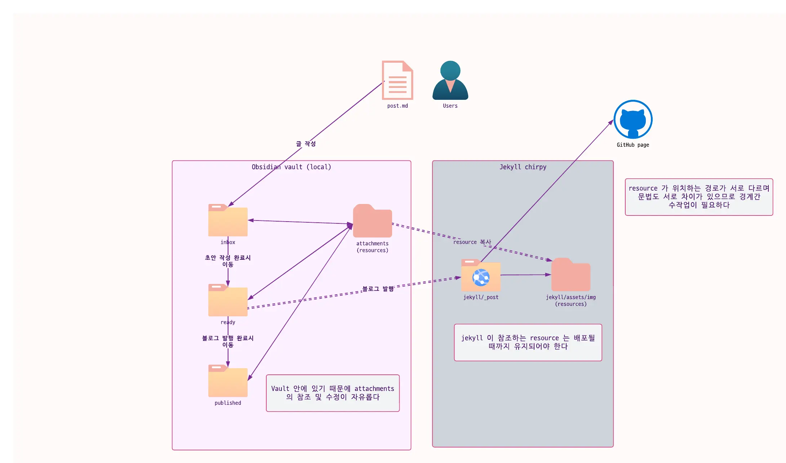
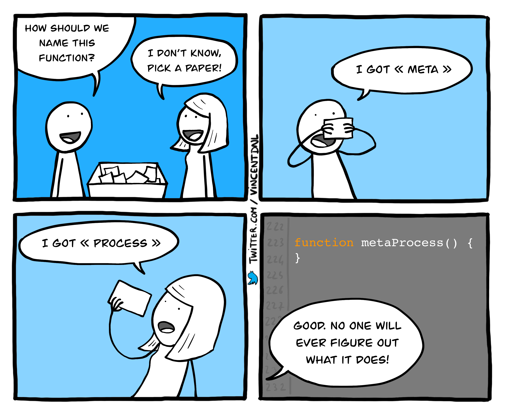
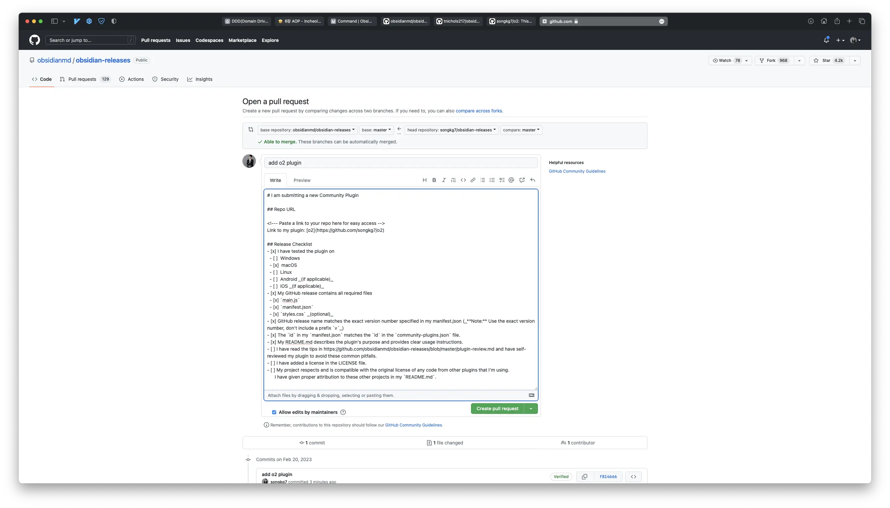
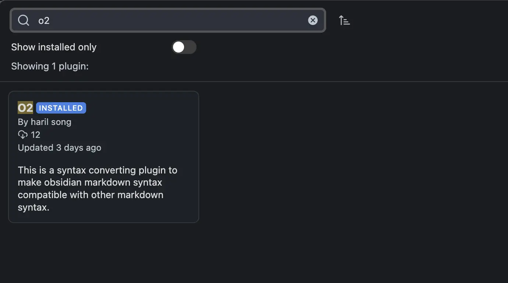

## 概要

ObsidianはMarkdownファイル間のリンクを通じてグラフビューを提供し、情報の保存とナビゲーションが便利です。しかし、これを実現するために、Obsidianは独自のシンタックスを元のMarkdownシンタックスに加えて強制します。これにより、他のプラットフォームでObsidianのMarkdownドキュメントを読む際に互換性の問題が生じることがあります。

現在、私はJekyllブログを使用して投稿しているため、Obsidianで書いた後、ブログ公開のためにシンタックスを手動で調整する必要があります。具体的なワークフローは以下の通りです：

- ファイルリンクに[[ ]]を使用する（これはObsidianの独自シンタックス）
- 画像ファイルを含む添付ファイルのパスをリセットする
- `title.md`を`yyyy-MM-dd-title.md`にリネームする
- コールアウトシンタックス


_レイヤー境界を越える二重矢印は手動での介入が必要です。_

ObsidianとJekyllを併用しているため、このシンタックス変換プロセスと添付ファイルのコピーを自動化する必要がありました。

ObsidianはNotionとは異なり、コミュニティプラグインを通じて機能拡張が可能なので、自分でプラグインを作成してみることにしました。公式ドキュメントを確認したところ、ObsidianはNodeJSをベースにしたプラグイン開発をガイドしていることがわかりました。言語の選択肢は限られていましたが、TypeScriptに興味があったので、NodeJS/TS環境をセットアップして学習を始めました。

## 実装プロセス

### ネーミング

まず、開発の最も重要な部分に取り組みました。

思ったよりも時間はかからず、プラグインの説明「ObsidianのシンタックスをJekyllに変換する」を書いているうちに突然「O2」というプロジェクト名が思い浮かびました。



### 変換の準備

適切な名前が決まったので、次にどのファイルをどのように変換するかを決定しました。

ブログ投稿のワークフローは以下の通りです：

1. `ready`というフォルダに下書きを書く。
2. 原稿が完成したら、添付ファイルを含むファイルをJekyllプロジェクトにコピーし、その過程でObsidianシンタックスをJekyllシンタックスに適切に変換する。
3. 原稿を`ready`フォルダから`published`に移動し、公開済みであることを示す。

このワークフローをそのままプログラムすることにしました。ただし、VScodeで開いているJekyllプロジェクトのオリジナルファイルを編集する代わりに、プラグインワークスペース内でコピーを作成して変更し、オリジナルファイルを変更せずにJekyllシンタックスに変換することにしました。

このステップを簡単にまとめると：

1. `/ready`から原稿`A.md`をコピーして`/published`に移動し、`/published/A.md`を変更しない。
2. `/ready/A.md`のタイトルとシンタックスを変換する。
3. `/ready/yyyy-MM-dd-A.md`をJekyll公開用のパスに移動する。

では、実装を始めましょう。

### オリジナルファイルのコピー

```typescript
// readyフォルダ内のMarkdownファイルのみを取得
function getFilesInReady(plugin: O2Plugin): TFile[] {
    return this.app.vault.getMarkdownFiles()
        .filter((file: TFile) => file.path.startsWith(plugin.settings.readyDir))
}

// ファイルをpublishedフォルダにコピー
async function copyToPublishedDirectory(plugin: O2Plugin) {
    const readyFiles = getFilesInReady.call(this, plugin)
    readyFiles.forEach((file: TFile) => {
        return this.app.vault.copy(file, file.path.replace(plugin.settings.readyDir, plugin.settings.publishedDir))
    })
}
```

`/ready`フォルダ内のMarkdownファイルを取得し、`file.path`を`publishedDir`に置き換えることで、簡単にコピーができます。

### 添付ファイルのコピーとパスのリセット

```typescript
function convertResourceLink(plugin: O2Plugin, title: string, contents: string) {
    const absolutePath = this.app.vault.adapter.getBasePath()
    const resourcePath = `${plugin.settings.jekyllResourcePath}/${title}`
    fs.mkdirSync(resourcePath, {recursive: true})

    const relativeResourcePath = plugin.settings.jekyllRelativeResourcePath

    // resourceDir/image.pngをassets/img/<title>/image.pngにコピーする前に変更
    extractImageName(contents)?.forEach((resourceName) => {
        fs.copyFile(
            `${absolutePath}/${plugin.settings.resourceDir}/${resourceName}`,
            `${resourcePath}/${resourceName}`,
            (err) => {
                if (err) {
                    new Notice(err.message)
                }
            }
        )
    })
    // シンタックス変換
    return contents.replace(ObsidianRegex.IMAGE_LINK, ``)
} 
```

添付ファイルはボルト外に移動する必要があり、これはObsidianのデフォルトAPIでは実現できません。そのため、`fs`を使用して直接ファイルシステムにアクセスする必要があります。

:::info

ファイルシステムへの直接アクセスはモバイルでの使用が難しいことを意味するため、Obsidianの[公式ドキュメント](https://github.com/obsidianmd/obsidian-releases/blob/master/plugin-review.md#nodejs-and-electron-api)では、そのような場合に`manifest.json`で`isDesktopOnly`を`true`に指定することをガイドしています。

:::

MarkdownファイルをJekyllプロジェクトに移動する前に、Obsidianの画像リンクシンタックスを解析して画像ファイル名を特定し、それらをJekyllの`resource`フォルダに移動してMarkdownデフォルトの画像リンクが正しく変換されるようにします。これにより、添付ファイルが見つかるようになります。

### コールアウトシンタックスの変換

#### Obsidianのコールアウト

```
> [!NOTE] callout title
> callout contents
```

サポートされるキーワード: tip, info, note, warning, danger, errorなど。

#### Jekyll chirpyのコールアウト

```
> callout contents
{: .promt-info}
```

サポートされるキーワード: tip, info, warning, danger

シンタックスが異なるため、この部分を置換するために正規表現を使用し、リプレーサーを実装する必要があります。

```typescript
export function convertCalloutSyntaxToChirpy(content: string) {
    function replacer(match: string, p1: string, p2: string) {
        if (p1.toLowerCase() === 'note') {
            p1 = 'info'
        }
        if (p1.toLowerCase() === 'error') {
            p1 = 'danger'
        }
        return `${p2}\n{: .prompt-${p1.toLowerCase()}}`
    }

    return content.replace(ObsidianRegex.CALLOUT, replacer)
}
```

Jekyllでサポートされていないキーワードは、類似の役割を持つ他のキーワードに変換されます。

### 完了したファイルの移動

現在使用しているJekyllベースのブログには、投稿を公開するために特定のパスに配置する必要があります。Jekyllプロジェクトの場所はクライアントごとに異なる可能性があるため、カスタムパスの処理が必要です。設定タブを通じてこれを設定することにし、以下のような入力フォームを作成しました。


すべての変換が完了したら、Jekyllの`_post`パスにファイルを移動することで変換プロセスが完了します。

```typescript
async function moveFilesToChirpy(plugin: O2Plugin) {
    // ボルト外のファイルを移動するためには絶対パスが必要
    const absolutePath = this.app.vault.adapter.getBasePath()
    const sourceFolderPath = `${absolutePath}/${plugin.settings.readyDir}`
    const targetFolderPath = plugin.settings.targetPath()

    fs.readdir(sourceFolderPath, (err, files) => {
        if (err) throw err

        files.forEach((filename) => {
            const sourceFilePath = path.join(sourceFolderPath, filename)
            const targetFilePath = path.join(targetFolderPath, filename)

            fs.rename(sourceFilePath, targetFilePath, (err) => {
                if (err) {
                    console.error(err)
                    new Notice(err.message)
                    throw err
                }
            })
        })
    })
}
 ```

### 正規表現

```typescript
export namespace ObsidianRegex {
    export const IMAGE_LINK = /!\[\[(.*?)]]/g
    export const DOCUMENT_LINK = /(?<!!)\[\[(.*?)]]/g
    export const CALLOUT = /> \[!(NOTE|WARNING|ERROR|TIP|INFO|DANGER)].*?\n(>.*)/ig
}
```

Obsidian独自の特別なシンタックスは、正規表現を使用して解析しました。グループを使用することで、特定の部分を抽出して変換することができ、プロセスが便利になりました。

### コミュニティプラグインリリースのためのPR作成

最後に、コミュニティプラグインリポジトリにプラグインを登録するために、[PR](https://github.com/obsidianmd/obsidian-releases/pull/1678)を作成して締めくくります。コミュニティガイドラインに従わないとPRが拒否される可能性があるため、Obsidianはプラグイン開発時に注意すべき点をガイドしているので、これらのガイドラインにできるだけ従うことが重要です。



過去のPRに基づくと、マージには約2〜4週間かかるようです。後でフィードバックがあれば、必要な調整を行い、マージを待ちます。

## 結論

「これは簡単な作業で、3日で終わるだろう」と思っていましたが、海外旅行中にプラグインを実装しようとしたため、リリースPRの作成を含めて約1週間かかりました😂


_JUnitを開発したKent BeckとErich Gammaも飛行機でこんな風にコーディングしていたのだろうか..._

JavaやKotlinからTypeScriptに切り替えるのは難しく、慣れていなかったため、書いているコードがベストプラクティスかどうか自信がありませんでした。しかし、このおかげで`async-await`のようなJSシンタックスを詳しく掘り下げることができ、新しい技術スタックを自分のレパートリーに追加することができました。これは誇らしい気持ちです。また、新しいトピックを書く機会も得られました。

最も良い点は、ブログ投稿にほとんど手作業が必要なくなったことです！プラグインでシンタックスを変換した後、スペルチェックを行ってGitHubにプッシュするだけです。~~もちろん、まだ多くのバグがありますが...~~

今後は、プラグインのアンチパターンを排除し、モジュールをよりクリーンにするためにTypeScriptの学習を続けていく予定です。

同じようなジレンマに直面している方は、プロジェクトに貢献したり、他の方法で協力して一緒に構築するのも良いでしょう！いつでも歓迎です😄

:::info

完全なコードは[GitHub](https://github.com/songkg7/o2)で確認できます。

:::

## 次のステップ 🤔

- 軽微なバグの修正
- 脚注シンタックスのサポート
- 画像リサイズシンタックスのサポート
- 変換中にエラーが発生した場合のロールバック処理の実装
- 他のモジュールを追加するための処理の抽象化

---

## リリース 🚀

約6日間のコードレビューの後、PRがマージされました。プラグインは現在、Obsidianコミュニティプラグインリポジトリで利用可能です。🎉



## 参考

- [Obsidian plugins](https://marcus.se.net/obsidian-plugin-docs/getting-started/create-your-first-plugin)