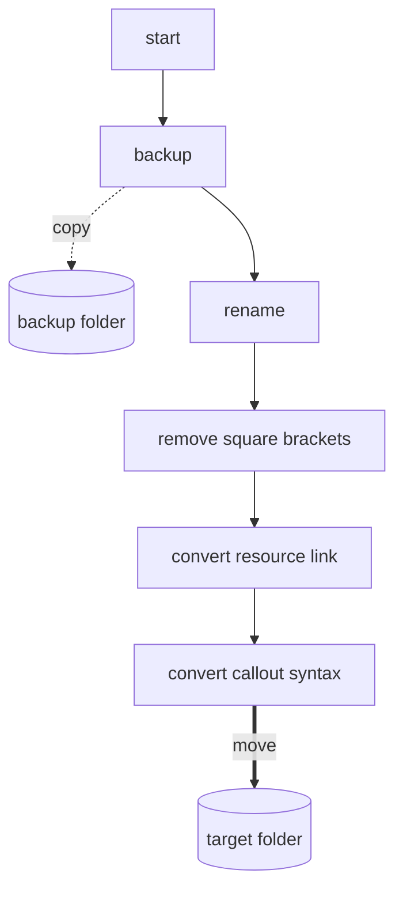
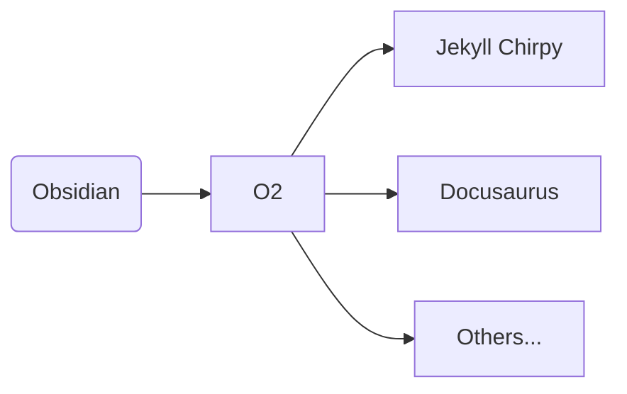
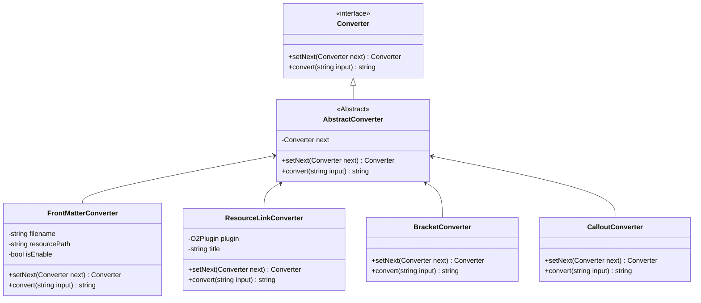
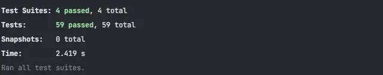

この記事では、[O2](https://github.com/songkg7/o2)プロジェクトの構造をデザインパターンを用いて改善し、より柔軟な管理を実現するプロセスについて説明します。

## 問題

開発に勤しんでいると、ある日突然[Issue](https://github.com/songkg7/o2/issues/50)が提起されました。


[Issue](https://github.com/songkg7/o2/issues/50)の内容を反映するのは難しくありませんでした。しかし、コードを掘り下げていくうちに、しばらく放置していた問題が浮上してきました。


以下は、以前に書かれたMarkdown構文変換コードの実装です。

:::warning

コードが長いため、一部抜粋しています。完全なコードはO2プラグイン[v1.1.1](https://github.com/songkg7/o2/releases/tag/1.1.1)をご参照ください 🙏

:::

```typescript
export async function convertToChirpy(plugin: O2Plugin) {
    try {
        await backupOriginalNotes(plugin);
        const markdownFiles = await renameMarkdownFile(plugin);
        for (const file of markdownFiles) {
            // 二重角括弧を削除
            const title = file.name.replace('.md', '').replace(/\s/g, '-');
            const contents = removeSquareBrackets(await plugin.app.vault.read(file));
            // リソースリンクをjekyllリンクに変換
            const resourceConvertedContents = convertResourceLink(plugin, title, contents);

            // コールアウト
            const result = convertCalloutSyntaxToChirpy(resourceConvertedContents);

            await plugin.app.vault.modify(file, result);
        }

        await moveFilesToChirpy(plugin);
        new Notice('Chirpy変換が完了しました。');
    } catch (e) {
        console.error(e);
        new Notice('Chirpy変換に失敗しました。');
    }
}
```

TypeScriptやObsidianの使用に不慣れだったため、全体のデザインよりも機能の実装に重点を置いていました。新しい機能を追加しようとすると、副作用を予測するのが難しく、コードの実装が開発者の意図を明確に伝えることができませんでした。

コードの流れをよりよく理解するために、現在のプロセスのグラフを作成しました。



機能を関数に分けたものの、コードは依然として手続き的に書かれており、コード行の順序が全体の動作に大きく影響していました。この状態で新しい機能を追加するには、全体の変換プロセスを壊さないように正確に実装する必要があります。新しい機能をどこに実装すればよいのか？その答えはおそらく「コードを見なければならない」でしょう。現在、ほとんどのコードが一つの大きなファイルに書かれているため、全体のコードを分析する必要があるのとほぼ同じです。オブジェクト指向の観点から言えば、**単一責任の原則 (SRP)** が適切に守られていないと言えます。

この状態は、どれだけ前向きに表現しても、メンテナンスが容易ではないように思えました。O2プラグインは個人的な使用のために作成されたものなので、「TSに不慣れだから」と合理化して、メンテナンスが難しいスパゲッティコードを生産することを正当化することはできませんでした。

Issueを解決する前に、まず構造を改善することにしました。

## どのような構造を実装すべきか？

O2プラグインは、構文変換プラグインとして、ObsidianのMarkdown構文をさまざまな形式に変換できる必要があります。これは明確な要件です。



したがって、デザインは主に拡張性に焦点を当てるべきです。

各**プラットフォームロジックをモジュール化**し、**変換プロセスを抽象化**してテンプレートのように実装する必要があります。これにより、異なるプラットフォームの構文をサポートする新しい機能を実装する際に、開発者は構文変換の小さな単位の実装に集中でき、全体のフローを再実装する必要がなくなります。

これに基づいて、デザイン要件は次のようになります：

1. 文字列（Markdownファイルの内容）は必要に応じて順番に（または順番に）変換されるべきです。
2. 特定の変換ロジックはスキップ可能であり、外部設定に基づいて動的に制御可能であるべきです。
3. 新しい機能の実装は簡単であり、既存のコードに最小限の影響しか与えないべきです。

実行の順序があり、機能を追加する能力があるため、責任の連鎖パターンがこの目的に適しているように思えました。

### デザインパターンの適用

プロセス->プロセス->プロセス->完了！
: 責任の連鎖の要約

```typescript
export interface Converter {
    setNext(next: Converter): Converter;
    convert(input: string): string;
}

export abstract class AbstractConverter implements Converter {
    private next: Converter;

    setNext(next: Converter): Converter {
        this.next = next;
        return next;
    }

    convert(input: string): string {
        if (this.next) {
            return this.next.convert(input);
        }
        return input;
    }
}
```

`Converter`インターフェースは、`convert(input)`を通じて特定の文字列を変換する役割を果たします。`setNext`で次に処理する`Converter`を指定し、再び`Converter`を返すことで、メソッドチェーンを使用できます。

抽象化が行われたことで、以前は一つのファイルに実装されていた変換ロジックが、各機能に責任を持つ個々の`Converter`実装に分離されました。以下は、コールアウト構文変換ロジックを分離した`CalloutConverter`の例です。

```typescript
export class CalloutConverter extends AbstractConverter {
    convert(input: string): string {
        const result = convertCalloutSyntaxToChirpy(input);
        return super.convert(result);
    }
}

function convertCalloutSyntaxToChirpy(content: string) {
    function replacer(match: string, p1: string, p2: string) {
        return `${p2}\n{: .prompt-${replaceKeyword(p1)}}`;
    }

    return content.replace(ObsidianRegex.CALLOUT, replacer);
}
```

現在、クラス間の関係は次のようになっています。



現在、各`Converter`に実装された最小単位の機能を組み合わせることで、順番に操作を行うチェーンが作成されます。これが、このパターンが責任の連鎖と呼ばれる理由です。

```typescript
export async function convertToChirpy(plugin: O2Plugin) {
    // ...
    // 変換チェーンを作成
    frontMatterConverter.setNext(bracketConverter)
        .setNext(resourceLinkConverter)
        .setNext(calloutConverter);

    // 先頭のfrontMatterConverterに変換を依頼し、接続されたコンバータが順次動作します。
    const result = frontMatterConverter.convert(await plugin.app.vault.read(file));
    await plugin.app.vault.modify(file, result);
    // ...
}
```

現在、ロジックが適切な責任に分離されているため、コードの読み取りが非常に簡単になりました。新しい機能を追加する必要がある場合は、必要な`Converter`を実装するだけで済みます。また、他の`Converter`がどのように動作するかを知る必要がなく、`setNext`を通じて新しい機能を追加できます。各`Converter`は独立して動作し、カプセル化の原則に従います。

最後に、すべてのテストが通過したことを確認し、[PR](https://github.com/songkg7/o2/pull/51)を作成しました。



### 次のステップ

構造が大幅に改善されたものの、まだ一つの欠点が残っています。`setNext`でリンクされた構造では、正しく動作するためには最前の`Converter`を呼び出す必要があります。最前の`Converter`ではなく、別の`Converter`を呼び出すと、意図した結果とは異なる結果になる可能性があります。例えば、`NewConverter`が`frontMatterConverter`の前に実装されているが、`frontMatterConverter.convert(input)`が変更されていない場合、`NewConverter`は適用されません。

```mermaid
flowchart LR
new[NewConverter] --> fm[FrontMatterConverter]
fm --> bc[BracketConverter]
call(convert) -.call.-> fm
 ```

これは開発者が注意を払う必要がある点であり、エラーの余地があるため、将来的に改善が必要な領域の一つです。例えば、`Converter`を含む`Context`のようなものを実装し、直接`Converter`を呼び出すことなく変換プロセスを実行する方法が考えられます。これは次のバージョンで実装する予定です。

---

### 2023-03-12 アップデート

[PR](https://github.com/songkg7/o2/pull/61)のおかげで、同じ機能が継承ではなくコンポジションを使用して、より柔軟な構造で実行されました。

```mermaid
classDiagram
class ConverterChain {
 -List~Converter~ converters
 +chaining(Converter converter) ConverterChain
 +converting(string input) string
}
class Converter {
 <<interface>>
 +convert(string input) string
}
ConverterChain*--Converter

class FrontMatterConverter {
  -string filename
  -string resourcePath
  -bool isEnable
  +convert(string input) string
}
Converter <|-- FrontMatterConverter

class ResourceLinkConverter {
  -O2Plugin plugin
  -string title
  +convert(string input) string
}
Converter <|-- ResourceLinkConverter

class WikiLinkConverter {
  +convert(string input) string
}
Converter <|-- WikiLinkConverter

class CalloutConverter {
  +convert(string input) string
}
Converter <|-- CalloutConverter
```

## 結論

この記事では、手続き的に書かれたモノリシックなファイルから、デザインパターンを通じて役割と責任を再分配し、よりオブジェクト指向でメンテナンスしやすいコードに改善するプロセスを説明しました。

:::info

完全なコードは[GitHub](https://github.com/songkg7/o2)で確認できます。

:::
