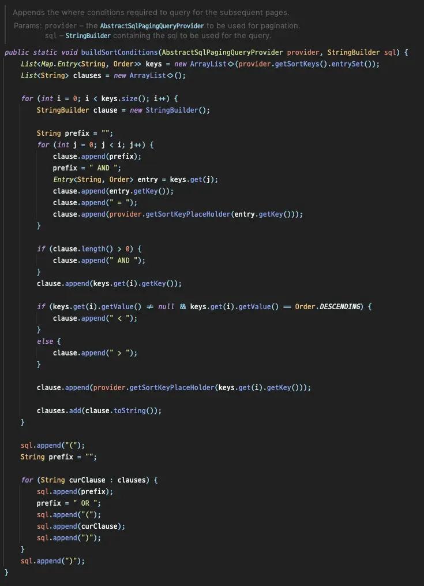
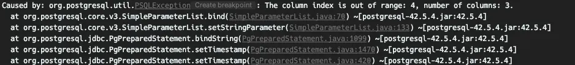
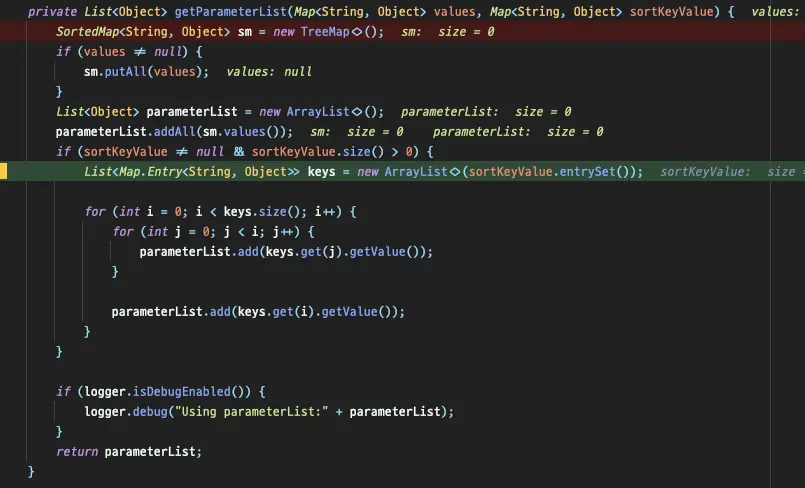

この記事では、Spring Batchを使用して数百万件のデータを持つテーブルをクエリする際に直面した問題とその解決策について説明します。

## 環境

- Spring Batch 5.0.1
- PostgreSQL 11

## 問題

`JdbcPagingItemReader`を使用して大規模なテーブルをクエリしていると、時間の経過とともにクエリのパフォーマンスが著しく低下することに気付き、コードを詳細に調査することにしました。

### デフォルトの動作

`PagingQueryProvider`によって自動生成され実行されるクエリは次の通りです：

```sql
SELECT *
FROM large_table
WHERE id > ?
ORDER BY id
LIMIT 1000;
```

Spring Batchでは、`JdbcPagingItemReader`を使用する際にオフセットを使用する代わりに、ページネーションのためのwhere句を生成します。これにより、数百万件のレコードを持つテーブルからでも遅延なくデータを高速に取得できます。

:::tip

`LIMIT`を使用しても、`OFFSET`を使用すると以前のデータをすべて再度読み込むことになります。そのため、読み込むデータ量が増えるとパフォーマンスが低下します。詳細については、この記事[^fn-nth-1]を参照してください。

:::

### 複数のソート条件を使用する場合

**複合キーを使用するテーブルをクエリする際に問題が発生します**。3つのカラムからなる複合キーをソートキーとして使用すると、生成されるクエリは次のようになります：

```sql
SELECT *
FROM large_table
WHERE ((create_at > ?) OR
       (create_at = ? AND user_id > ?) OR
       (create_at = ? AND user_id = ? AND content_no > ?))
ORDER BY create_at, user_id, content_no
LIMIT 1000;
```

しかし、**where句にOR操作が含まれるクエリはインデックスを効果的に利用できません**。OR操作は複数の条件を実行する必要があり、オプティマイザが正確な判断を下すのが難しくなります。`explain`の出力を調べたところ、次のような結果が得られました：

```log
Limit  (cost=0.56..1902.12 rows=1000 width=327) (actual time=29065.549..29070.808 rows=1000 loops=1)
  ->  Index Scan using th_large_table_pkey on large_table  (cost=0.56..31990859.76 rows=16823528 width=327) (actual time=29065.547..29070.627 rows=1000 loops=1)
"        Filter: ((""create_at"" > '2023-01-28 06:58:13'::create_at without time zone) OR ((""create_at"" = '2023-01-28 06:58:13'::create_at without time zone) AND ((user_id)::text > '441997000'::text)) OR ((""create_at"" = '2023-01-28 06:58:13'::create_at without time zone) AND ((user_id)::text = '441997000'::text) AND ((content_no)::text > '9070711'::text)))"
        Rows Removed by Filter: 10000001
Planning Time: 0.152 ms
Execution Time: 29070.915 ms
```

クエリの実行時間が30秒近くかかり、インデックス上でフィルタリング中にほとんどのデータが破棄され、不要な時間が浪費されています。

PostgreSQLは複合キーをタプルとして管理しているため、タプルを使用してクエリを書くことで、複雑なwhere句でもインデックススキャンの利点を活用できます。

```sql
SELECT *
FROM large_table
WHERE (create_at, user_id, content_no) > (?, ?, ?)
ORDER BY create_at, user_id, content_no
LIMIT 1000;
```

```log
Limit  (cost=0.56..1196.69 rows=1000 width=327) (actual time=3.204..11.393 rows=1000 loops=1)
  ->  Index Scan using th_large_table_pkey on large_table  (cost=0.56..20122898.60 rows=16823319 width=327) (actual time=3.202..11.297 rows=1000 loops=1)
"        Index Cond: (ROW(""create_at"", (user_id)::text, (content_no)::text) > ROW('2023-01-28 06:58:13'::create_at without time zone, '441997000'::text, '9070711'::text))"
Planning Time: 0.276 ms
Execution Time: 11.475 ms
```

フィルタリングによってデータを破棄することなく、インデックスを通じて直接データが取得されていることがわかります。

したがって、`JdbcPagingItemReader`が実行するクエリがタプルを使用する場合、複合キーをソートキーとして使用しても、非常に迅速に処理を行うことができます。

では、コードに入りましょう。

## PagingQueryProviderの修正

### 分析

前述のように、クエリ生成の責任は`PagingQueryProvider`にあります。私はPostgreSQLを使用しているため、`PostgresPagingQueryProvider`が選択され使用されています。


_生成されるクエリは、`group by`句を含むかどうかによって異なります。_

`SqlPagingQueryUtils`の`buildSortConditions`を調べると、問題のあるクエリがどのように生成されるかがわかります。



ネストされたforループ内で、ソートキーに基づいてクエリが生成される様子がわかります。

### `buildSortConditions`のカスタマイズ

クエリ生成の責任を持つコードを直接確認した後、このコードを修正して望ましい動作を実現することにしました。しかし、このコードを直接オーバーライドすることはできないため、`PostgresOptimizingQueryProvider`という新しいクラスを作成し、このクラス内でコードを再実装しました。

```java
private String buildSortConditions(StringBuilder sql) {
    Map<String, Order> sortKeys = getSortKeys();
    sql.append("(");
    sortKeys.keySet().forEach(key -> sql.append(key).append(", "));
    sql.delete(sql.length() - 2, sql.length());
    if (is(sortKeys, order -> order == Order.ASCENDING)) {
        sql.append(") > (");
    } else if (is(sortKeys, order -> order == Order.DESCENDING)) {
        sql.append(") < (");
    } else {
        throw new IllegalStateException("Cannot mix ascending and descending sort keys"); // タプルの制限
    }
    sortKeys.keySet().forEach(key -> sql.append("?, "));
    sql.delete(sql.length() - 2, sql.length());
    sql.append(")");
    return sql.toString();
}
```

### テストコード

新しく実装した部分が正しく動作することを確認するために、テストコードを通じて検証しました。

```java
@Test
@DisplayName("Offsetの代わりに生成されるWhere句は(create_at, user_id, content_no) > (?, ?, ?)です。")
void test() {
    // given
    PostgresOptimizingQueryProvider queryProvider = new PostgresOptimizingQueryProvider();
    queryProvider.setSelectClause("*");
    queryProvider.setFromClause("large_table");

    Map<String, Order> parameterMap = new LinkedHashMap<>();
    parameterMap.put("create_at", Order.ASCENDING);
    parameterMap.put("user_id", Order.ASCENDING);
    parameterMap.put("content_no", Order.ASCENDING);
    queryProvider.setSortKeys(parameterMap);

    // when
    String firstQuery = queryProvider.generateFirstPageQuery(10);
    String secondQuery = queryProvider.generateRemainingPagesQuery(10);

    // then
    assertThat(firstQuery).isEqualTo("SELECT * FROM large_table ORDER BY create_at ASC, user_id ASC, content_no ASC LIMIT 10");
    assertThat(secondQuery).isEqualTo("SELECT * FROM large_table WHERE (create_at, user_id, content_no) > (?, ?, ?) ORDER BY create_at ASC, user_id ASC, content_no ASC LIMIT 10");
}
```


正常に実行されることを確認し、バッチを実行しました。


> _Guy: "終わったのか？"_
>
> _Boy: "黙れ、そんなこと言ったらまた起きるって！"_

しかし、`out of range`エラーが発生し、クエリが変更されたことが認識されていないことがわかりました。



クエリが変更されたからといって、パラメータの注入部分が自動的に認識されるわけではないようなので、再度デバッグしてパラメータの注入部分を見つけましょう。

## JdbcOptimizedPagingItemReader

パラメータは`JdbcPagingItemReader`によって直接作成され、`JdbcPagingItemReader`の`getParameterList`を繰り返してSQLに注入するパラメータの数が増えることがわかりました。



このメソッドをオーバーライドするだけで済むと思いましたが、残念ながらそれは不可能です。多くの考えの末、`JdbcPagingItemReader`全体をコピーし、`getParameterList`部分だけを修正しました。

`JdbcOptimizedPagingItemReader`では、`getParameterList`メソッドが次のようにオーバーライドされています：

```java
private List<Object> getParameterList(Map<String, Object> values, Map<String, Object> sortKeyValue) {
    // ...
    // where句に設定する必要があるパラメータを増やさずに返します。
    return new ArrayList<>(sortKeyValue.values());
}
```

`sortKeyValue`を追加する必要はないので、直接`parameterList`に追加して返します。

では、再度バッチを実行してみましょう。

最初のクエリはパラメータを必要とせずに実行されます、

```log
2023-03-13T17:43:14.240+09:00 DEBUG 70125 --- [           main] o.s.jdbc.core.JdbcTemplate               : Executing SQL query [SELECT * FROM large_table ORDER BY create_at ASC, user_id ASC, content_no ASC LIMIT 2000]
```

次のクエリ実行は前のクエリからパラメータを受け取ります。

```log
2023-03-13T17:43:14.253+09:00 DEBUG 70125 --- [           main] o.s.jdbc.core.JdbcTemplate               : Executing prepared SQL statement [SELECT * FROM large_table WHERE (create_at, user_id, content_no) > (?, ?, ?) ORDER BY create_at ASC, user_id ASC, content_no ASC LIMIT 2000]
```

クエリは意図した通りに実行されました！ 🎉

1000万件以上のレコードを持つページネーション処理では、以前は約30秒かかっていたクエリが0.1秒程度で実行されるようになり、約300倍のパフォーマンス向上を実現しました。


これで、データ量に関係なく、パフォーマンスの低下を心配することなくミリ秒単位でクエリを読み取ることができます。 😎

## 結論

この記事では、複合キーを持つ環境でSpring Batchを最適化する方法を紹介しました。しかし、この方法には欠点があります。それは、複合キーを構成するすべてのカラムが同じソート条件を持たなければならないことです。複合キーによって生成されるインデックス条件内で`desc`や`asc`が混在している場合、この問題を解決するために別のインデックスを使用する必要があります 😢

今日の内容を一行でまとめて記事を締めくくりましょう。

**「複合キーの使用をできるだけ避け、ビジネスに関連しない代替キーを使用する。」**

## 参考文献

- [Stack overflow](https://stackoverflow.com/questions/34110504/optimize-query-with-offset-on-large-table)

---

[^fn-nth-1]: https://jojoldu.tistory.com/528
