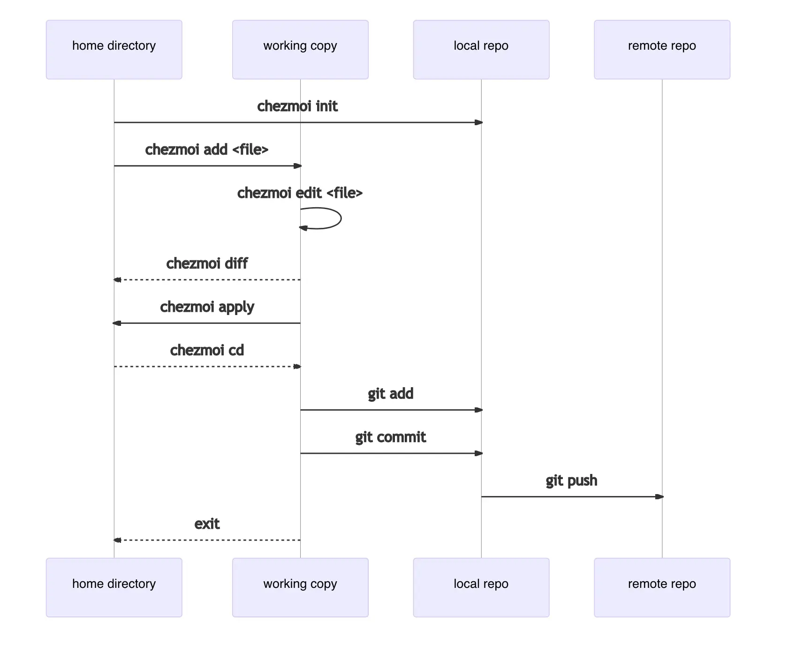
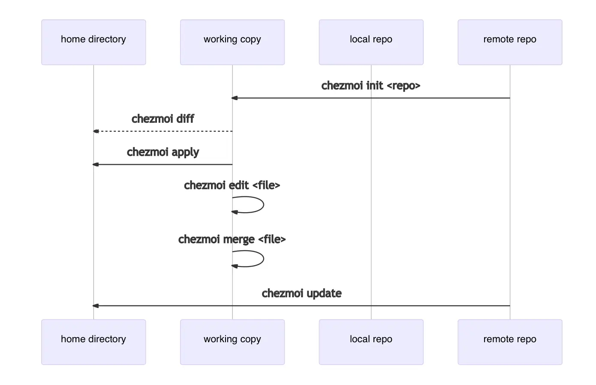
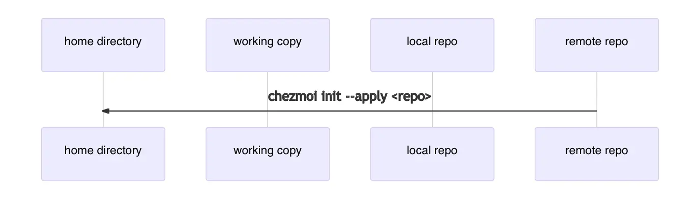

新しいMacBookを手に入れた後、開発環境を再設定することに圧倒されたことはありませんか？または、仕事中に素晴らしいツールを見つけたけれど、自宅の個人環境で再設定するのが面倒だと感じたことはありませんか？設定をGitHubにプッシュするのをセキュリティの懸念からためらったことはありませんか？

複数のデバイスを使用している場合、これらのジレンマに直面したことがあるかもしれません。異なるプラットフォーム間で設定を一貫して管理するにはどうすれば良いのでしょうか？

## 問題

さまざまなソフトウェアの設定ファイル（例：`.zshrc`）は、$HOME（ルート）を含む異なるパスに散在しています。しかし、これらのファイルをバージョン管理するためにルートでGitを設定するのは大変です。広範囲にわたるスキャンが実際にはファイル管理をさらに難しくすることがあります。

仕事用のMacBook、自宅のiMac、個人用のMacBookの3つのデバイスで一貫した開発環境を維持するのは、ほぼ不可能に思えました。

> 仕事中にVimのショートカットを1つ変更しただけで、仕事が終わった後に他の2つのデバイスでも同じ変更をしなければならないことに気づく... 😭

Apple Silicon時代の到来により、Intel Macと新しいデバイスとの間の大きな違いが、一貫した環境を実現するのをさらに難しくしました。仕事で頻繁に使用するエイリアスを自宅のマシンで設定するのを忘れることが多かったため、この問題について長い間考えていました。

この問題を解決するために試した方法のいくつかは次のとおりです：

1. **ドットファイルを特定のフォルダーに集中させ、Gitプロジェクトとして管理する**
    1. ドットファイルの場所はさまざまです。ほとんどの場合、ルートにない場合でも事前に定義された場所があります。
    2. Gitが設定されたフォルダーで直接作業することはできず、他のデバイスにコピー＆ペーストする必要があります。

2. **シンボリックリンク**
    1. 新しいデバイスでセットアップするには、すべてのファイルのシンボリックリンクを正しい場所に再作成する必要があります（...）。管理するファイルが多い場合、これは面倒な作業です。
    2. Gitよりも使用が複雑で、さまざまな詳細に注意を払う必要があります。

最終的に、Gitメソッドを使用しましたが、ルートにないファイル（`~/.ssh/config`、`~/.config/nvim`など）に対してのみで、ルートを使用するファイル（`~/.zshrc`、`~/.gitconfig`など）については部分的に諦めていました。しかし、**chezmoi**を発見するまでのことです！

それでは、この難しい問題をエレガントに解決する**chezmoi**を紹介します。

## Chezmoiとは？

> 複数の多様なマシン間でドットファイルを安全に管理します。
> \- chezmoi.io

**Chezmoi**は、さまざまな環境やデバイス間で多数のドットファイルを一貫して管理できるツールです。公式ドキュメントに記載されているように、いくつかの設定を行うだけで「セキュリティ」を確保できます。ドットファイルがどこにあるか、どこに配置すべきかを心配する必要はありません。**chezmoi**に管理するドットファイルを伝えるだけで済みます。

### コンセプト

この一見魔法のような偉業はどのように可能なのでしょうか？ 🤔

本質的に、**chezmoi**はドットファイルを`~/.local/share/chezmoi`に保存し、`chezmoi apply`を実行すると、各ドットファイルの状態をチェックし、最小限の変更を加えて希望する状態に一致させます。詳細なコンセプトについては、[リファレンスマニュアル](https://www.chezmoi.io/reference/concepts/)を参照してください。

それでは、簡単に使い方を説明します。

## Chezmoiの始め方

**chezmoi**をインストールしたら（インストールガイドは[こちら](https://www.chezmoi.io/install/)）、次のコマンドで初期化を行います：

```bash
chezmoi init
```

この操作により、ローカルデバイスの`~/.local/share/chezmoi`（作業ディレクトリ）に新しいGitリポジトリが作成され、ドットファイルが保存されます。デフォルトでは、**chezmoi**はローカルデバイスの作業ディレクトリに変更を反映します。

`~/.zshrc`ファイルを**chezmoi**で管理したい場合は、次のコマンドを実行します：

```bash
chezmoi add ~/.zshrc
```

`~/.zshrc`ファイルが`~/.local/share/chezmoi/dot_zshrc`にコピーされたことがわかります。

**chezmoi**で管理されている`~/.zshrc`ファイルを編集するには、次のコマンドを使用します：

```bash
chezmoi edit ~/.zshrc
```

このコマンドは、`$EDITOR`で`~/.local/share/chezmoi/dot_zshrc`を開いて編集します。テストのためにいくつかの変更を加えて保存します。

:::info

環境変数に`$EDITOR`が設定されていない場合、デフォルトで`vi`が使用されます。

:::

作業ディレクトリでどのような変更が行われたかを確認するには、次のコマンドを使用します：

```bash
chezmoi diff
```

**chezmoi**によってローカルデバイスに適用された変更を反映するには、次のコマンドを使用します：

```bash
chezmoi apply -v
```

すべての**chezmoi**コマンドは`-v`（詳細）オプションを使用できます。このオプションは、ローカルデバイスに適用される内容を視覚的に表示し、コンソールで明確にします。`-n`（ドライラン）オプションを使用すると、コマンドを適用せずに実行できます。したがって、`-v`と`-n`オプションを組み合わせることで、見慣れないコマンドを実行する前にどのようなアクションが取られるかをプレビューできます。

それでは、ソースディレクトリに直接アクセスし、**chezmoi**の内容をリモートリポジトリにプッシュしましょう。リポジトリ名を`dotfiles`にすることをお勧めします。後で説明します。

```bash
chezmoi cd
git add .
git commit -m "Initial commit"
git remote add origin https://github.com/$GITHUB_USERNAME/dotfiles.git
git push
```

:::tip

`chezmoi.toml`ファイルに関連設定を書き込むことで、リポジトリの同期プロセスを自動化し、より便利に使用できます。

:::

**chezmoi**の作業ディレクトリを終了するには、次のコマンドを使用します：

```bash
exit
```

ここまでのプロセスを視覚化すると、次のようになります：



## 別のデバイスでChezmoiを使用する

これが**chezmoi**を使用する理由です。**chezmoi**を使用して2台目のデバイスに内容を取得しましょう。この例ではSSH URLを使用しています。2台目のデバイスに**chezmoi**がすでにインストールされていると仮定します。

```bash
chezmoi init git@github.com:$GITHUB_USERNAME/dotfiles.git
```

特定のリポジトリで初期化することで、**chezmoi**は自動的にサブモジュールや必要な外部ソースファイルをチェックし、オプションに基づいてchezmoiの設定ファイルを生成します。

先ほど見た`diff`コマンドを使用して、**chezmoi**が2台目のデバイスにどのような変更をもたらすかを確認します。

```bash
chezmoi diff
```

すべての変更を適用することに満足している場合は、先ほど説明した`apply`コマンドを使用します。

```bash
chezmoi apply -v
```

ローカルに適用する前にいくつかのファイルを変更する必要がある場合は、`edit`を使用します。

```bash
chezmoi edit $FILE
```

または、マージツールを使用してGitマージのようにローカルの変更を適用することもできます。

```bash
chezmoi merge $FILE
```

:::tip

`chezmoi merge-all`を使用すると、マージが必要なすべてのファイルに対してマージ操作を実行できます。

:::

これらの手順をすべて一度に実行するには、次のコマンドを使用します：

```bash
chezmoi update -v
```

このプロセスを視覚化すると、次のようになります：



初期化時に2台目のデバイスで必要なすべての手順を適用することもできます...！この機能は、2台目のデバイスが新しく購入したものである場合に非常に便利です。

```bash
chezmoi init --apply https://github.com/$GITHUB_USERNAME/dotfiles.git
```

リポジトリ名を`dotfiles`にすることをお勧めした理由は、リポジトリが`dotfiles`という名前であれば、前述のコマンドの短縮版を使用できるからです。

```bash
chezmoi init --apply $GITHUB_USERNAME
```



本当に便利です...🥹 2023年に発見された最高のオープンソースツールの1つになると信じています。

## 結論

**chezmoi**は非常に良く文書化されており、活発に開発されています。Golangで開発されているため、非常に高速に感じます 😄。シェルスクリプトの知識があれば、高度に自動化されたプロセスを実装し、複数のデバイス間で設定にほとんど介入する必要のない環境を作成できます。

この記事では、**chezmoi**の基本的な使い方を紹介しました。次の記事では、**chezmoi**の設定ファイルの管理とセキュリティの維持について詳しく説明します。

:::info

私の設定に興味がある場合は、[こちら](https://github.com/songkg7/dotfiles)で確認できます。

:::

## 参考文献

- [chezmoi](https://www.chezmoi.io)
