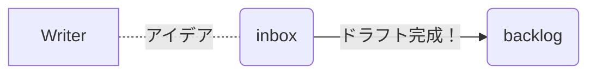
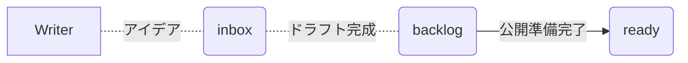
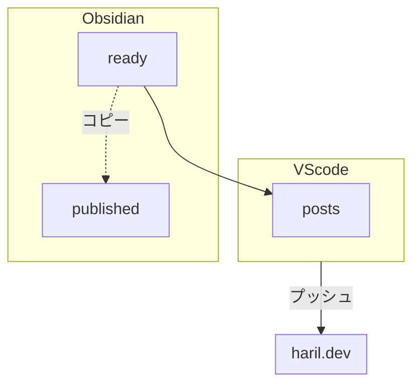

私は主にMarkdownエディタのObsidianを使って執筆し、ブログはGitHub Pagesでホストしています。この2つの異なるプラットフォームで中断せずに書く習慣を維持するために、私の方法を共有します。

:::info

この投稿は、[Sungyun](https://github.com/zzsza)さんの글또(geultto)でのプレゼンテーションに触発されました。

:::

## 素材の収集

仕事やサイドプロジェクト、勉強などのさまざまな状況で、知らないトピックに出会うことがよくあります。そのたびに、新しいノートをすぐに作成します[^fn-nth-1]。このノートには、よく知らなかったキーワードに焦点を当てて、1～2行の簡単な要約を書きます。

最初から詳細に整理しようとはしません。まだトピックに詳しくないので、疲れることがあります。また、新しく学んだ情報がすぐに重要であるとは限りません。しかし、後で同じトピックについてのノートを作成しないように、ノートのタイトルやタグに注意を払い、簡単に検索できるようにします。

重要なポイントは、このプロセスが**継続的である**ことです。すでに同じトピックに関するノートが存在する場合、それらは充実していきます。繰り返しを通じて、最終的には良い投稿が生まれます。

最初に作成されたノートは「inbox」というディレクトリに保存されます。

## 学習と整理

ノートがinboxに積み重なっていきます... それを片付ける必要がありますよね？

有用で整理しやすい素材を見つけたら、そのトピックを勉強し、ラフなドラフトを書きます。この段階では、ブログのためではなく、自分の学習のために書いています。簡単なメモなので、書き方や表現は多少柔軟です。~~投稿の構造を面白くするために、ユーモアを加えることもあります...~~

このドラフトを書いた後、それがブログに投稿するのに適しているかどうかを評価します。もし他のコミュニティやブログで過度にカバーされているトピックであれば、差別化のために別途投稿しないことが多いです。

:::info

しかし、問題の解決策を紹介したり、個人的な経験を共有したりするような個人的な経験に関連するコンテンツについては、他のブログに似た投稿があっても、自分の感情や視点が異なるため、書くようにしています。

:::

整理された投稿は、backlogディレクトリに移動されます。

## ブログ投稿の選定

inboxほどではありませんが、backlogにはある程度完成した投稿が蓄積されます。そこには約10件の投稿がバッファのように存在します。時間が経つと、内容に対する考えが変わり、編集が必要になったり、誤った情報が見つかり再度勉強が必要になったりする場合、いくつかの投稿は再びinboxに降格されます。これは、誤った情報の拡散を防ぐために私が個人的に行う最小限の検証プロセスです。すべての困難を乗り越えた投稿は、個人的な学習投稿から他の人が見るための投稿に洗練されます。

投稿が満足のいくものになったら、「ready」ディレクトリに移動し、ブログの公開準備が整います。

## アップロード

アップロードの準備が整ったら、O2を使用して「ready」にあるノートをMarkdown形式に変換し、Jekyllプロジェクトフォルダに移動します。

:::info

[O2](https://github.com/songkg7/o2)は、Obsidianで書かれたノートをMarkdown形式に変換するためのコミュニティプラグインです。

:::

_画像リンクが自動的に変換される様子がわかります。_

「ready」にあるノートは、Jekyllプロジェクトに移動する前に公開ディレクトリにコピーされ、バックアップとして保存されます。すべてのObsidian固有の構文は基本的なMarkdownに変換され、添付ファイルがある場合はノートと一緒にJekyllプロジェクトフォルダにコピーされます。添付ファイルのパスが変更されるため、Obsidianで機能していたMarkdownリンクが壊れることがありますが、すべてがO2によって自動化されているため心配いりません[^fn-nth-2]。😄 [^fn-nth-3]

ここで、ツールをObsidianからVScodeに切り替えます。Jekyllブログの管理にはコードを扱う必要があることがあります。これは単純なMarkdownエディタでは対応できないため、Obsidianで作業を続けるといくつかの課題が生じるかもしれません。

文法やコンテキストを簡単に確認し、`npm run publish`を実行してブログ投稿の公開プロセスを完了します。

:::info

公開についての詳細は[この投稿](https://haril.dev/jp/blog/2023/04/26/Image-optimazation-for-SEO)で学ぶことができます。

:::

## 校正

定期的に投稿を見直し、見逃した文法の誤りや不自然な表現を修正し、徐々に洗練させていきます。このプロセスには明確な終わりはなく、時々ブログをチェックして一貫して修正を行います。

ブログ投稿のパイプラインはここで終了しますが、より良い投稿を書くための活用方法を簡単に説明します。

## オプション. データ分析

Obsidianにはグラフビュー機能があります。この機能を利用することで、ノートが有機的にどのように接続されているかを視覚化し、データ分析に活用できます。

_グラフでは、明るい緑色のノードだけがブログに公開された投稿です。_

ほとんどのノートはまだ勉強中のトピックや、ブログ公開に至らなかった投稿です。このグラフから以下のことが推測できます：

- 中心に多くのエッジがあるがブログ投稿として公開されていないノードは、非常に一般的なトピックをカバーしている可能性が高く、公開しないことを選んだものです。~~または単に怠けていたかもしれません...~~
- 外縁に散らばってエッジがないノードは、まだ深く掘り下げていない断片的な知識を表しています。これらはどのトピックにもリンクされていないため、関連するトピックを学んで内部的に接続する必要があります😂。これらのノードは、関連するトピックを学ぶことで内部的にリンクする必要があります。
- 外縁にあり、公開された投稿は、新しい知識を取得する過程で衝動的に公開された投稿を表しています。衝動的に公開されたため、定期的に見直して内容に誤りがないか確認することが重要です。

この客観的なデータに基づいて、自分がどれだけ知っているか、何を知らないかを定期的に確認し、知識を広げるよう努めています。🧐

## 結論

この投稿では、私のライティングパイプラインと、Obsidianを使ったデータ分析を通じて自分を正確に理解する方法を紹介しました。書くことが単なる作業ではなく、日常の一部になることを願っています！

- 新たに浮かんだアイデアを素早くメモすることで、作業の文脈を失わずに書くことができ、一貫して書くことが可能になります。状況に応じて適切なツールを選び、活用しましょう。
- 書くことが苦痛に感じないようにするためには、毎日数分ずつ一貫して追加する方が、何時間もかけて一から書くよりも効率的です。
- ブログの公開は面倒な作業になることがあるため、できるだけ自動化してワークフローをシンプルに保ちましょう。執筆に集中しましょう！
- 自分がどれだけ知っているか、何を知らないかを評価する（自己客観化）。これはブログ投稿のトピックを選定し、学習の方向性を決定するのに大いに役立ちます。

:::info

ブログに投稿されていないドラフトを含むすべての執筆は、[GitHub](https://github.com/songkg7/haril-vault)で公開されています。

:::

--- 

[^fn-nth-1]: 音楽を勉強していた頃から、常にノートを手元に置いていました。何か思いつくのは寝る直前が一番多かったようです。今もあまり変わりません。バグの解決策も寝る直前に思いつくことが多いです...

[^fn-nth-2]: [O2プラグイン開発ストーリー](https://haril.dev/blog/2023/02/22/develop-obsidian-plugin)

[^fn-nth-3]: 各投稿に新しいバグの問題が追加されることもありますが... 😭 ~~???: それは機能です~~
