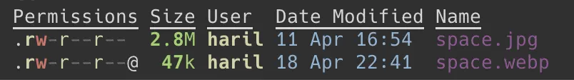
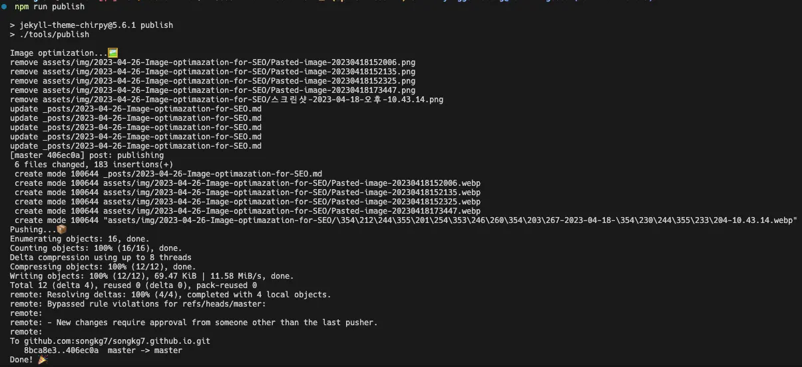

ブログ投稿の自動化プロセスにおいて、SEOのための画像最適化について議論します。これは成功の話ではなく、むしろ失敗の話であり、最終的にはプランBに頼ることになりました。

:::info

コードは[GitHub](https://github.com/songkg7/songkg7.github.io-legacy/blob/master/tools/imagemin.js)で確認できます。

:::

## 問題の特定

SEO最適化のためには、ブログ投稿内の画像をできるだけ小さくするのが最善です。これにより、検索エンジンのクロールボットの効率が向上し、ページの読み込み速度が速くなり、ユーザーエクスペリエンスにも良い影響を与えます。

では、どの画像フォーマットを使用すべきでしょうか？ 🤔

Googleはこの問題に対処するために**WebP**という画像フォーマットを開発し、その使用を積極的に推奨しています。広告から利益を得るGoogleにとって、画像の最適化はユーザーがウェブサイトの広告に迅速にアクセスできるようにするため、利益に直結します。

実際、約2.8MBのjpgファイルをwebpに変換すると、約47kbに減少しました。これは**50分の1以上の削減**です！ 多少の画質の低下はありましたが、ウェブページ上ではほとんど気になりませんでした。



このレベルの改善があれば、問題を解決するモチベーションは十分です。実装するための情報を集めましょう。

## 解決へのアプローチ

### プランA. O2への機能追加

ブログ投稿のために開発したプラグイン[O2](https://github.com/songkg7/o2)があります。このプラグインの機能の一部として`WebP`変換タスクを含めるのが最も理想的だと考え、まずこのアプローチを試みました。

画像処理で最も有名なライブラリは`sharp`ですが、これはOS依存であり、Obsidianプラグインでは使用できません。これを確認するためにObsidianコミュニティで質問したところ、使用できないという明確な回答を得ました。


_関連するコミュニティの会話_

`sharp`が使用できないため、代替として`imagemin`を使用することにしました。

しかし、重大な問題がありました：`imagemin`はesbuildを実行する際にプラットフォームがnodeであることを要求しますが、Obsidianプラグインはプラットフォームがブラウザであることを要求します。両方のプラットフォームで動作するはずのneutralに設定しても、どちらでも動作しませんでした...


O2に適用できる適切なライブラリをすぐに見つけることができなかったため、フォーマット変換タスクを処理するための簡単なスクリプトを実装することにしました。

### プランB. npmスクリプト

プラグインに機能を追加する代わりに、Jekyllプロジェクト内で直接スクリプトを使ってフォーマットを簡単に変換できます。

```javascript
async function deleteFilesInDirectory(dir) {
    const files = fs.readdirSync(dir);

    files.forEach(function (file) {
        const filePath = path.join(dir, file);
        const extname = path.extname(filePath);
        if (extname === '.png' || extname === '.jpg' || extname === '.jpeg') {
            fs.unlinkSync(filePath);
            console.log(`remove ${filePath}`);
        }
    });
}

async function convertImages(dir) {
    const subDirs = fs
        .readdirSync(dir)
        .filter((file) => fs.statSync(path.join(dir, file)).isDirectory());

    await imagemin([`${dir}/*.{png,jpg,jpeg}`], {
        destination: dir,
        plugins: [imageminWebp({quality: 75})]
    });
    await deleteFilesInDirectory(dir);

    for (const subDir of subDirs) {
        const subDirPath = path.join(dir, subDir);
        await convertImages(subDirPath);
    }
}

(async () => {
    await convertImages('assets/img');
})();
```

この方法では、望む機能を迅速に実装できますが、ユーザーがO2の制御外で変更された画像を手動でマークダウン文書に再リンクする必要があります。

この方法を使用する場合、正規表現を使用してすべてのファイルにリンクされた画像の拡張子を`webp`に変更し、文書内で画像を再リンクするタスクをスキップすることにしました。

```javascript
// 省略
async function updateMarkdownFile(dir) {
    const files = fs.readdirSync(dir);

    files.forEach(function (file) {
        const filePath = path.join(dir, file);
        const extname = path.extname(filePath);
        if (extname === '.md') {
            const data = fs.readFileSync(filePath, 'utf-8');
            const newData = data.replace(
                /(!\^\*]\((.*?)\.(png|jpg|jpeg)\))/g,
                (match, p1, p2, p3) => {
                    return p1.replace(`${p2}.${p3}`, `${p2}.webp`);
                }
            );
            fs.writeFileSync(filePath, newData);
        }
    });
}

(async () => {
    await convertImages('assets/img');
    await updateMarkdownFile('_posts');
})();
```

次に、ブログ投稿を公開する際に実行するスクリプトを書きました。

```bash
#!/usr/bin/env bash

echo "画像最適化中...🖼️"
node tools/imagemin.js

git add .
git commit -m "post: publishing"

echo "プッシュ中...📦"
git push origin master

echo "完了！ 🎉"
```

```bash
./tools/publish
```

ターミナルで直接shを実行するのはなんとなくエレガントではないと感じました。`package.json`に追加して、よりクリーンに使用できるようにしましょう。

```json
{
  "scripts": {
    "publish": "./tools/publish"
  }
}
```

```bash
npm run publish
```


_かなりうまくいきます。_

とりあえず、これで結論を出しました。

## 結論

このプロセスを通じて、ブログ投稿のパイプラインは次のように変わりました：

**以前**


**現在**


結果だけを見ると、それほど悪くないように見えますね...? 🤔

画像フォーマット変換機能をO2プラグインの一部として追加したかったのですが、さまざまな理由で適用できませんでした（今のところ）。JSとshを使用する方法は、ユーザーに追加のアクションを要求し、メンテナンスが容易ではありません。この機能を内部的にO2に取り込む方法を一貫して考える必要があります。

## 参考文献

- [Sharp](https://sharp.pixelplumbing.com/)
- [Imagemin](https://github.com/imagemin/imagemin)
- [Github issue](https://github.com/songkg7/o2/issues/99)
