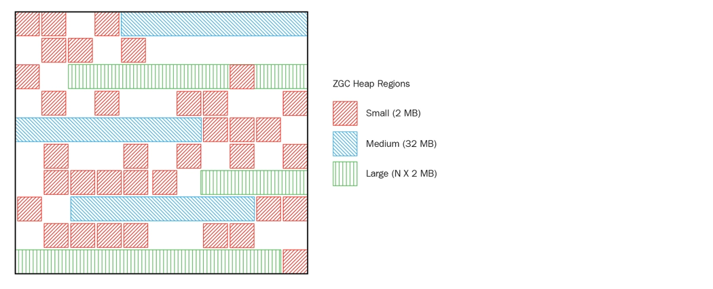

## 概要

JVMにおけるガベージコレクション（GC）のトピックについて掘り下げてみましょう。

## GCとは？

JVMのメモリは複数の領域に分かれています。


ヒープ領域は、`new`などの操作で作成されたオブジェクトや配列が格納される場所です。ヒープ領域で作成されたオブジェクトや配列は他のオブジェクトから参照されることがあります。GCはまさにこのヒープ領域で行われます。

Javaプログラムが終了せずに実行を続けると、メモリにデータが蓄積され続けます。GCはこの問題を解決します。

どうやって解決するのでしょうか？JVMは**到達不能なオブジェクト**をGCの対象として識別します。どのオブジェクトが到達不能になるかを理解するためには、以下のコードを見てみましょう。

```java
public class Main {
 public static void main(String[] args) {
  Person person = new Person("a", "すぐに参照されなくなる");
  person = new Person("b", "参照が維持される");
 }
}
```

`person`が最初に初期化されると、作成された`a`は次の行で`b`に再割り当てされ、到達不能なオブジェクトになります。次のGCで`a`はメモリから解放されます。

## ストップ・ザ・ワールド


_ザ・ワールド！時よ止まれ！ - ジョジョの奇妙な冒険_

アプリケーションの実行を停止してGCを行います。**「ストップ・ザ・ワールド」イベントが発生すると、GCを実行しているスレッド以外のすべてのスレッドが一時停止します。** GC操作が完了すると、一時停止していたタスクが再開されます。使用されるGCアルゴリズムに関係なく、「ストップ・ザ・ワールド」イベントは発生し、GCのチューニングは通常、この一時停止状態の時間を短縮することを目的としています。

:::warning

Javaではプログラムコード内で明示的にメモリを解放することはありません。オブジェクトを`null`に設定して解放することは大きな問題ではありませんが、`System.gc()`を呼び出すとシステムのパフォーマンスに大きな影響を与える可能性があり、絶対に使用すべきではありません。さらに、`System.gc()`は実際にGCが発生することを保証しません。

:::

## GCが発生する2つの領域

Javaでは開発者が明示的にメモリを解放しないため、ガベージコレクタが不要になった（ガベージ）オブジェクトを識別して削除する役割を担います。ガベージコレクタは2つの主要な仮定に基づいて動作します：

- ほとんどのオブジェクトはすぐに到達不能になる。
- 古いオブジェクトから若いオブジェクトへの参照は非常に少ない。

### ほとんどのオブジェクトはすぐに到達不能になる

```java
for (int i = 0; i < 10000; i++) {
    NewObject obj = new NewObject();  
    obj.doSomething();
}
```

このループ内で使用される10,000個の`NewObject`インスタンスは、ループ外では必要ありません。これらのオブジェクトがメモリを占有し続けると、他のコードを実行するためのリソースが徐々に減少します。

### 古いオブジェクトから若いオブジェクトへの参照は非常に少ない

以下のコードスニペットを考えてみましょう。

```java
Model model = new Model("value");
doSomething(model);

// modelはもう使用されない
```

最初に作成された`model`は`doSomething`内で使用されますが、その後はあまり使用されることはありません。再利用される場合もありますが、GCはそのようなケースが稀であるという仮定のもとで設計されています。Oracleの統計を見ると、ほとんどのオブジェクトは作成されてからすぐにGCによってクリーンアップされることがわかります。


この仮定は**弱い世代仮説**として知られています。この仮説の利点を最大限に活用するために、HotSpot VMは物理的なスペースを2つの主要な領域に分けています：Young GenerationとOld Generationです。


- Young Generation: この領域には主に新しく作成されたオブジェクトが格納されます。ほとんどのオブジェクトはすぐに到達不能になるため、多くのオブジェクトがYoung Generationで作成され、消滅します。この領域からオブジェクトが消滅すると、Minor GCがトリガーされます。
- Old Generation: Young Generationで到達不能にならずに生き残ったオブジェクトはOld Generationに移動されます。この領域は通常、Young Generationよりも大きく、GCの頻度も少なくなります。この領域からオブジェクトが消滅すると、Major GC（またはFull GC）がトリガーされます。

Young Generationの各オブジェクトには、Minor GCを生き延びるたびにインクリメントされる年齢ビットがあります。この年齢ビットが**MaxTenuringThreshold**という設定を超えると、オブジェクトはOld Generationに移動されます。ただし、年齢ビットが設定を超えなくても、Survivorスペースに十分なメモリがない場合、オブジェクトはOld Generationに移動されることがあります。

:::info

Permanentスペースは、作成されたオブジェクトのアドレスが格納される場所です。クラスローダーがロードされたクラスやメソッドに関するメタ情報を格納するために使用されます。Java 7以前では、ヒープ内に存在していました。

:::

## GCの種類

Old Generationが満杯になるとGCがトリガーされます。異なるGC方法を理解することで、関連する手続きを理解するのに役立ちます。

### Serial GC

> -XX:+UseSerialGC

Serial GCを理解するためには、まずMark-Sweep-Compactアルゴリズムを理解する必要があります。このアルゴリズムの最初のステップは、Old Generation内の生存オブジェクトを識別することです（Mark）。次に、ヒープの前から後ろまでスイープし、生存オブジェクトだけを保持します（Sweep）。最後のステップでは、オブジェクトが連続して積み重なるようにヒープを前から埋めていき、オブジェクトがあるセクションとないセクションに分けます（Compaction）。

:::warning

Serial GCはメモリとCPUコアが限られたシステムに適しています。ただし、Serial GCを使用するとアプリケーションのパフォーマンスに大きな影響を与える可能性があります。

:::

### Parallel GC

> -XX:+UseParallelGC

- Java 8のデフォルトGC

基本的なアルゴリズムはSerial GCと似ていますが、Parallel GCはYoung GenerationでのMinor GCを複数のスレッドで実行します。

### Parallel Old GC

> -XX:+UseParallelOldGC

- Parallel GCの改良版

名前が示すように、このGC方法はOld Generationに関連しています。ParallelGCがYoung Generationのみで複数のスレッドを使用するのに対し、Parallel Old GCはOld Generationでも複数のスレッドを使用してGCを実行します。

### CMS GC（Concurrent Mark Sweep）

このGCは、アプリケーションスレッドとGCスレッドが同時に実行されることで「ストップ・ザ・ワールド」時間を最小限に抑えるように設計されています。GCターゲットを識別するための多段階プロセスのため、他のGC方法と比較してCPU使用率が高くなります。

最終的に、CMS GCはJava 9から非推奨となり、**Java 14で完全に廃止されました**。

### G1GC（Garbage First）

> -XX:+UseG1GC

- CMS GCを置き換えるためにJDK 7でリリース
- Java 9以降のデフォルトGC
- 4GB以上のヒープメモリが必要で、「ストップ・ザ・ワールド」時間が約0.5秒で許容される場合に推奨（小さなヒープの場合は他のアルゴリズムが推奨されます）

G1GCは完全に再設計されたGC方法であり、新しいアプローチが必要です。

Q. G1GCが後のバージョンでデフォルトとなっていることを考えると、以前のCMSと比較しての利点と欠点は何ですか？

- 利点
  - G1GCはスキャン中にコンパクションを行い、「ストップ・ザ・ワールド」時間を短縮します。
  - 追加の「ストップ・ザ・ワールド」ポーズなしで空きメモリスペースを圧縮する能力を提供します。
  - 文字列重複排除の最適化
  - サイズ、カウントなどのチューニングオプション
- 欠点
  - Full GC中はシングルスレッドで動作します。
  - 小さなヒープサイズのアプリケーションでは頻繁にFull GCイベントが発生する可能性があります。

### Shenandoah GC

> -XX:+UseShenandoahGC

- Java 12でリリース
- Red Hatによって開発
- CMSのメモリ断片化問題とG1のポーズ問題に対処
- 強力な並行性と軽量なGCロジックで知られ、ヒープサイズに関係なく一貫したポーズ時間を保証


### ZGC

> -XX:+UnlockExperimentalVMOptions -XX:+UseZGC

- Java 15でリリース
- 大規模メモリサイズ（8MBから16TB）の低レイテンシ処理用に設計
- G1のリージョンに似たZPagesを使用しますが、ZPagesは2MBの倍数で動的に管理されます（大きなオブジェクトに対応するためにリージョンサイズを動的に調整）
- ZGCの主要な利点の1つは、**ヒープサイズに関係なく「ストップ・ザ・ワールド」時間が10msを超えないことです**



## 結論

さまざまなGCタイプが利用可能ですが、ほとんどの場合、デフォルトのGCを使用するだけで十分です。GCのチューニングには多大な労力が必要であり、GCログやヒープダンプの分析などのタスクが含まれます。GCログの分析については別の記事で取り上げます。

## 参考文献

- [Naver D2](https://d2.naver.com/helloworld/1329)
- [tecoble](https://tecoble.techcourse.co.kr/post/2021-08-30-jvm-gc/)
- [Oracle](https://docs.oracle.com/javase/8/docs/technotes/guides/vm/gctuning/generations.html)
- [How Java Garbage Collection Works](https://mirinae312.github.io/develop/2018/06/04/jvm_gc.html)
- [Java Garbage Collection Principles](https://inpa.tistory.com/entry/JAVA-☕-가비지-컬렉션GC-동작-원리-알고리즘-💯-총정리)
- [Baeldung](https://www.baeldung.com/jvm-garbage-collectors)
