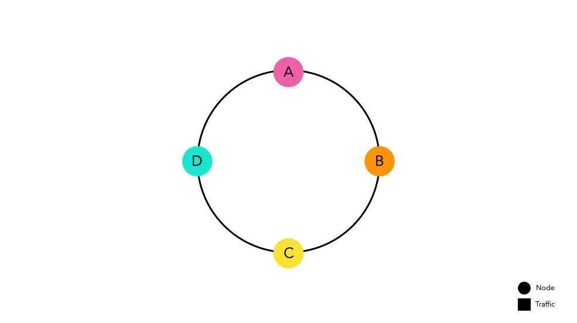
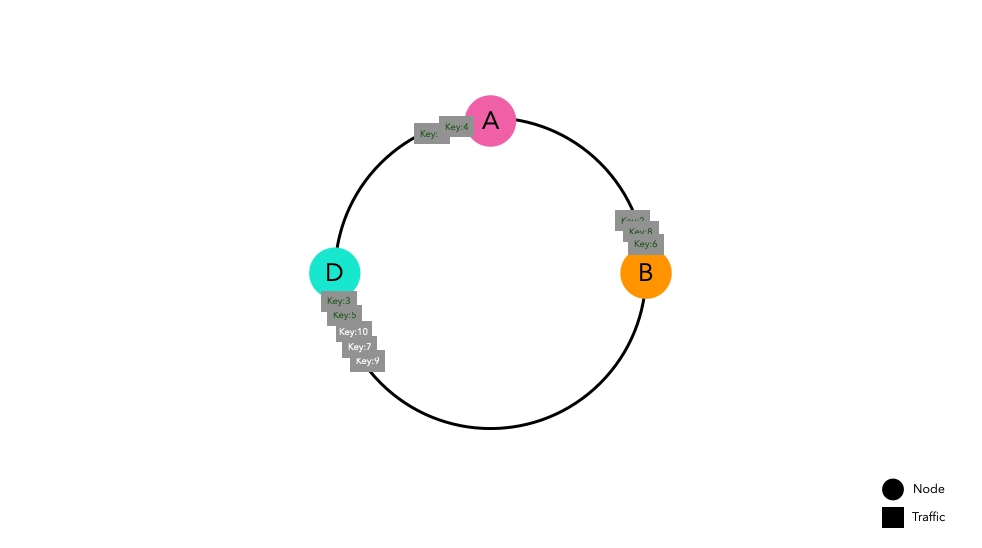
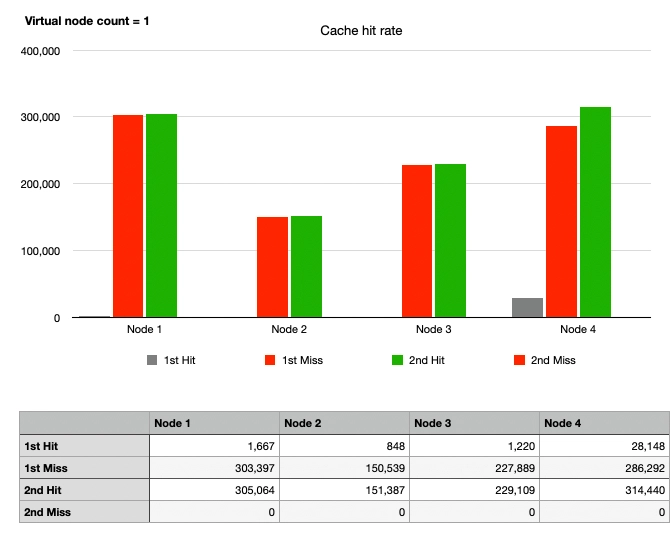
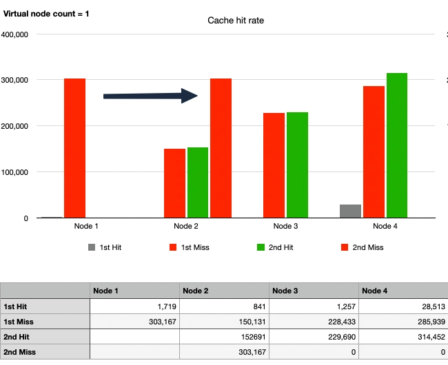
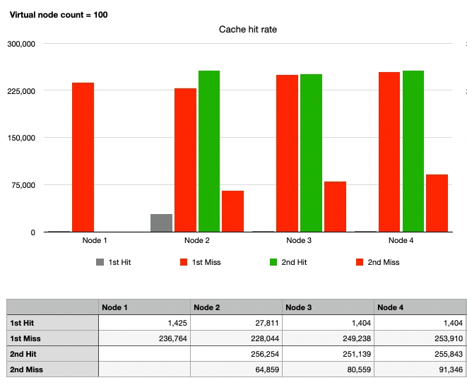

大規模なシステムを設計するために必要な基本的なコンポーネントは何でしょうか？

この記事では、ルーティングシステムで一般的に使用される一貫性ハッシュを直接実装し、データに基づいて議論します。

:::info

完全なコードは[Github](https://github.com/songkg7/consistent-hashing-sample)で確認できます。

:::

この記事はかなり長いので、説明の便宜上、以降は「~」を使用します。🙏

## ハッシュとは？

一貫性ハッシュに入る前に、まずハッシュについて簡単に触れておきましょう。

辞書的な定義によると、ハッシュとは「任意の長さのデータ文字列を入力として受け取り、固定サイズの出力（通常はハッシュ値またはハッシュコード）を生成する数学的関数」です。

簡単に言えば、同じ入力文字列は常に同じハッシュコードを返すということです。このハッシュの特性は、暗号化やファイルの整合性検証など、さまざまな目的で使用されます。

## では、一貫性ハッシュとは？

一貫性ハッシュは、分散サーバーやサービス間でデータを均等に分散させるための技術です。

一貫性ハッシュを使用しなくても、データを均等に分散させることは不可能ではありません。しかし、一貫性ハッシュは**水平スケーリングを容易にすることに焦点を当てています**。一貫性ハッシュを探る前に、簡単なハッシュルーティング方法を通じて一貫性ハッシュがなぜ登場したのかを理解しましょう。

### ノードベースのハッシュルーティング方法

> hash(key) % n


この方法はシンプルでありながら効率的にトラフィックを分散させます。

しかし、水平スケーリングには大きな弱点があります。ノードリストが変更されると、トラフィックが再分配される可能性が高く、新しいノードにルーティングされることになります。

特定のノードでキャッシュを管理している場合、ノードがグループから離れると**大規模なキャッシュミス**が発生し、サービスの中断を引き起こす可能性があります。


4つのノードで実験したところ、**1つのノードが離れるだけでキャッシュヒット率が27%に急落**することが観察されました。実験方法の詳細は以下の段落で説明します。

### 一貫性ハッシュルーティング方法

一貫性ハッシュは、大規模なキャッシュミスの可能性を最小限に抑えるために設計された概念です。



アイデアはシンプルです。ハッシュ空間の開始と終了をリングで接続し、その上にノードを配置します。各ノードは自分のハッシュ空間を割り当てられ、トラフィックを待ちます。

:::info

ノードを配置するために使用されるハッシュ関数は、モジュロ演算とは独立しています。

:::

次に、この一貫性ハッシュを実装したルーターにトラフィックが入る状況を仮定しましょう。


ハッシュ関数を通過したトラフィックは、リング上の最も近いノードにルーティングされます。ノードBは将来のリクエストに備えて`key1`をキャッシュします。

大量のトラフィックが発生しても、トラフィックは同じ原則に従ってそれぞれのノードにルーティングされます。

#### 一貫性ハッシュの利点

##### ノードリストが変更されてもキャッシュミスの確率が低い

ノードEが追加される状況を考えてみましょう。


以前に入力されたキーは同じポイントに配置されます。ノードDとCの間に配置された一部のキーは新しいノードEを指すようになり、キャッシュミスが発生します。しかし、他のスペースに配置されたキーはキャッシュミスを経験しません。

ネットワークエラーでノードCが消える場合でも、結果は同様です。



ノードCに向かっていたキーはノードDにルーティングされ、キャッシュミスが発生します。しかし、他のスペースに配置されたキーはキャッシュミスを経験しません。

結論として、ノードリストに変更があっても、変更されたノードに直接関連するキーだけがキャッシュミスを経験します。これにより、ノードベースのハッシュルーティングと比較してキャッシュヒット率が向上し、システム全体のパフォーマンスが向上します。

#### 一貫性ハッシュの欠点

他のすべての設計と同様に、一見エレガントに見える一貫性ハッシュにも欠点があります。

##### 均一なパーティションの維持が難しい


_異なるサイズのハッシュ空間を持つノードがリング上に配置されています。_

どのキーが生成されるかを知らずにハッシュ関数の結果を予測するのは非常に難しいです。したがって、ハッシュ結果に基づいてリング上の位置を決定する一貫性ハッシュは、ノードが均一なハッシュ空間を持ち、リング上に均等に分散されることを保証できません。

##### 均一な分散の達成が難しい


_ノードのハッシュ空間が異常に広い場合、トラフィックが集中する可能性があります。_

この問題は、ノードがハッシュリング上に均等に分散されていないために発生します。ノードDのハッシュ空間が他のノードよりも異常に広い場合、特定のノードにトラフィックが集中し、システム全体の障害を引き起こすホットスポット問題が発生する可能性があります。

## 仮想ノード

ハッシュ空間は有限です。したがって、ハッシュ空間に配置されるノードの数が多いほど、標準偏差が減少し、1つのノードが削除されても次のノードに大きな負担がかかりません。問題は、現実の世界では**物理ノードの数がコストに直結する**ことです。

これに対処するために、物理ノードを模倣する仮想ノードが実装され、これを賢く解決します。


仮想ノードは内部的に物理ノードのハッシュ値を指します。これを一種の複製マジックと考えてください。主要な物理ノードはハッシュリング上に配置されず、複製された仮想ノードだけがハッシュリング上でトラフィックを待ちます。トラフィックが仮想ノードに割り当てられると、それはそれが表す実際のノードのハッシュ値に基づいてルーティングされます。

## DIY一貫性ハッシュ

> DIY: Do It Yourself

これまで理論的な側面を議論してきました。個人的には、概念を学ぶ最良の方法は**自分で実装すること**だと信じています。実装してみましょう。

### ハッシュアルゴリズムの選択

名前にハッシュが含まれているので当然のように思えるかもしれませんが、一貫性ハッシュを実装する際には適切なハッシュアルゴリズムを選択することが重要です。ハッシュ関数の速度はパフォーマンスに直接関係します。一般的に使用されるハッシュアルゴリズムはMD5とSHA-256です。

- MD5: セキュリティよりも速度が重要なアプリケーションに適しています。SHA-256に比べてハッシュ空間が小さいです。2^128
- SHA-256: より長いハッシュサイズと強力な暗号化特性を持ちます。MD5よりも遅いです。約2^256の非常に大きなハッシュ空間を持ち、衝突はほとんどありません。

ルーティングでは、セキュリティよりも速度が重要であり、ハッシュ衝突の懸念が少ないため、MD5はハッシュ関数の実装に十分と考えられます。

```java
public class MD5Hash implements HashAlgorithm {
    MessageDigest instance;

    public MD5Hash() {
        try {
            instance = MessageDigest.getInstance("MD5");
        } catch (NoSuchAlgorithmException e) {
            throw new IllegalStateException("no algorithm found");
        }
    }

    @Override
    public long hash(String key) {
        instance.reset();
        instance.update(key.getBytes());
        byte[] digest = instance.digest();
        long h = 0;
        for (int i = 0; i < 4; i++) {
            h <<= 8;
            h |= (digest[i]) & 0xFF;
        }
        return h;
    }
}
```

:::tip

Javaでは、`MessageDigest`を使用してMD5アルゴリズムを使用したハッシュ関数を便利に実装できます。

:::

### ハッシュリング

```java
// businessKeyをハッシュし、リング上に配置されたハッシュ値（ノード）を見つけます。
public T routeNode(String businessKey) {
    if (ring.isEmpty()) { // リングが空の場合、ノードがないことを意味するのでnullを返します
        return null;
    }
    Long hashOfBusinessKey = this.hashAlgorithm.hash(businessKey);
    SortedMap<Long, VirtualNode<T>> biggerTailMap = ring.tailMap(hashOfBusinessKey);
    Long nodeHash;
    if (biggerTailMap.isEmpty()) {
        nodeHash = ring.firstKey();
    } else {
        nodeHash = biggerTailMap.firstKey();
    }
    VirtualNode<T> virtualNode = ring.get(nodeHash);
    return virtualNode.getPhysicalNode();
}
```

ハッシュリングは`TreeMap`を使用して実装されています。`TreeMap`はキー（ハッシュ値）を昇順に保持するため、`tailMap(key)`メソッドを使用してキー（ハッシュ値）より大きい値を見つけ、より大きなキーが見つからない場合は最大のキーに接続できます。

:::info

`TreeMap`に慣れていない場合は、この[リンク](https://coding-factory.tistory.com/557)を参照してください。

:::

### テスト

一貫性ハッシュは標準的なルーティング方法と比較してどれほど効果的でしょうか？自分で実装したので、この疑問を解決しましょう。大まかなテスト設計は次のとおりです：

- 100万件のリクエストを処理し、その後ノードリストに変更を加え、同じトラフィックが再度発生することを仮定します。
- 4つの物理ノード

数値データは簡単なテストコード[^fn-nth-1]を通じて定量化され、グラフ化すると6つのケースが明らかになりました。それぞれのケースを見てみましょう。

#### ケース1: シンプルハッシュ、ノード変更なし


100万件のリクエストを送信し、その後同じリクエストをもう100万件送信した場合、ノードに変更がなかったため、2回目のリクエスト以降のキャッシュヒット率は100%でした。

:::info

キャッシュヒット率が低かったとしても、最初のリクエスト（灰色のグラフ）でキャッシュヒットの可能性があったのは、テストで使用されたキーがランダムであり、重複キーの確率が低かったためです。

:::

ノードごとのグラフの高さを見ると、`hash % N`を使用したルーティングがすべてのトラフィックを非常に均等に分散させていることがわかります。

#### ケース2: シンプルハッシュ、1ノードの離脱


緑のグラフで示されるキャッシュヒット率が大幅に低下しました。ノード1が離脱すると、トラフィックはノード2、3、4に分散されました。運良く同じノードでキャッシュヒットしたトラフィックもありましたが、大部分は異なるノードに向かい、キャッシュミスが発生しました。

#### ケース3: 一貫性ハッシュ、ノード変更なし、仮想ノードなし



:::info

物理ノードがハッシュリング上に配置されないことを考えると、仮想ノードを1つだけ使用することは実質的に仮想ノードを使用しないことを意味します。

:::

ケース1と同様に、最初のリクエストではキャッシュヒットがすぐに発生しないため、赤いグラフが最初に上昇します。2回目のリクエストではキャッシュヒット率が100%となり、緑と赤のグラフの高さが一致します。

しかし、各ノードのグラフの高さが異なることが観察され、一貫性ハッシュの欠点である**均一でないパーティションによるトラフィックの不均等分散**が示されています。

#### ケース4: 一貫性ハッシュ、1ノードの離脱、仮想ノードなし



ノード1が離脱した後、キャッシュヒット率はケース2と比較して圧倒的に改善されました。

詳細に見ると、元々ノード1に向かっていたトラフィックが2回目のトラフィック波でノード2に移動したことがわかります。ノード2は約45万件のリクエストを処理し、これはノード3が処理した22万件のリクエストの2倍以上です。一方、ノード3と4へのトラフィックは変わりませんでした。これにより、一貫性ハッシュの利点が示されると同時に、一種の**ホットスポット現象**が強調されました。

#### ケース5: 一貫性ハッシュ、1ノードの離脱、10仮想ノード

均一なパーティションを達成し、ホットスポット問題を解決するために、仮想ノードを適用してみましょう。


全体的にグラフに変化があります。ノード1に向かっていたトラフィックがノード2、3、4に分散されました。パーティションは均等に分配されていませんが、ケース4と比較してホットスポット問題が徐々に解決されていることがわかります。10仮想ノードでは不十分なようなので、さらに増やしてみましょう。

#### ケース6: 一貫性ハッシュ、1ノードの離脱、100仮想ノード



最後に、ノード2、3、4のグラフが似ています。ノード1が離脱した後、各物理ノードに100の仮想ノードがハッシュリング上に配置され、合計300の仮想ノードが存在します。まとめると：

- ケース1に耐えられるほどトラフィックが均等に分散されていることがわかります。
- ノード1が離脱しても、ノード1に向かっていたトラフィックが複数のノードに分散され、ホットスポット問題が防止されます。
- ノード1に向かっていたトラフィック以外はキャッシュヒットが発生します。

十分な数の仮想ノードを配置することで、一貫性ハッシュを使用したルーティング方法が残りの操作と比較して水平スケーリングに非常に有利で