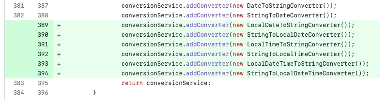

ここでは、Spring Batch 5.0の変更点についてまとめます。

## 新しい点は？

### `@EnableBatchProcessing`は推奨されなくなりました

```java
@AutoConfiguration(after = { HibernateJpaAutoConfiguration.class, TransactionAutoConfiguration.class })
@ConditionalOnClass({ JobLauncher.class, DataSource.class, DatabasePopulator.class })
@ConditionalOnBean({ DataSource.class, PlatformTransactionManager.class })
@ConditionalOnMissingBean(value = DefaultBatchConfiguration.class, annotation = EnableBatchProcessing.class) // 5.0から追加されました。
@EnableConfigurationProperties(BatchProperties.class)
@Import(DatabaseInitializationDependencyConfigurer.class)
public class BatchAutoConfiguration {
// ...
}
```

以前は、`@EnableBatchProcessing`アノテーションを使用してSpring BatchのSpring Boot自動構成を有効にすることができました。しかし、現在ではこれを削除してSpring Bootの自動構成を使用する必要があります。
`@EnableBatchProcessing`を指定したり、`DefaultBatchConfiguration`を継承すると、Spring Bootの自動構成が後回しにされ、アプリケーション設定のカスタマイズに使用されます。

そのため、`@EnableBatchProcessing`や`DefaultBatchConfiguration`を使用すると、`spring.batch.jdbc.initialize-schema`のようなデフォルト設定が機能しなくなります。さらに、Bootが起動したときにジョブが自動的に実行されなくなるため、Runnerの実装が必要です。

### 複数ジョブの実行がサポートされなくなりました

以前は、バッチ内に複数のジョブがある場合、それらを一度に実行することができました。しかし、現在ではBootが単一のジョブを検出するとそれを実行します。コンテキストに複数のジョブがある場合、Bootを起動する際に`spring.batch.job.name`を使用して実行するジョブを指定する必要があります。

### JobParameterのサポートが拡張されました

Spring Batch v4では、ジョブパラメータは`Long`、`String`、`Date`、`Double`の型のみを使用できましたが、v5ではコンバータを実装することで任意の型をJobParameterとして使用できるようになりました。しかし、Spring Batchのデフォルトの変換サービスは依然として`LocalDate`や`LocalDateTime`をサポートしておらず、例外が発生します。デフォルトの変換サービスに対してコンバータを実装することでこれを解決できますが、`JobParametersBuilder`が関連メソッドを提供しているにもかかわらず、実際には変換が行われず例外が発生するのは問題です。
この問題については[issue](https://github.com/spring-projects/spring-batch/issues/4257)がオープンされており、`5.0.1`で修正される予定です。

```java
JobParameters jobParameters = jobLauncherTestUtils.getUniqueJobParametersBuilder()
		.addLocalDate("date", LocalDate.now()) // このメソッドを使用すると、提供されているにもかかわらず例外が発生します。
		.toJobParameters();
```



この問題は2023-02-23にリリースされた5.0.1で解決されました。

### initializeSchema

```yaml
spring:
  datasource:
    url: jdbc:postgresql://localhost:5432/postgres?currentSchema=mySchema
    username: postgres
    password: 1234
    driver-class-name: org.postgresql.Driver
  batch:
    jdbc:
      initialize-schema: always
      table-prefix: mySchema.BATCH_
  sql:
    init:
      mode: always
```

正しく機能させるために`currentSchema`オプションを指定してください。

## 参考文献

- [Spring Boot 3.0 Migration Guide](https://github.com/spring-projects/spring-boot/wiki/Spring-Boot-3.0-Migration-Guide#spring-batch-changes)
- [What's New in Spring Batch 5.0](https://docs.spring.io/spring-batch/docs/current/reference/html/whatsnew.html#job-parameters-handling-updates)