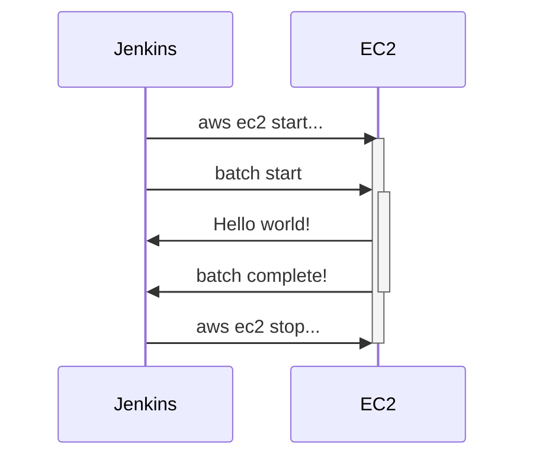

特定の時間や条件で実行する必要があるバッチアプリケーションのリソースコストを最適化するための非常にシンプルな方法を共有したいと思います。

## 問題

1. バッチは特定の時間にのみ実行されます。例えば、日次、月次、年次などの定期的な計算タスク。
2. 応答速度は重要ではなく、バッチが実行されることが優先されます。
3. 特定の時間に必要なリソースのために24時間EC2インスタンスを維持するのは非効率です。
4. クラウドサーバーのリソースが必要なときだけEC2インスタンスを準備することは可能でしょうか？

もちろん可能です。AWS ECSやAWS EKSなどの自動化ソリューションもありますが、ここではJenkinsを使ってバッチとEC2サーバーを直接管理し、環境を設定する方法を考えます。

## アーキテクチャ



このインフラストラクチャ設計により、バッチ実行のためにリソースが必要なときだけコストが発生するようにできます。

## Jenkins

### Jenkinsノード管理ポリシー


キューにリクエストが待機しているときのみノードをアクティブにし、不要なエラーログを最小限に抑えます。また、1分間アクティビティがない場合はアイドル状態に移行します。

## AWS CLI

### AWS CLIのインストール

AWS CLIを使用すると、ターミナル環境でAWSリソースを管理できます。以下のコマンドを使用して、現在実行中のインスタンスのリストを取得できます：

```bash
aws ec2 describe-instances
```

必要なリソースの情報を確認したら、ターゲットを指定して特定のアクションを実行できます。コマンドは以下の通りです：

#### EC2の起動

```bash
aws ec2 start-instances --instance-ids {instanceId}
```

#### EC2の停止

```bash
aws ec2 stop-instances --instance-ids {instanceId}
```

## スケジューリング

バッチを月に一度実行するためのcron式を書いて、簡単に設定できます。


```text
H 9 1 * *
```

これで、EC2インスタンスはほとんどの時間停止状態にあり、月に一度Jenkinsによってバッチ処理のために起動されます。

## 結論

使用していないときにEC2インスタンスを稼働状態にしておくのはコスト面で非効率です。この記事では、Jenkinsと簡単なコマンドを使用して、必要なときだけEC2を利用する方法を示しました。

EKSのような高レベルのクラウドオーケストレーションツールもこのような問題をエレガントに解決できますが、時にはシンプルなアプローチが最も効率的であることもあります。この記事を締めくくるにあたり、あなたの状況に最適な方法を選んでいただければ幸いです。