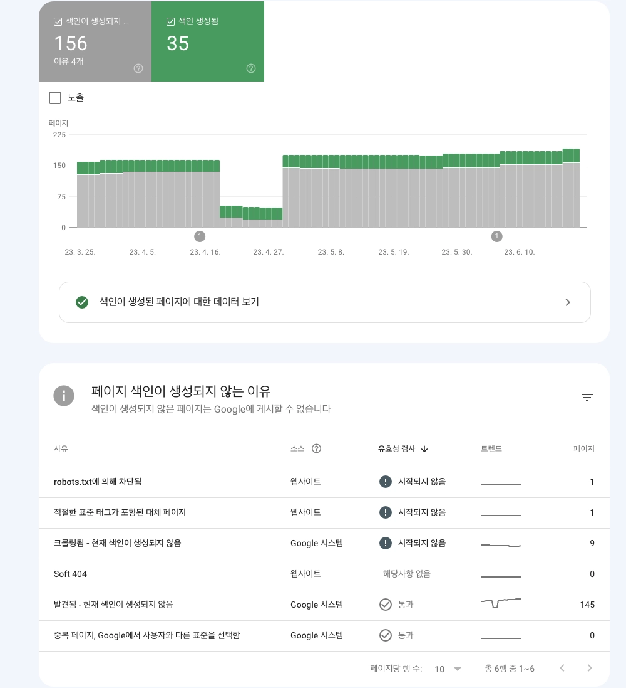
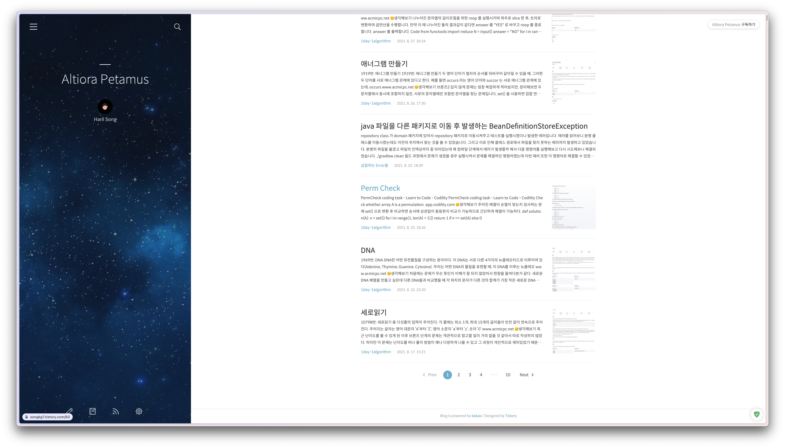
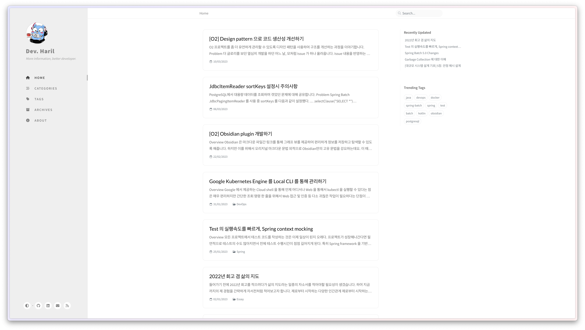
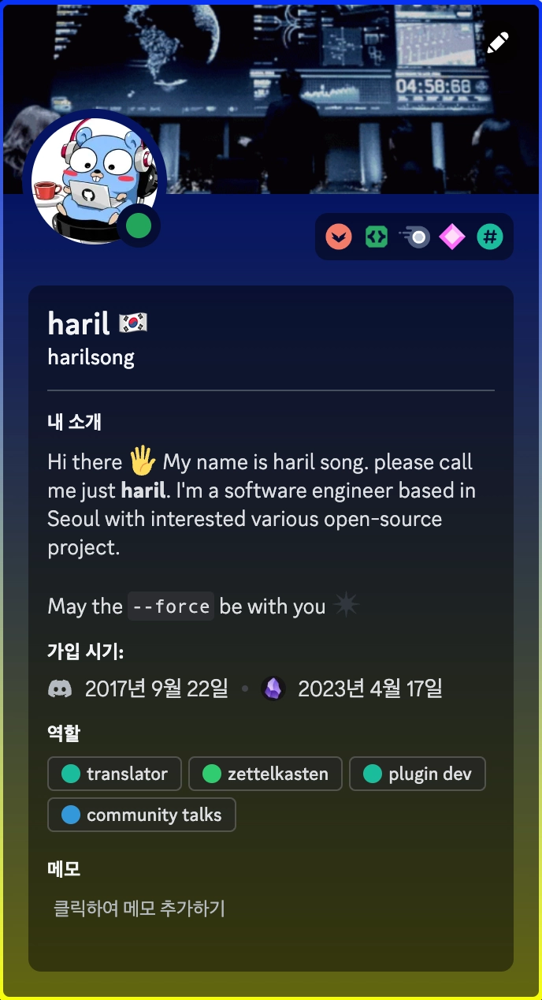
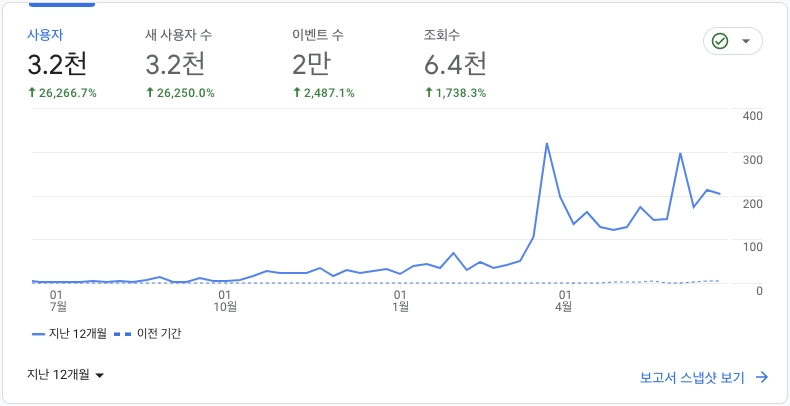

## 概要

この投稿は私にとって非常に意味深いものです。今年の初めから続けてきたブログ旅の最終エントリーとして、これまでのブログ経験を振り返り、まとめることを目的としています。

## ブログプラットフォーム選びの基準

便利に投稿できるプラットフォームを探していて、以下の基準を満たすものを求めていました：

- Markdownの簡単な使用
- 便利な画像アップロード
- 継続的なメンテナンス（特にオープンソースプラットフォームの場合）

TistoryのようなプラットフォームはMarkdownのサポートが不十分で、画像のアップロードが面倒でした。Velogは開発者の間で人気があるものの、最近は放置されているように感じたため、選びませんでした。最終的に、GitHub Pages + JekyllがMarkdownを完全にサポートし、画像のアップロードも簡単で、長期的なメンテナンスが可能であるため、最も合理的な選択だと判断しました。Jekyllの管理にはRubyの知識が必要ですが、基本的な理解があったので、必要に応じて学びながら運用してきました。

## SEOの苦労

全てのページをインデックスさせるために努力しましたが、思ったようには進みませんでした。クロールがいつ始まるのか、待ち遠しいです。

しかし、この旅を通じて、SEOの分野を学び、忍耐の重要性を実感しました。ページがインデックスされるまで時間がかかるものの、トラフィックが増えれば自然にインデックスされると信じています。徐々にインデックスされるページ数が増えてきました。コンテンツの公開速度がインデックス速度を上回っているため、Googleのクロールポリシーにより、ページがインデックスされて検索結果に表示されるまでの時間をコントロールできないことを受け入れなければなりません。

## コンテンツの進化

最初にTistoryでブログを始めたときは、アルゴリズムの問題解決に焦点を当てていました。

実務に取り組む中で、アルゴリズムの解決策はアルゴリズム問題解決プラットフォームで説明する方が良いと感じ、単に知識を列挙することは公式ドキュメントを参照するのに比べて冗長だと感じました。私のブログがただの平凡なものになるのは避けたかったのです。

**他のブログとは一線を画し、個性的で独自のものにしたい**という願望が続き、コンテンツの質と独自性を向上させるために努力してきました。個人的に満足している投稿には、[オープンソースプロジェクトを作成する旅](https://haril.dev/en/blog/2023/02/22/develop-obsidian-plugin)や[概念を読むだけでなく実装する](https://haril.dev/en/blog/2023/06/04/Consistent-Hashing)ものがあります。

:::info

2024年には、Docusaurusを使用したブログに進化しました😄。

:::

## Obsidianプラグインのオープンソース化

ブログ投稿専用のプラグインとして、[O2](https://github.com/songkg7/o2)を開発しました。これはObsidianとJekyllのタスクを連携させるものです。このプラグインを開発するために、TypeScriptも学びました😅。

幸いなことに、2023年7月時点で約400人のユーザーがこのプラグインを使用しています。~~おそらくほとんどの人が10分以内にアンインストールしたでしょうが... DAU 1...~~

最初は多くのバグがありましたが、現在では多くの小さな問題を解決し、プラグインは安定した段階に入りました。もしObsidianユーザーでJekyllをブログプラットフォームとして使用している方がいれば、このプラグインに興味を持っていただけると嬉しいです！

また、Obsidian Discordコミュニティで`plugin dev`の役割を取得し、積極的に参加しています。Obsidianに関する質問があれば、気軽にお尋ねください！

## 成長指標

ブログを始める際に一貫したモチベーションと方向性を維持するために、Google Analyticsを使用することが重要だと考えました。グラフが徐々に上昇するのを見ると、達成感を感じました。初期のブログ訪問者が少ないことがネガティブな影響を与えるという意見もありますが、個人的にはそれがモチベーションになりました。もっと多くの人にブログを訪れてもらいたいという気持ちが湧きました。

以下は、過去1年間のブログの成長率です。

グラフは動的に見えますが、影響力のある多くのブロガーと比べると数字はそれほど高くありません。それが統計のパラドックスです... それでも、全体的な上昇傾向は励みになります。

ライティングプログラムに参加することで、投稿の質により注意を払うようになり、その結果、外部リンクが増え、トラフィックが増加しました。特に、**Serfitコミュニティサイト**で頻繁にキュレーションされることで、トラフィックが大幅に増加しました。私の平凡な投稿を選んでくれたキュレーターに感謝します。今後も一生懸命に執筆し、作品を磨いていきます。

## 今後の目標

今年後半と来年の目標をまとめると、以下のようになります：

1. 単なる知識共有を超えた、高品質で独自性のある実用的な投稿を目指す。
2. 新規ユーザーを30,000人以上獲得する。
3. 月に少なくとも2つの投稿を公開する。
4. 英語学習のために英語での投稿を開始する。

特に英語の投稿に最適なアプローチとプラットフォームを考えています。将来的には英語以外の言語でも投稿したいので、**多言語対応を考慮する**ことが重要です。ライティングプログラムを進める中で（第9期に選ばれますように）、これらの計画をさらに洗練させていきます。

これまでの旅にお付き合いいただき、ありがとうございました。今後ともよろしくお願いいたします🙏。