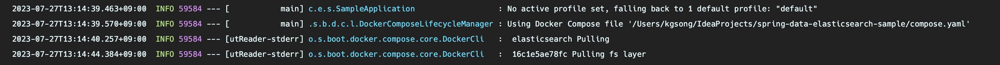

Spring Boot 3.1で導入されたDocker Composeサポートについて簡単に見ていきましょう。

:::info

不正確な点があればフィードバックをお願いします！

:::

## 概要

Springフレームワークで開発する際、DB環境をローカルマシンに直接インストールするよりも、Dockerを使用してセットアップする方が一般的なようです。通常のワークフローは以下の通りです：

1. `bootRun`の前に`docker run`を使用してDBを起動状態にする
2. `bootRun`を使用して開発および検証作業を行う
3. `bootRun`を停止し、`docker stop`を使用してコンテナDBを停止する

開発作業の前後にDockerを実行および停止するプロセスは非常に面倒でした。しかし、Spring Boot 3.1からは、`docker-compose.yaml`ファイルを使用してSpringとDockerコンテナのライフサイクルを同期させることができます。

## 内容

まず、依存関係を追加します：

```groovy
dependencies {
    // ...
    developmentOnly 'org.springframework.boot:spring-boot-docker-compose'
    // ...
}
```

次に、以下のようにcomposeファイルを作成します：

```yaml
services:
  elasticsearch:
    image: 'docker.elastic.co/elasticsearch/elasticsearch:7.17.10'
    environment:
      - 'ELASTIC_PASSWORD=secret'
      - 'discovery.type=single-node'
      - 'xpack.security.enabled=false'
    ports:
      - '9200' # ランダムポートマッピング
      - '9300'
```



`bootRun`の際に、composeファイルが自動的に認識され、`docker compose up`操作が最初に実行されます。

ただし、コンテナポートをランダムなホストポートにマッピングしている場合、`docker compose down`がトリガーされるたびに`application.yml`を更新する必要があるかもしれません。幸いなことに、Spring Boot 3.1からは、composeファイルを書くだけでSpring Bootが残りの作業を引き受けてくれます。非常に便利です！

composeファイルのパスを変更する必要がある場合は、`file`プロパティを変更するだけです：

```yaml
spring:
  docker:
    compose:
      file: infrastructure/compose.yaml
```

ライフサイクル管理に関連するプロパティもあり、コンテナのライフサイクルを適切に調整できます。Bootをシャットダウンするたびにコンテナを停止したくない場合は、`start_only`オプションを使用できます：

```yaml
spring:
  docker:
    compose:
      lifecycle-management: start_and_stop # none, start_only
```

他にもさまざまなオプションがあるので、探求してみると良いでしょう。


## 結論

どれだけテストコードを書いても、実際のDBとの相互作用を検証することは開発プロセスにおいて不可欠でした。その環境をセットアップすることは面倒な作業に感じられました。コンテナ技術により設定は非常に簡単になりましたが、Spring Bootを起動する前後に`docker`コマンドを実行することを忘れないようにするのは手間でした。

しかし、Spring Boot 3.1からは、コンテナの起動や停止を忘れることがなくなり、メモリ消費を防ぐことができます。これにより、開発者は開発にもっと集中できるようになります。DockerとSpringのシームレスな統合は非常に魅力的で便利です。ぜひ試してみてください！

## 参考

- [Spring Boot 3.1におけるDocker Composeサポート](https://spring.io/blog/2023/06/21/docker-compose-support-in-spring-boot-3-1)