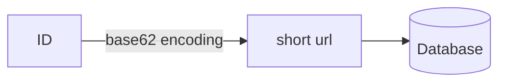
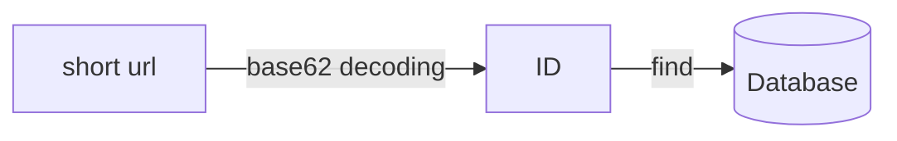
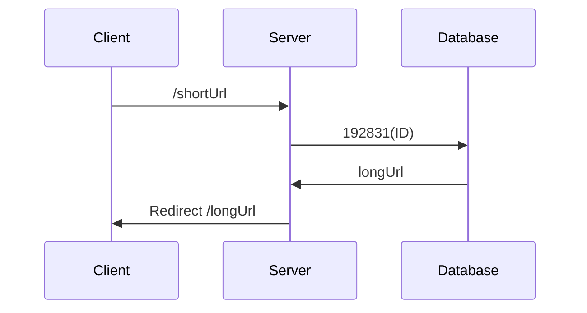

:::info

コードは[GitHub](https://github.com/songkg7/url-shortener-sample)で確認できます。

:::

## 概要

URLの短縮は、もともとメールやSMSでURLが分断されるのを防ぐために始まりました。しかし、現在ではTwitterやInstagramなどのソーシャルメディアプラットフォームで特定のリンクを共有するためにより積極的に使用されています。URLが冗長に見えないことで可読性が向上し、リダイレクト前にユーザーの統計情報を収集するなどの追加機能も提供できます。

この記事では、URL短縮サービスをゼロから実装し、その仕組みを探ります。

## URL短縮サービスとは？

まず、結果を見てみましょう。

この記事で実装するURL短縮サービスは、以下のコマンドで直接実行できます。

```bash
docker run -d -p 8080:8080 songkg7/url-shortener
```

使用方法は簡単です。短縮したい長いURLを`longUrl`の値として入力します。

```bash
curl -X POST --location "http://localhost:8080/api/v1/shorten" \
    -H "Content-Type: application/json" \
    -d "{
            \"longUrl\": \"https://www.google.com/search?q=url+shortener&sourceid=chrome&ie=UTF-8\"
        }"
# ランダムな値（例：tN47tML）が返されます。
```

次に、`http://localhost:8080/tN47tML`にアクセスすると、


元のURLに正しくリダイレクトされることが確認できます。

**短縮前**

- https://www.google.com/search?q=url+shortener&sourceid=chrome&ie=UTF-8

**短縮後**

- http://localhost:8080/tN47tML

では、どのようにしてURLを短縮するのか見てみましょう。

## 大まかな設計

### URLの短縮

1. longUrlを保存する前にIDを生成します。
2. IDをbase62にエンコードしてshortUrlを作成します。
3. ID、shortUrl、およびlongUrlをデータベースに保存します。

メモリは有限で比較的高価です。RDBはインデックスを通じて迅速にクエリを実行でき、メモリに比べて比較的安価なので、URLの管理にはRDBを使用します。

URLを管理するためには、まずID生成戦略を確保する必要があります。ID生成にはさまざまな方法がありますが、ここでは長くなるため省略します。今回は単純に現在のタイムスタンプを使用してIDを生成します。

#### Base62変換

ULIDを使用すると、タイムスタンプを含む一意のIDを生成できます。

```kotlin
val id: Long = Ulid.fast().time // 例：3145144998701、プライマリキーとして使用
```

この数値をbase62に変換すると、次のような文字列になります。

```
tN47tML
```

この文字列はshortUrlとしてデータベースに保存されます。

| id            | short   | long                                                                   |
|---------------|---------|------------------------------------------------------------------------|
| 3145144998701 | tN47tML | https://www.google.com/search?q=url+shortener&sourceid=chrome&ie=UTF-8 |

取得プロセスは次のように進行します：

1. `localhost:8080/tN47tML`にGETリクエストを送信します。
2. `tN47tML`をbase62からデコードします。
3. プライマリキー3145144998701を取得し、データベースをクエリします。
4. リクエストをlongUrlにリダイレクトします。

これで大まかな流れを見たので、実装して詳細を掘り下げていきましょう。

## 実装

前回の記事「Consistent Hashing」と同様に、自分で実装します。幸いなことに、URL短縮サービスの実装はそれほど難しくありません。

### モデル

まず、ユーザーからのリクエストを受け取るモデルを実装します。短縮するURLのみを受け取るように構造を簡略化しました。

```kotlin
data class ShortenRequest(
    val longUrl: String
)
```

`POST`リクエストを処理するためのコントローラーを実装します。

```kotlin
@PostMapping("/api/v1/shorten")
fun shorten(@RequestBody request: ShortenRequest): ResponseEntity<ShortenResponse> {
    val url = urlShortenService.shorten(request.longUrl)
    return ResponseEntity.ok(ShortenResponse(url))
}
```

### Base62変換

最後に、最も重要な部分です。IDを生成した後、base62にエンコードして短縮します。この短縮された文字列がshortUrlになります。逆に、shortUrlをデコードしてIDを見つけ、それを使用してデータベースをクエリし、longUrlを取得します。







```kotlin
private const val BASE62 = "0123456789abcdefghijklmnopqrstuvwxyzABCDEFGHIJKLMNOPQRSTUVWXYZ"

class Base62Conversion : Conversion {
    override fun encode(input: Long): String {
        val sb = StringBuilder()
        var num = BigInteger.valueOf(input)
        while (num > BigInteger.ZERO) {
            val remainder = num % BigInteger.valueOf(62)
            sb.append(BASE62[remainder.toInt()])
            num /= BigInteger.valueOf(62)
        }
        return sb.reverse().toString()
    }

    override fun decode(input: String): Long {
        var num = BigInteger.ZERO
        for (c in input) {
            num *= BigInteger.valueOf(62)
            num += BigInteger.valueOf(BASE62.indexOf(c).toLong())
        }
        return num.toLong()

    }
}
```

短縮されたURLの長さはID番号のサイズに反比例します。生成されたID番号が小さいほど、URLを短くすることができます。

短縮されたURLの長さが8文字を超えないようにするには、IDのサイズが62^8を超えないようにする必要があります。したがって、IDの生成方法も重要です。前述のように、この記事では内容を簡略化するためにタイムスタンプ値を使用しました。

### テスト

`curl`を使用してランダムなURLを短縮するためのPOSTリクエストを送信してみましょう。

```bash
curl -X POST --location "http://localhost:8080/api/v1/shorten" \
    -H "Content-Type: application/json" \
    -d "{
            \"longUrl\": \"https://www.google.com/search?q=url+shortener&sourceid=chrome&ie=UTF-8\"
        }"
```

http://localhost:8080/{shortUrl}にアクセスして、正しくリダイレクトされることを確認できます。

## 結論

改善の余地がある点：

- ID生成戦略をより正確に制御することで、shortUrlをさらに短縮できます。
    - トラフィックが多い場合、同時実行性に関連する問題を考慮する必要があります。
    - Snowflake
- ホスト部分にDNSを使用することで、URLをさらに短縮できます。
- 永続化レイヤーにキャッシュを適用することで、応答速度を向上させることができます。