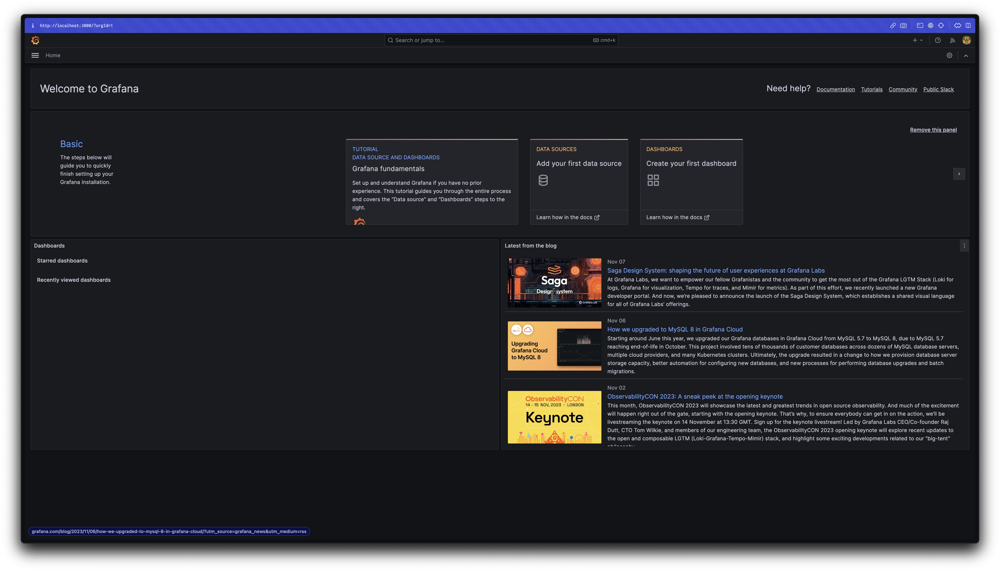

## 概要

> Spring MVCのWebアプリケーションはどれだけの同時ユーザーを受け入れられるのか？🤔

多くのユーザーを受け入れながら安定したサービスを提供するために、サーバーが処理しなければならないユーザー数を推定するために、本記事ではSpring MVCのTomcat設定に焦点を当ててネットワークトラフィックの変化を探ります。

利便性のため、以下の文章は会話調で書かれています 🙏

:::info

技術的な誤り、誤字脱字、または不正確な情報があれば、コメントでお知らせください。フィードバックは大変ありがたいです 🙇‍♂️

:::

<!-- truncate -->

## テストシナリオ

- 200人以上のユーザーが同時にAPIリクエストを行う状況を想定
- APIがすぐに応答しないように5秒の待機時間を設定
- Spring MVCのTomcat設定を調整してトラフィック処理能力を確認
- テストデータの汚染を防ぐため、APIをEC2にデプロイし、ローカルで負荷を生成

## 環境

- EC2 t4g.small (Amazon Linux 2core 2GB 64bit ARM)
- SpringBoot 3.1.5
- Spring MVC
- Spring Actuator
- K6

## テストアプリケーション

まず、シンプルなAPIを実装しましょう。

```java
@RestController
public class HelloController {

    @GetMapping("/hello")
    public String hello() throws InterruptedException {
        TimeUnit.SECONDS.sleep(5); // 処理時間をシミュレート
        return "Hello, World!";
    }
}
```

APIが過負荷状態をシミュレートするために5秒の遅延を追加しました。遅延がなければリクエストがすぐに処理され、ネットワークの挙動を観察するのが難しくなります。この記事で調整する設定は以下の通りです：

```yaml
server:
  tomcat:
    threads:
      max: 200                # 作成可能なスレッドの総数
    max-connections: 8192     # 確立可能な接続の総数
    accept-count: 100         # 作業キューのサイズ
    connection-timeout: 20000 # タイムアウト閾値、20秒
```

サーバー上で設定をスムーズに変更できるように、すべての部分をシステム環境変数に置き換えます。

```yaml
server:
  tomcat:
    threads:
      max: ${TOMCAT_MAX_THREADS:200}
    max-connections: ${TOMCAT_MAX_CONNECTIONS:8192}
    accept-count: ${TOMCAT_ACCEPT_COUNT:100}
    connection-timeout: ${TOMCAT_CONNECTION_TIMEOUT:20000}
```

DockerイメージをビルドするためのDockerfileを作成します。

```dockerfile
# Java 17 multi-stage build
FROM gradle:8.4.0-jdk17 as builder
WORKDIR /app
COPY . .
RUN gradle clean build

FROM openjdk:17-ea-11-jdk-slim
WORKDIR /app
COPY --from=builder /app/build/libs/*.jar app.jar
EXPOSE 8080
ENTRYPOINT ["java", "-jar", "app.jar"]
```

Dockerイメージをビルドします。

```bash
docker build -t sample-server .
```

テストアプリケーションの準備はほぼ完了です。イメージを適切なレジストリにプッシュし、EC2で`docker run`を実行します。EC2インスタンスの作成とイメージのデプロイのプロセスは簡略化のため省略します。

## K6

[K6](https://k6.io/)は、Grafana Labsが開発したモダンな負荷テストツールです。JavaScriptでテストシナリオを記述し、さまざまなシナリオをシミュレートできます。[Apache JMeter](https://jmeter.apache.org/)も良い選択肢ですが、K6はGrafanaとの統合が容易で、テスト結果の可視化が簡単です。そのため、今回のテストにはK6を選びました。最近では、K6がJMeterよりも好まれることが多いです。

### K6のインストール

```bash
brew install k6
```

### モニタリング設定

Docker Composeを使用してGrafanaとInfluxDBを実行します。

```yaml
version: "3.7"

services:
  influxdb:
    image: bitnami/influxdb:1.8.5
    container_name: influxdb
    ports:
      - "8086:8086"
      - "8085:8088"
    environment:
      - INFLUXDB_ADMIN_USER_PASSWORD=bitnami123
      - INFLUXDB_ADMIN_USER_TOKEN=admintoken123
      - INFLUXDB_HTTP_AUTH_ENABLED=false
      - INFLUXDB_DB=myk6db
  grafana:
    image: bitnami/grafana:latest
    ports:
      - "3000:3000"
```

```bash
docker compose up -d
```

InfluxDBが正しく動作しているか確認します。以下のコマンドが動作しない場合は、まず`brew install influxdb-cli`でコマンドをインストールしてください。

```bash
influx ping
# OK
```

http://localhost:3000 にアクセスして、Grafanaが正常に動作していることを確認します。



:::info

Grafanaの初期クレデンシャルは、ユーザー名とパスワードの両方が「admin」です。パスワードの変更を求められますが、これはテスト環境なのでスキップできます。

:::

InfluxDBをデータソースとして設定し、[K6ダッシュボード](https://grafana.com/grafana/dashboards/2587-k6-load-testing-results/)のURLをインポートしてモニタリング設定を完了します。


_わずか5分でモニタリング環境を設定...!_

### テストスクリプトの作成

スパイクテストを実行するために、以下のスクリプトを作成します。

```js
// spike-test.js
import http from 'k6/http';
import {check} from 'k6';

export const options = {
    scenarios: {
        spike: {
            executor: 'constant-vus',
            vus: 300,
            duration: '1s',
        },
    },
};

export default function () {
    const res = http.get('http://{EC2_INSTANCE_IP}/hello');
    check(res, {'is status 200': (r) => r.status == 200});
};
```

ここでの重要なポイントは以下の通りです：

- `constant-vus`: テスト開始前に固定数のユーザーを生成するエグゼキュータ
- `vus`: 仮想ユーザー、テストで使用するユーザー数を表す

## テストの実行と分析

以下のコマンドを実行してテストを開始します。

```bash
k6 run --out influxdb=http://localhost:8086/myk6db spike-test.js
```

### 300リクエスト

まずは300リクエストを送信してみましょう。予想される動作は以下の通りです：

- スレッドプールの最大スレッド数は200で、作業キュー（acceptCount）は100です。したがって、200リクエストが即座に処理され、残りの100リクエストが続いて処理されます。


予想通り、200リクエストが最初に5秒間隔で処理され、その後残りの100リクエストが処理されます。

### 1000リクエスト


再び、リクエストは5秒間隔で処理されます。総処理時間は約25秒です。APIに最初にアクセスしたユーザーは5.01秒で応答を受け取るかもしれませんが、他のユーザーは結果を見るために25秒待つ必要があります。

この時点で、デフォルトのTomcat設定の`connection-timeout`である20秒を超えています。しかし、タイムアウトエラーは発生せず、すべてのリクエストが処理されました。これは、`connection-timeout`がリクエストが行われた瞬間からカウントを開始しないことを示唆しています。詳細は後ほど説明します。

### 2000リクエスト

挑戦の時が来ました。

K6には、タイムアウトが発生する前に一定期間実行されているテストを安全に停止する`gracefulStop`[^fn-nth-1]機能があります。デフォルト値は30秒で、タイムアウトエラーが発生する前にテストが停止する可能性があります。テストを長期間実行するためには、スクリプトを修正する必要があります。

```js
import http from 'k6/http';
import {check} from 'k6';

export const options = {
    scenarios: {
        spike: {
            executor: 'constant-vus',
            vus: 2000,
            duration: '1s',
            gracefulStop: '5m', // 追加
        },
    },
};

export default function () {
    const res = http.get('http://54.180.78.85/hello');
    check(res, {'is status 200': (r) => r.status == 200});
};
```


`gracefulStop`時間を延長することで、タイムアウトエラーが発生する前にテストが停止しなくなりました。

### 3000リクエスト

また新たな挑戦がやってきました。


今回は、約1分待った後にリクエストがタイムアウトし始めました。

200スレッドで3000リクエストを処理する場合、運が悪くてキューの最後にいるユーザーは75秒（3000 / 200 * 5 = 75秒）待たなければなりません。タイムアウトを避けるためには、応答時間を少なくとも15秒短縮する必要があります。スレッドプールのサイズを200から約500に増やすことで、同時実行性が向上し、問題が解決されます。

```bash
docker run -d -p "80:8080" \
    -e TOMCAT_MAX_THREADS=500 \
    --name sample-server \
    --restart always \
    123456789012.dkr.ecr.ap-northeast-2.amazonaws.com/sample-server:v1
```

このテストの目的を考えると、スレッド数を増やすことが最も適切な解決策のようです。これにより、応答時間が75秒から30秒に短縮され、単にスレッドを追加するだけでパフォーマンスが大幅に向上することが示されました。

スレッドプールのサイズを増やした後、再度3000リクエストでテストを実行しました。


予想通り、すべてのリクエストがエラーなく処理されました。

### 6000リクエスト


スレッドプールを500に増やしたにもかかわらず、6000リクエストでは再びリクエストタイムアウトが発生しました。さらなる同時実行性の向上が必要なようです。この場合、スレッド数を1000に増やすことで負荷を処理し、安定性を維持することができました。


### 10kリクエスト

最終的に、最小限の設定変更で10,000の同時リクエストを達成しました。しかし、新たなエラーとして「メモリを割り当てられない」、「接続がリセットされた」、「リクエストタイムアウト」（20秒で発生）、および「i/oタイムアウト」が発生し始めました。


これらのエラーの根本原因を調査するために、Linuxの`ss`コマンドを使用して実行時に受け入れられているTCP接続の数を監視しました。

```bash
# TCP接続を監視
watch ss -s
```


_閉じられた接続の数は10kを超えませんでした。接続が正常に作成されていれば、10kを超えていたはずです。_


_しばらく待ってテストを繰り返しても、成功したVUsは8293にとどまりました。_

サーバーが10,000以上のTCP接続を確立できないことが確認されました。これにより、サーバーが新しい接続を受け入れられず、さまざまなエラーが発生しました。なぜこれが起こっているのかという疑問が生じました。

この時点で、いくつかの仮説が考えられ、それに基づいていくつかの理論が作成されました：

1. `max-connections`プロパティは、アプリケーションが処理できる最大TCP接続数に関連している可能性がある。
2. リクエストタイムアウトエラーが20秒前後で発生するのは、`connection-timeout`設定に関連している可能性がある。
3. `accept-count`プロパティも、アプリケーションが処理できる最大TCP接続数に関連している可能性がある（約8293、8192 + 100の合計）。
4. `max-connections`を増やすことで、サーバーがより多くの接続を処理し、接続タイムアウトエラーを回避できる可能性がある。

次のステップでは、これらの仮説を検証します。各テストが独立していることを確認するために、同じサーバーでテストを実行する際には、設定変更ごとに新しいコンテナを作成しました。

#### 1. 最大接続数

> `max-connections`プロパティは、アプリケーションが処理できる最大TCP接続数に関連しているのか？

まず、`max-connections`の値を20kに増やし、テストを実行しました。


接続数が10kを超え、サーバーがより多くの接続を処理できることが確認されました。


さらに、すべてのリクエストがエラーなく処理されました。これは、`max-connections`プロパティがOSが受け入れられる接続数に直接関連していることを示唆しています。

#### 2. 接続タイムアウト

> リクエストタイムアウトエラーは、サーバーが20秒以内にTCP接続を確立できない場合に発生する`connection-timeout`設定に関連しているのか？

次に、`max-connections`をデフォルト値に戻し、`connection-timeout`を30秒に増やしてテストを実行しました。

```yaml
max-connections: 8192
connection-timeout: 30000
```

タイムアウトを増やしても、リクエストタイムアウトは20秒後に発生しました。これは、`connection-timeout`設定が接続の開始プロセスに関連していないことを示しています。

実際、この設定は接続が確立された後に接続を閉じるためのタイムアウトであり、初期接続の確立のためのものではありません[^fn-nth-2]。テスト開始から約20秒後に発生するリクエストタイムアウトエラーは、作業キューと接続

結果は素晴らしいものでした。`max-connections`を増やさなくても、`accept-count`を増やすことでサーバーは10,000件以上のリクエストを処理できました。

いくつかのブログでは、ワークキュー（`accept-count`）に待機しているリクエストはTCP接続を確立しないと示唆しています。これを確認するために、Actuatorを使用してアプリケーションの設定をチェックしたところ、すべて期待通りでした。


_Actuatorは実行中のアプリケーションの状態を監視するための便利なツールです。_

`ServerProperties`クラスのJavaDocを調べると、この謎を解明するヒントが見つかりました。

```java
/**
 * サーバーが任意の時点で受け入れ、処理する最大接続数。この制限に達すると、オペレーティングシステムは
 * "acceptCount"プロパティに基づいて接続を受け入れることがあります。
 */
private int maxConnections = 8192;

/**
 * すべてのリクエスト処理スレッドが使用中のときに、受信接続リクエストの最大キュー長。
 */
private int acceptCount = 100;
```

`maxConnections`フィールドのコメントを確認すると、次のように記載されています：

> この制限に達すると、オペレーティングシステムは"acceptCount"プロパティに基づいて接続を受け入れることがあります。

これは、`maxConnections`の制限に達した場合でも、OSが`acceptCount`の値に基づいて追加の接続を受け入れることができることを示しています。つまり、`maxConnections`と`acceptCount`の合計（8192 + 100 = 8293）[^fn-nth-3]が概ねの限界であることを示唆しています。

まとめると：

1. `max-connections`と`accept-count`の両方がアプリケーションが処理できる接続数に影響を与えます。
2. `threads.max`はアプリケーションのスループットに直接影響を与えます。
3. `connection-timeout`は、サーバーがTCP接続を確立できなかったために発生するリクエストタイムアウトエラーとは関係ありません。
4. `max-connections`を増やすことで、新しい接続を受け入れられないことによるタイムアウトエラーを回避できます。


:::info

もし`threads.max`、`max-connections`、`accept-count`がすべて1に設定されている場合、どうなるでしょうか？スループットに応じて、時間内に受け入れられなかったリクエストはタイムアウトになります。現在の環境では、3件のリクエストが成功し、7件が失敗しました。`acceptCount`を10に増やすことで、すべてのリクエストが受け入れられ、成功しました。

:::

#### 4. 最大接続数と接続タイムアウト

> `max-connections`を増やすことで、接続を確立し、タイムアウトを回避することができますか？

ポイント2で見たように、`connection-timeout`設定はサーバーがTCP接続を確立できなかったために発生するリクエストタイムアウトエラーとは関係ありません。`max-connections`を増やすことで特定のタイムアウトを回避することはできますが、タイムアウトの種類は異なります。

#### 10k問題の結論

`max-connections`と`accept-count`の両方が、サーバーの接続処理能力に大きな役割を果たします。`max-connections`と`accept-count`の合計が10,000を超えると、サーバーは10,000以上の同時接続を容易に処理できます。しかし、接続の作成コストとスレッドの作成数を考慮して、適切なバランスを見つけることが重要です。


_10,000件以上のリクエストでの成功_

## どれだけ処理できるか？

OSレベルの設定（例えばulimit）を調整せずに、アプリケーションの設定を変更するだけで、最大15,000の仮想ユーザー（VUs）をエラーなしで処理できました。


使用した設定は以下の通りです：

```yaml
thread:
  max: 2000
max-connections: 50000
accept-count: 5000
```

`max-connections`と`accept-count`の値はかなり攻撃的でしたが、`max-connections`を高い値に設定してもすべての接続が受け入れられる保証はありません。これらの設定でも、20,000件以上のリクエストを処理する際にエラーが発生し、ソケットやポートの割り当てに関連するネットワークの問題がある可能性があります。これについては、今後のネットワーク学習セッションでさらに調査する予定です。

重要な点は、サーバーが大量の接続を受け入れることができても、すべてのリクエストを処理できるわけではないということです。接続が受け入れられても、処理速度が十分でない場合、クライアントはリクエストタイムアウトを経験し、60秒以内に多くのリクエストがタイムアウトによって終了します。

> `max-connections`は最大量の水を保持できる容器のようなもので、アプリケーションの処理速度（スループット）は水が注がれる速度です。設定された時間内に水が完全に注がれない場合、OSは管理者として残りの水を床にこぼします。

## 結論

- `max-connections`と`accept-count`はアプリケーションが使用する接続数に影響を与えます。
- `threads.max`はスループットに直接影響を与える重要なプロパティです。
- `connection-timeout`は

学ぶことが増えると、知らないことも増えるように感じます...

:::info

この記事で使用したコードはGitHubで確認できます：[test-script](https://github.com/songkg7/spike-test)および[sample-server](https://github.com/songkg7/sample-server)。

:::

## 未解決のトピック

この記事を書きながら整理したトピックのリストですが、ややオフトピックであるか、別途扱うべきトピックと考えられるものです。

- SSMを使用してEC2に接続し、ECRの使用方法を学び、AWS Identity CenterでSSOを設定する
- メモリエラーを解決するためにサーバー側のメモリを増やすか、スワップメモリを設定する
- i/oタイムアウトの原因を調査する
- BIOコネクタとNIOコネクタの違いと運用フローを調べる
- 接続、ソケット、ポートの類似点と関係、および同時ユーザーアクセスについて探る

## 参考文献

- [Grafana K6での負荷テストの可視化](https://velog.io/@heka1024/Grafana-k6%EC%9C%BC%EB%A1%9C-%EB%B6%80%ED%95%98-%ED%85%8C%EC%8A%A4%ED%8A%B8%ED%95%98%EA%B8%B0)
- [K6スパイクテスト](https://k6.io/docs/test-types/spike-testing/)
- [100k_concurrent_server](https://shdkej.com/blog/100k_concurrent_server/)
- [spring-boot-configure-tomcat](https://www.baeldung.com/spring-boot-configure-tomcat)
- [https://junuuu.tistory.com/835](https://junuuu.tistory.com/835)
- [NIOコネクタとBIOコネクタについて学ぶ](https://velog.io/@cjh8746/%EC%95%84%ED%8C%8C%EC%B9%98-%ED%86%B0%EC%BA%A3%EC%9D%98-NIO-Connector-%EC%99%80-BIO-Connector%EC%97%90-%EB%8C%80%ED%95%B4-%EC%95%8C%EC%95%84%EB%B3%B4%EC%9E%90)
- [springboot-tomcat-acceptcount-poolについて](https://stackoverflow.com/questions/65779046/about-springboot-tomcat-acceptcount-pool)
- [tomcat-8.5-doc](https://tomcat.apache.org/tomcat-8.5-doc/config/http.html)

---

[^fn-nth-1]: [K6グレースフルストップ](https://k6.io/docs/using-k6/scenarios/concepts/graceful-stop/)
[^fn-nth-2]: [spring-boot-configure-tomcat](https://www.baeldung.com/spring-boot-configure-tomcat#3-server-connections)
[^fn-nth-3]: 誤差の1は依然として謎です。