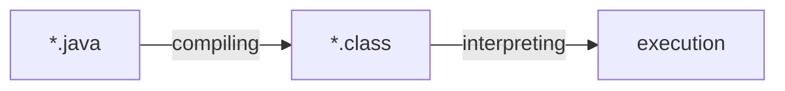

[前回の記事](https://haril.dev/en/blog/2023/12/10/Java-Hello-World-Deepdive-1/)から続けて、コードが「Hello World」を表示するまでの進化を探っていきましょう。

## 第2章 コンパイルと逆アセンブル

プログラミング言語にはレベルがあります。

プログラミング言語が人間の言語に近いほど高水準言語とされ、コンピュータが理解できる言語（機械語）に近いほど低水準言語とされます。高水準言語でプログラムを書くことは、人間にとって理解しやすく、生産性を向上させますが、機械語との間にギャップが生じ、そのギャップを埋めるプロセスが必要です。

高水準言語が低水準に降りていくプロセスを**コンパイル**と呼びます。

Javaは低水準言語ではないため、コンパイルプロセスが存在します。Javaのコンパイルプロセスがどのように機能するかを見てみましょう。

### コンパイル

前述のように、Javaコードはコンピュータによって直接実行されることはできません。Javaコードを実行するためには、コンピュータが読み取り、解釈できる形に変換する必要があります。この変換には以下の主要なステップが含まれます：



コンパイルの結果得られる`.class`ファイルはバイトコードです。しかし、これはまだコンピュータが実行できる機械語ではありません。Java仮想マシン（JVM）はこのバイトコードを読み取り、さらに機械語に変換します。このプロセスについては最終章で取り上げます。

まず、`.java`ファイルをコンパイルして`.class`ファイルを作成しましょう。`javac`コマンドを使用してコンパイルできます。

```java
// VerboseLanguage.java
public class VerboseLanguage {
    public static void main(String[] args) {
        System.out.println("Hello World");
    }
}
```

```bash
javac VerboseLanguage.java
```


クラスファイルが作成されたことが確認できます。`java`コマンドを使用してクラスファイルを実行できます。これがJavaプログラムを実行する基本的な流れです。

```bash
java VerboseLanguage
// Hello World
```

クラスファイルの内容が気になりますか？コンピュータがどのように言語を読み取り、実行するのか疑問に思いますか？このファイルにはどんな秘密が隠されているのでしょうか？まるでパンドラの箱を開けるような気分です。

期待しながら開けてみると...


_なんてこった！_

ほんの少しのバイナリ内容が表示されるだけです。

_待って、コンパイルの結果はバイトコードじゃなかったの？_

そうです、それはバイトコードです。同時に、それはバイナリコードでもあります。この時点で、バイトコードとバイナリコードの違いについて簡単に触れておきましょう。

バイナリコード
: 0と1で構成されたコード。機械語はバイナリコードで構成されていますが、すべてのバイナリコードが機械語というわけではありません。

バイトコード
: 0と1で構成されたコード。ただし、バイトコードは機械ではなく**VM**を対象としています。JITコンパイラなどのプロセスを通じてVMによって機械語に変換されます。

それでも、この記事が深掘りを謳っている以上、私たちはこの変換を読み取ることに挑戦しました。


_幸いなことに、私たちのパンドラの箱には0と1だけが含まれており、他の困難や挑戦はありません。_

読み取ることには成功しましたが、0と1だけでは内容を理解するのは非常に難しいです 🤔

さて、このコードを解読してみましょう。

### 逆アセンブル

コンパイルプロセス中に、コードは0と1で構成されたバイトコードに変換されます。前述のように、バイトコードを直接解釈するのは非常に難しいです。幸いなことに、JDKには開発者がコンパイルされたバイトコードを読み取るのに役立つツールが含まれており、デバッグに役立ちます。

バイトコードを開発者にとってより読みやすい形に変換するプロセスを**逆アセンブル**と呼びます。このプロセスは時々デコンパイルと混同されることがありますが、デコンパイルはアセンブリ言語ではなく、より高水準のプログラミング言語に変換されます。また、`javap`のドキュメントでは明確に逆アセンブルという用語が使用されているため、ここでもそれに従います。


:::info

デコンパイルは、バイナリコードを比較的高水準の言語で表現することを指します。一方、逆アセンブルはバイナリコードを最小限の人間が読みやすい形（アセンブリ言語）で表現します。

:::

#### 仮想マシンアセンブリ言語

`javap`を使用してバイトコードを逆アセンブルしてみましょう。出力は0と1だけよりもはるかに読みやすいです。

```bash
javap -c VerboseLanguage.class
```

```text
Compiled from "VerboseLanguage.java"
public class VerboseLanguage {
  public VerboseLanguage();
    Code:
       0: aload_0
       1: invokespecial #1                  // Method java/lang/Object."<init>":()V
       4: return

  public static void main(java.lang.String[]);
    Code:
       0: getstatic     #7                  // Field java/lang/System.out:Ljava/io/PrintStream;
       3: ldc           #13                 // String Hello World
       5: invokevirtual #15                 // Method java/io/PrintStream.println:(Ljava/lang/String;)V
       8: return
}
```

ここから何が学べるでしょうか？

まず、この言語は仮想マシンアセンブリ言語と呼ばれます。

> Java仮想マシンコードは、JDKリリースに含まれるOracleのjavapユーティリティによって出力される非公式の「仮想マシンアセンブリ言語」で書かれています。 - JVM Spec

フォーマットは次の通りです：

```text
<index> <opcode> [ <operand1> [ <operand2>... ]] [<comment>]
```

index
: JVMコードバイト配列のインデックス。メソッドの開始オフセットと考えることができます。

opcode
: 命令セットのオペコードを表すニーモニックシンボル。虹の色の順番を'ROYGBIV'として覚えるように、命令セットを区別するためのニーモニックシンボルです。虹の色が命令セットを表すとすれば、'ROYGBIV'の各音節がそれらを区別するために定義されたニーモニックシンボルと考えることができます。

operandN
: 命令のオペランド。コンピュータ命令のオペランドはアドレスフィールドです。定数プールに格納されているデータの場所を指します。

逆アセンブル結果のmainメソッド部分を詳しく見てみましょう。

```text
Code:
   0: getstatic     #7                  // Field java/lang/System.out:Ljava/io/PrintStream;
   3: ldc           #13                 // String Hello World
   5: invokevirtual #15                 // Method java/io/PrintStream.println:(Ljava/lang/String;)V
   8: return
```

- `invokevirtual`: インスタンスメソッドを呼び出す
- `getstatic`: クラスから静的フィールドを取得する
- `ldc`: 実行時定数プールにデータをロードする

3行目の`3: ldc #13`は、インデックス13の項目をプールにロードすることを意味し、親切にもコメントでその項目が示されています。

_Hello World_

バイトコード命令である`getstatic`や`invokevirtual`は、1バイトのオペコード番号で表されます。例えば、`getstatic=0xb2`、`invokevirtual=0xb6`などです。Javaバイトコード命令も最大で**256**種類のオペコードを持つことが理解できます。


_`invokevirtual`のバイトコードを示すJVM命令セット_

mainメソッドのバイトコードを16進数で見ると、次のようになります：

```text
b2 00 07 12 0d b6
```

まだパターンがわかりにくいかもしれません。ヒントとして、前述のようにオペコードの前の数値はJVM配列のインデックスであることを思い出してください。表現を少し変えてみましょう。

```text
arr = [b2, 00, 07, 12, 0d, b6]
```

- arr[0] = b2 = getstatic
- arr[3] = 12 = ldc
- arr[5] = b6 = invokevirtual

インデックスの意味が少し明確になります。いくつかのインデックスをスキップしている理由は非常に簡単です：`getstatic`は2バイトのオペランドを必要とし、`ldc`は1バイトのオペランドを必要とします。したがって、`getstatic`の次の命令である`ldc`はインデックス3に記録され、1と2をスキップします。同様に、4をスキップして`invokevirtual`命令はインデックス5に記録されます。

最後に、4行目のコメント`(Ljava/lang/String;)V`に注目してください。このコメントを通じて、Javaバイトコードではクラスが`L;`として表され、voidが`V`として表されることがわかります。他の型もそれぞれ独自の表現を持ち、次のようにまとめられます：

| Javaバイトコード  | 型        | 説明                                   |
|-------------------|-----------|---------------------------------------|
| B                 | byte      | 符号付きバイト                        |
| C                 | char      | Unicode文字                           |
| D                 | double    | 倍精度浮動小数点値                    |
| F                 | float     | 単精度浮動小数点値                    |
| I                 | int       | 整数                                   |
| J                 | long      | 長整数                                 |
| L\<classname>;    | reference | クラス\<classname>のインスタンス       |
| S                 | short     | 符号付きショート                       |
| Z                 | boolean   | 真または偽                             |
| [                 | reference | 一次元配列                             |

`-verbose`オプションを使用すると、定数プールを含むより詳細な逆アセンブル結果を見ることができます。オペランドと定数プールを一緒に調べると興味深いでしょう。

```text
  "VerboseLanguage.java"からコンパイル
public class VerboseLanguage
  minor version: 0
  major version: 65
  flags: (0x0021) ACC_PUBLIC, ACC_SUPER
  this_class: #21                         // VerboseLanguage
  super_class: #2                         // java/lang/Object
  interfaces: 0, fields: 0, methods: 2, attributes: 1
Constant pool:
   #1 = Methodref          #2.#3          // java/lang/Object."<init>":()V
   #2 = Class              #4             // java/lang/Object
   #3 = NameAndType        #5:#6          // "<init>":()V
   #4 = Utf8               java/lang/Object
   #5 = Utf8               <init>
   #6 = Utf8               ()V
   #7 = Fieldref           #8.#9          // java/lang/System.out:Ljava/io/PrintStream;
   #8 = Class              #10            // java/lang/System
   #9 = NameAndType        #11:#12        // out:Ljava/io/PrintStream;
  #10 = Utf8               java/lang/System
  #11 = Utf8               out
  #12 = Utf8               Ljava/io/PrintStream;
  #13 = String             #14            // Hello World
  #14 = Utf8               Hello World
  #15 = Methodref          #16.#17        // java/io/PrintStream.println:(Ljava/lang/String;)V
  #16 = Class              #18            // java/io/PrintStream
  #17 = NameAndType        #19:#20        // println:(Ljava/lang/String;)V
  #18 = Utf8               java/io/PrintStream
  #19 = Utf8               println
  #20 = Utf8               (Ljava/lang/String;)V
  #21 = Class              #22            // VerboseLanguage
  #22 = Utf8               VerboseLanguage
  #23 = Utf8               Code
  #24 = Utf8               LineNumberTable
  #25 = Utf8               main
  #26 = Utf8               ([Ljava/lang/String;)V
  #27 = Utf8               SourceFile
  #28 = Utf8               VerboseLanguage.java
{
  public VerboseLanguage();
    descriptor: ()V
    flags: (0x0001) ACC_PUBLIC
    Code:
      stack=1, locals=1, args_size=1
         0: aload_0
         1: invokespecial #1                  // Method java/lang/Object."<init>":()V
         4: return
      LineNumberTable:
        line 1: 0

  public static void main(java.lang.String[]);
    descriptor: ([Ljava/lang/String;)V
    flags: (0x0009) ACC_PUBLIC, ACC_STATIC
    Code:
      stack=2, locals=1, args_size=1
         0: getstatic     #7                  // Field java/lang/System.out:Ljava/io/PrintStream;
         3: ldc           #13                 // String Hello World
         5: invokevirtual #15                 // Method java/io/PrintStream.println:(Ljava/lang/String;)V
         8: return
      LineNumberTable:
        line 3: 0
        line 4: 8
}
SourceFile: "VerboseLanguage.java"
```

## 結論

前の章では、Hello Worldを出力するために冗長なプロセスが必要な理由を探りました。この章では、Hello Worldを出力する前のコンパイルと逆アセンブルのプロセスを見てきました。次に、JVMを使用してHello Worldを出力するメソッドの実行フローを最終的に調べます。

## 参考文献

- [Opcode Codes](https://seung-nari.tistory.com/entry/%EC%BB%B4%ED%93%A8%ED%84%B0-%EA%B5%AC%EC%A1%B0-%EB%AA%85%EB%A0%B9%EC%96%B4-%EC%BD%94%EB%93%9C-OP-Code-Mode-Operand)
- [Naver D2](https://d2.naver.com/helloworld/1230)
- JVM仕様書
```
