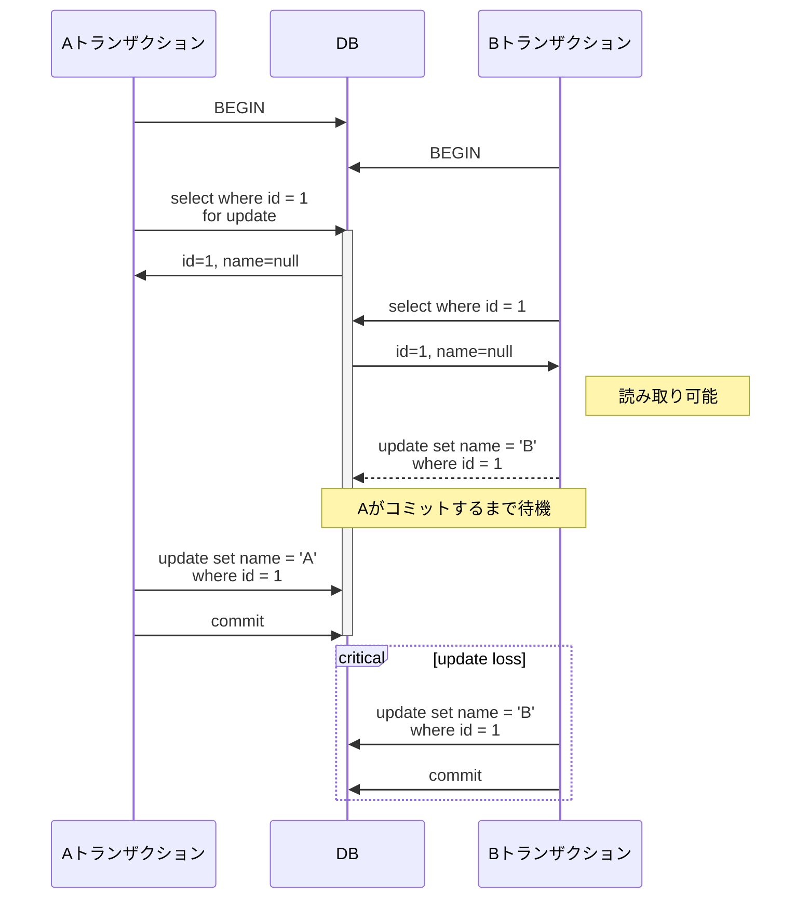
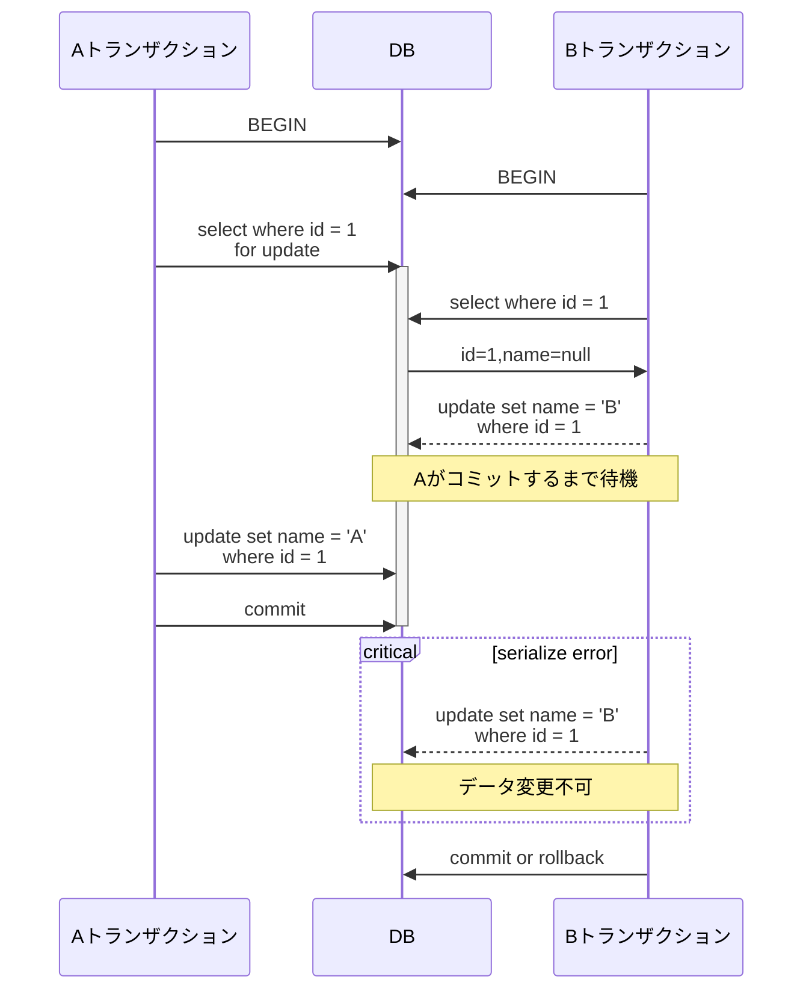
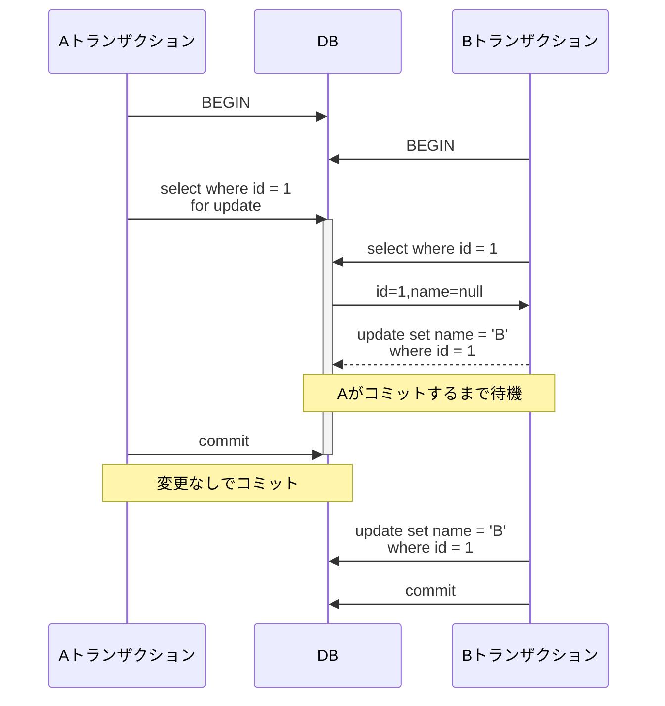
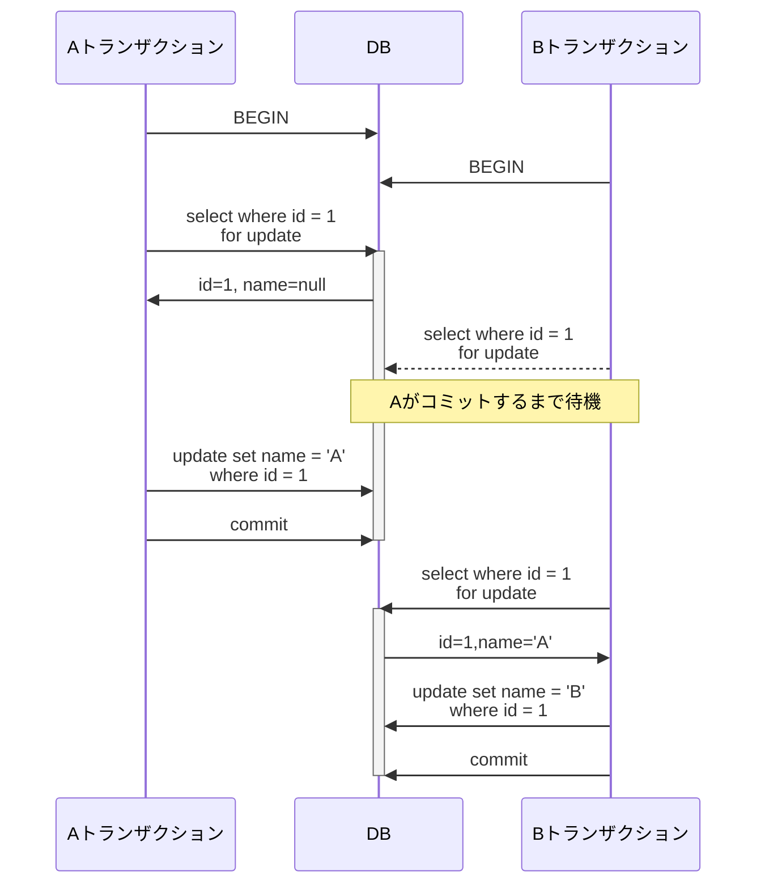

# SELECT FOR UPDATEの動作

PostgreSQLでは、FOR UPDATEロックはトランザクション内でSELECTクエリを実行する際にテーブルの行を明示的にロックするために使用されます。このロックモードは、選択された行がトランザクションが完了するまで変更されないようにし、他のトランザクションがこれらの行を変更したり、競合するロックをかけたりするのを防ぐために使用されます。

例えば、特定の顧客がチケット予約プロセスを進めている間に他の顧客がデータを変更するのを防ぐために使用されることがあります。

この記事で検討するケースは少し特殊です：

- ロックされた読み取りとロックされていない読み取りが混在する場合、`select for update`はどのように動作するのか？
- 最初にロックが使用された場合、他のトランザクションが読み取ることは可能か？
- 読み取り方法が混在してもデータの一貫した読み取りが保証されるか？

PostgreSQLでは、`select for update`句は**トランザクション分離レベル**によって異なる動作をします。したがって、各分離レベルでの動作を確認する必要があります。

以下のデータが存在する場合にデータが変更されるシナリオを仮定します。

| id  | name |
| --- | ---- |
| 1   | null |

<!-- truncate-->

## Read Committed

- PostgreSQLのデフォルトの分離レベル。
- トランザクションAが`select for update`を使用して行をロックしても、トランザクションBはデータを読み取ることができます。
    - ロックなしでの読み取り。
- トランザクションAがコミットするまで、トランザクションBはデータを変更できません。
- トランザクションBがトランザクションAのコミットを待っている場合、トランザクションAがコミットするとすぐにトランザクションBは続行できます。
- 一貫した読み取りは保証されません。
- **更新の損失が発生する可能性があります。**

### データ変更時のトランザクションの相互作用

排他ロックがかかっている領域は太字で強調されています。図からわかるように、PostgreSQLはロックなしでの読み取りを防ぎません。代わりに、トランザクションBがトランザクションAによってロックされたレコードを変更しようとすると、トランザクションAが完了するまで待つ必要があります。最終的に、**更新の損失は避けられません**。

更新の損失を防ぐ必要がある場合は、Repeatable Read分離レベルを使用するべきです。

## Repeatable Read

- トランザクションAが`select for update`を使用して行をロックしても、トランザクションBはデータを読み取ることができます。
- トランザクションAがコミットするまで、トランザクションBはデータを変更できません。
- トランザクションBがデータを変更しようとすると、**シリアライゼーションエラーが発生**します（トランザクションBはロールバックする必要があります）。
- 一貫した読み取りが保証されます。
- **更新の損失は発生しません。**

### データ変更トランザクションが競合する場合

同時変更アクティビティ中にシリアライゼーションエラーが検出されます。この場合、開発者はエラーを手動で処理する必要があります。

### データ変更トランザクションが競合しない場合

トランザクションAが行をロックするが変更しない場合、トランザクションBがそれを変更すると、結果はどうなるでしょうか？

PostgreSQLでは、コミット結果が競合しない場合、すべての変更が適用されます。

トランザクションAが最初にロックを取得しましたが、競合がないため、トランザクションBの変更はエラーなしで適用されます。

## Serializable

- Repeatable Readとほぼ同じ。
- Serializableを使用しても必ずしもパフォーマンスが低下するわけではありません。現代のデータベースのSerializableの実装は、その潜在的な利点を考慮する価値があります。[^fn-nth-1]

## AとBの両方のトランザクションがSELECT FOR UPDATEを呼び出す場合

両方のトランザクション、AとBが`select for update`を呼び出す場合はどうなりますか？

このシナリオでは、**分離レベルに関係なく**、両方の側が排他ロックを取得する必要があり、一方がロックを解除しない限り、他のトランザクションはアクセスできません。

すべての操作が順次処理されるようにするためには、すべてのトランザクションが`select for update`を使用してロックを取得する必要があります。

## 結論

ここまでの要点をまとめましょう：

- `select for update`文はロックなしの読み取り操作を防ぎません。
- PostgreSQLはFirst-Committer Winsポリシーを使用して並行性を管理し、最初にコミットされたトランザクションのみを許可し、他のトランザクションを拒否します。
    - 更新の損失に注意が必要です。
- 安全な並行性制御のためには、すべてのトランザクションが`select for update`を使用することが有益です。

PostgreSQLの`select for update`は、どの分離レベルでも読み取り操作を妨げません。代わりに、データ変更が検出された場合、コミット時にエラーを発生させ、追加の処理を促します。ロックは必ずしも他のトランザクションが待機する必要があることを意味しません。この設計は、さまざまな状況に対応しながら最適なパフォーマンスを確保することを目的としており、この機能の興味深い側面です。

## 参考文献

- [Locks in PostgreSQL part 3](https://dev.to/mahmoudhossam917/postgresql-locks-part-3-3481#:~:text=The%20FOR%20SHARE%20lock%20mode%20in%20PostgreSQL,ensuring%20data%20consistency%20without%20blocking%20other%20readers)

---

[^fn-nth-1]: [PSQLでSerializable隔離レベルを使うのが怖いですか？](https://velog.io/@jaquan1227/PSQL-%E3%81%A7-Serializable-%E9%9A%94%E9%9B%A2%E3%83%AC%E3%83%99%E3%83%AB%E3%82%92%E4%BD%BF%E3%81%86%E3%81%AE%E3%81%8C%E6%80%96%E3%81%84%E3%81%A7%E3%81%99%E3%81%8B)

