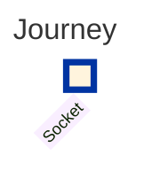
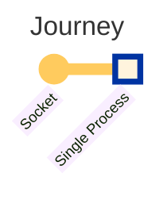
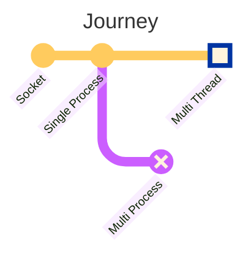
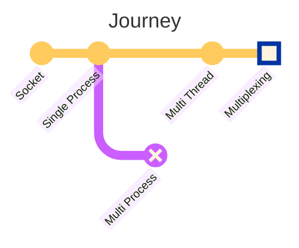
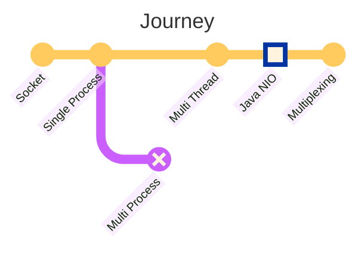
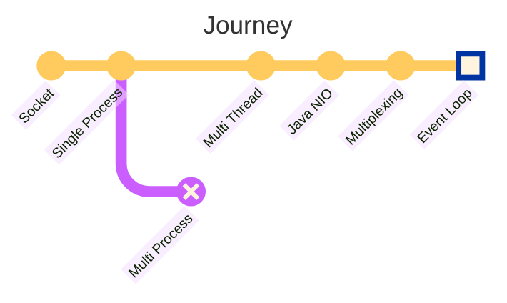
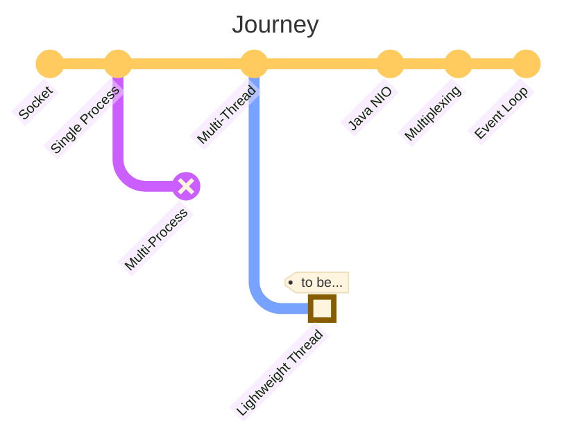

## 概要

複数のクライアントリクエストを同時に処理できるサーバアプリケーションの実装は、今や非常に簡単です。Spring MVCを使うだけで、すぐに実現できます。しかし、エンジニアとして、その基礎原理に興味があります。本記事では、明らかに見えることを問い直しながら、マルチコネクションサーバを実装するための考慮事項について考察していきます。

:::info

例のコードは[GitHub](https://github.com/songkg7/journey-to-a-multi-connect-server)で確認できます。

:::

## ソケット



最初の目的地は「ソケット」です。ネットワークプログラミングの観点から、ソケットはネットワーク上でデータを交換するための通信エンドポイントです。「ファイルのように使用される」という説明が重要です。これは、ファイルディスクリプタ（fd）を通じてアクセスされ、ファイルと同様のI/O操作をサポートするためです。

:::info[なぜソケットはポートではなくfdで識別されるのか？]

ソケットはIP、ポート、および相手のIPとポートを使用して識別できますが、fdを使用する方が好まれます。これは、接続が受け入れられるまでソケットには情報がなく、単純な整数（fd）以上のデータが必要だからです。

:::

ソケットを使用してサーバアプリケーションを実装するには、次の手順を踏む必要があります：

<!-- truncate -->


- `socket()`でソケットを作成
- `bind(), listen()`で接続の準備
- `accept()`で接続を受け入れる
- 接続を受け入れた直後に別のソケットを割り当てる = 他の接続を受け入れる必要がある

接続に使用されるソケットはリスニングソケットと呼ばれます。このリスニングソケットは接続を受け入れるためだけに使用されるため、各クライアントとの通信には別のソケットが作成されます。

サーバとクライアント間の接続がどのように確立され、維持されるかを見たところで、Javaでサーバアプリケーションを実装してみましょう。

## シングルプロセスサーバ



```java
try (ServerSocket serverSocket = new ServerSocket(PORT)) {
    while (true) {
        try (
                Socket clientSocket = serverSocket.accept();
                BufferedReader in = new BufferedReader(new InputStreamReader(clientSocket.getInputStream()));
                PrintWriter out = new PrintWriter(clientSocket.getOutputStream(), true)
        ) {
            String inputLine;
            while ((inputLine = in.readLine()) != null) {
                System.out.println("Echo: " + inputLine);
            }
            System.out.println("Client disconnected.");
        } catch (IOException e) {
            System.out.println("Exception in connection with client: " + e.getMessage());
        }
    }
} catch (IOException e) {
    System.out.println("Could not listen on port " + PORT + ": " + e.getMessage());
}
```

1. `ServerSocket`にポートをバインドし、無限ループでクライアントリクエストを待ちます。
2. クライアントリクエストが発生すると、`accept()`を呼び出して接続を受け入れ、新しい`Socket`を作成します。
3. ストリームを使用してデータを読み書きします。

先ほど説明したソケットの概念を使用して、シンプルなサーバアプリケーションが完成しました。この記事の読者であるあなたも、フレームワークを使用せずにサーバアプリケーションを実装できるようになりました 🎉。

しかし、このサーバアプリケーションにはいくつかの欠点があります。複数のリクエストを同時に処理するのが難しいのです。シングルプロセスで動作するため、一度に1つのリクエストしか処理できず、次のリクエストは前の接続が終了するまで待たなければなりません。

例を見てみましょう。


hello1の応答は正常に返ってきますが、hello2の応答はhello1の接続が終了した後にしか到着しないことがわかります。

- 単一のクライアントが接続する場合には問題ありませんが、複数のクライアントが接続する場合には問題があります。
- 複数のクライアントが接続すると、後続のクライアントは最初の接続が終了するまでキューで待たなければなりません。
- 複数のリクエストを同時に処理できないため、リソースの利用効率が低下します。

この問題を解決するために、2つのアプローチが考えられます：

- マルチプロセス
- マルチスレッド

Javaで直接マルチプロセスを扱うのは難しいです。この点は残念ですが、マルチスレッドに進みましょう。

## マルチスレッドサーバ



```java
try (ServerSocket serverSocket = new ServerSocket(PORT)) {
    LOGGER.info("Server is running on port " + PORT);

    while (true) {
        Socket clientSocket = serverSocket.accept(); // メインスレッドがリクエストを受け入れ、クライアントソケットを作成
        new Thread(new ClientHandler(clientSocket)).start(); // ワーカースレッドに委譲
    }
} catch (IOException e) {
    LOGGER.severe("Could not listen on port " + PORT + ": " + e.getMessage());
}
```

```java
public class ClientHandler implements Runnable {
    // 省略...

    @Override
    public void run() {
        try (
                BufferedReader in = new BufferedReader(new InputStreamReader(clientSocket.getInputStream()));
                PrintWriter out = new PrintWriter(clientSocket.getOutputStream(), true)
        ) {
            String inputLine;
            while ((inputLine = in.readLine()) != null) {
                out.println("Echo: " + inputLine); // 受信したメッセージをエコーバック
            }
        } catch (IOException e) {
            LOGGER.severe("Error handling client: " + e.getMessage());
        } finally {
            try {
                clientSocket.close();
            } catch (IOException e) {
                LOGGER.severe("Failed to close client socket: " + e.getMessage());
            }
        }
    }
}
```


各リクエストに対して新しいスレッドを作成することで、複数のリクエストを同時に処理できるようになりました。では、これで旅は終わりでしょうか？JVMの特性を考えると、さらなる最適化の余地があるように思えます。

- **スレッドの作成と維持はリソースを多く消費するタスク**であり、Javaはスレッドを作成する際にスタックスペースを割り当てます。これはCPUアーキテクチャによっては約1MBです。
- 10,000のリクエストが同時に発生すると、サーバはスレッドリソースだけで10GB以上のメモリを必要とします。
- サーバリソースは無限ではないため、スレッドの最大数を制限する必要があります。ここで**スレッドプール**の概念が登場します。
- Spring MVCはこれらの考えに基づいて開発されました。

最適化が完了しました。
[いくつかの実験](https://haril.dev/blog/2023/11/10/Spring-MVC-Traffic-Testing)を通じて、このフレームワークが[c10k問題](http://www.kegel.com/c10k.html)を容易に処理できることが証明されました。しかし、何かがしっくりきません 🤔。

- スレッドがブロックされるほど、アプリケーションの効率が低下します。これはコンテキストスイッチング中に競合が発生するためです。
- スレッドはソケットにデータが到着したかどうかを確認し、それを読み取るために限られたCPUリソースを競います。
- つまり、ネットワークリクエストの数が増えると、アプリケーションが遅くなります。
- **スレッドプールを使用するということは、同時に処理できるリクエストの最大数に上限がある**ということです。
- より高い目標を目指すエンジニアとして、この上限を突破したいと考えます。

## マルチプレクシングサーバ



スレッドがブロックされるオーバーヘッドは、サーバアプリケーションにとって負担でした。スレッドがブロックされずに多くのリクエストを処理するにはどうすればよいでしょうか？

答えはマルチプレクシングにあります。マルチプレクシングは、少ないスレッドで多くのリクエストを処理する技術です。マルチプレクシングを使用すると、約100,000の同時接続を簡単に処理できるサーバを実装することが可能です。これが今回の旅のメインコースです。

マルチプレクシングに入る前に、JavaのI/Oを理解する必要があります。

### Java NIO



Java NIOは、既存のI/O APIを置き換えるためにJDK 1.4以降で導入されたAPIです。なぜJavaのI/Oは遅かったのでしょうか？

- Javaはカーネルメモリに直接アクセスできなかったため、カーネルバッファからJVMメモリへのコピーが必要であり、これがブロッキング方式で動作していました。
- データがJVMメモリ（ヒープ）にコピーされた後、ガベージコレクションが必要であり、追加のオーバーヘッドが発生しました。
- NIOはカーネルメモリに直接アクセスできるAPIであるByteBufferを導入しました。
- これにより、カーネルスペースからのコピーが不要になり、ゼロコピーが実現されました。

Java NIOには、**チャネル、バッファ、セレクタ**という3つのコアコンポーネントがあります。

#### チャネル

サーバとクライアント間でデータを交換する際に、チャネルを使用してバッファ（ByteBuffer）を介してデータを読み書きします。

- FileChannel: ファイルにデータを読み書きします。
- DatagramChannel: UDPを使用してネットワーク上でデータを読み書きします。
- **SocketChannel**: TCPを使用してネットワーク上でデータを読み書きします。
- **ServerSocketChannel**: クライアントからのTCP接続リクエストをリッスンし、各接続に対してSocketChannelを作成します。

#### バッファ

バッファはデータの読み書きに使用されるコンポーネントです。双方向に動作する必要があるため、`flip()`メソッドを使用して書き込みモードと読み取りモードを切り替えます。すべてのデータを読み取った後、再度書き込みを行うためには、`clear()`メソッドを呼び出してバッファをクリアする必要があります。

バッファにはいくつかの特徴があります：

- `capacity`: 作成時にサイズを指定する必要があり、変更できません。
- `position`: 次に読み取るまたは書き込む要素のインデックスを示します。
- `limit`: バッファ内でデータを読み取るまたは書き込む最初の制限を表します。
- `mark`: 位置をマークし、後でその位置に戻ることができます。

#### セレクタ

セレクタは、マルチプレクシングを可能にする重要なコンポーネントです。Cで実装されたselect、epoll、kqueueをJavaで簡単に使用できるようにします。


- 複数のチャネルからのイベントを監視します。
- 単一のスレッドで複数のチャネルを監視できます。
- 内部的には、SelectorProviderがOSとバージョンに基づいて適切なマルチプレクシング技術を選択します。
    - select、poll、epoll、kqueueがあり、デバッグ用のマシンによって異なる実装技術が使用されるため、デバッグ時には注意が必要です。

コードを見てみましょう。

##### セレクタの作成

```java
Selector selector = Selector.open();
```

`open`メソッドを使用してセレクタを作成できます。前述のように、`SelectorProvider`を通じて、OSに基づいて適切なマルチプレクシング技術が選択されます。

##### チャネルの登録

```java
ServerSocketChannel channel = ServerSocketChannel.open();
channel.bind(new InetSocketAddress("localhost", 8080));
channel.configureBlocking(false); // ノンブロッキングモード
SelectionKey key = channel.register(selector, SelectionKey.OP_READ);
```

ノンブロッキングモードに切り替えることが重要です。チャネルをセレクタに登録する際に、監視するイベントを指定できます。イベントはSelectionKeyの定数で表される4種類があります。

- `OP_CONNECT`
- `OP_ACCEPT`
- `OP_READ`
- `OP_WRITE`

##### セレクタでチャネルを選択

セレクタは、処理が準備できたチャネルがあるまでselectを呼び出して待機します。

```java
selector.select(); // ブロッキング
```

興味深いですね。内部操作がノンブロッキングI/Oの実装であっても、すべての操作がノン

:::

必要に応じて、`selectNow`を呼び出すことで非ブロッキングのセレクトを行うことができます。

```java
selector.selectNow(); // 非ブロッキング
```

その後、`selectedKeys()`メソッドを使用して準備ができているチャネルのセットを取得できます。

```java
Set<SelectionKey> keys = selector.selectedKeys();
```

### マルチプレクシングサーバの実装

これまでに学んだ概念を組み合わせることで、以下のようにマルチプレクシングベースのサーバを実装できます。

```java
try (
        ServerSocketChannel channel = ServerSocketChannel.open();
        Selector selector = Selector.open()
) {
    channel.bind(new InetSocketAddress(PORT));
    channel.configureBlocking(false); // 非ブロッキングモード
    LOGGER.info("Server started on port " + PORT);

    channel.register(selector, SelectionKey.OP_ACCEPT);
    ByteBuffer buffer = ByteBuffer.allocate(256);

    while (true) {
        selector.select(); // ブロッキング

        Iterator<SelectionKey> keys = selector.selectedKeys().iterator();
        while (keys.hasNext()) {
            SelectionKey key = keys.next();
            keys.remove();

            if (key.isAcceptable()) {
                // クライアントからの接続を受け入れる
                accept(channel, selector);
            } else if (key.isReadable()) {
                // クライアントからのデータを読み取る
                read(key, buffer);
            }
        }
    }
}
```

- 非ブロッキングモードで`ServerSocketChannel`を設定します。
- イベントと共にセレクタをチャネルに登録します。
- 無限ループでイベントが発生するまで待機します。`select`を使用することで、イベントが発生したときにブロックを解除できます。
- イベントをトリガーしたチャネルのリストを取得します。`SelectionKey`を使用してチャネル情報を確認できます。
- イベントを適切なハンドラに委譲して処理します。

マルチプレクシングについて理解した今、複雑に感じますか？もしNettyを使ったことがあるなら、すでにマルチプレクシングを使っていることになります。Nettyは、nioベースのマルチプレクシングを簡単に使用できるように設計されたフレームワークです。

## イベントループ



Nettyを探索していると、イベントループという概念に出会うかもしれません。イベントループとは何でしょうか？NodeJSに触れたことがあるなら、この用語を頻繁に耳にしたことがあるでしょう。Wikipediaでイベントループを検索すると、次のような説明が得られます：

> イベントがキューのようなデータ構造で発生するかどうかを監視し、適切なハンドラにアクションを委譲する無限ループです。

無限ループ、イベント処理...これまでに検討してきた内容と似ていませんか？イベントループはマルチプレクシングに基づく概念であり、そのため私たちが議論してきた操作に似ています。

```java
// イベントループ
while (true) {
    selector.select();
    Set<SelectionKey> selected = selector.selectedKeys();
    for (SelectionKey selectionKey : selected) {
        dispatch(selectionKey);
    }
    selected.clear();
}
```

JVMのメインスレッドはループ内でイベントが発生するまで待機し、その後イベントを適切なハンドラに委譲します。

非ブロッキングのマルチプレクシングサーバでブロッキング操作を避けるべき理由が理解できた今、メインスレッドはイベントが発生するまで待機し、ループ外でスレッドがブロックされると、selectを通じたイベントの委譲が時間とともに遅くなることが明らかです。

これで私たちの旅は終わりに近づきました。非ブロッキングのマルチプレクシングサーバでブロッキング操作を避ける理由を掘り下げ、イベントループのメカニズムを理解することで、サーバが複数のリクエストを効率的に処理できることがわかりました。

同様に、計算集約的なタスク（= CPU集約的なタスク）はイベントループと相性が悪いです。これらのタスクが頻繁に発生する場合、メインスレッドループを妨げないように、別のスレッドを作成してタスクを委譲する必要があります。

## 結論

マルチ接続サーバを実装するための思考プロセスの本質を探る旅にお付き合いいただきました。

- 単一プロセスでは複数の接続を処理できませんでした。
- マルチプロセスとマルチスレッドはリソースを多く消費しました。
    - スレッドプールはリソース問題を解決しましたが、多くのリクエストを同時に処理するには不十分でした。
- マルチプレクシングを使用することで、1つのスレッドで多くのリクエストを処理できます。
    - キーは、どのリクエストが処理準備ができているかを判断するセレクタを持つことでした。

この旅を通じて、多くの質問に答えることができました。旅が終わった今、皆さんが安心して休めることを願っています。

あ、実はまだ訪れていない場所が一つあります。それは本当に興味深いトピックなので、次回の投稿に取っておきます。



## 参考文献

- https://engineering.linecorp.com/ko/blog/do-not-block-the-event-loop-part1
- https://mark-kim.blog/understanding-non-blocking-io-and-nio/
- https://oliveyoung.tech/blog/2023-10-02/c10-problem/